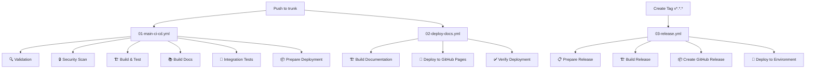

# 🚀 IA-Ops Platform Workflows

Esta carpeta contiene los workflows de GitHub Actions organizados y optimizados para el proyecto IA-Ops Platform.

## 📋 Workflows Activos

### 🔄 Workflows Principales

| Workflow | Archivo | Trigger | Descripción |
|----------|---------|---------|-------------|
| **🚀 Main CI/CD Pipeline** | `01-main-ci-cd.yml` | Push a `trunk`, PR, Manual | Pipeline principal con validación, testing, build y despliegue |
| **📚 Deploy Documentation** | `02-deploy-docs.yml` | Push a `trunk` (docs/), Manual | Construcción y despliegue de documentación a GitHub Pages |
| **🏷️ Release & Deploy** | `03-release.yml` | Tags `v*.*.*`, Manual | Creación de releases y despliegue a ambientes |

## 🎯 Flujo de Trabajo



## 📊 Detalles de Workflows

### 🚀 01-main-ci-cd.yml - Pipeline Principal

**Stages:**
1. **🔍 Validation** - Validación de archivos YAML/JSON
2. **🔒 Security Scan** - Escaneo de seguridad con Trivy (formato tabla)
3. **🏗️ Build & Test** - Construcción y testing de servicios
4. **📚 Build Docs** - Construcción de documentación
5. **🔗 Integration Tests** - Tests de integración con Docker Compose
6. **📦 Prepare Deployment** - Preparación de artefactos de despliegue

**Características:**
- ✅ Sin características premium de GitHub
- ✅ Security scanning en formato tabla (logs)
- ✅ Build paralelo de servicios (backstage, openai-service, proxy-service)
- ✅ Tests de integración con base de datos
- ✅ Generación de artefactos de despliegue

### 📚 02-deploy-docs.yml - Documentación

**Stages:**
1. **🏗️ Build Documentation** - Construcción con MkDocs
2. **🚀 Deploy to GitHub Pages** - Despliegue a GitHub Pages
3. **✅ Verify Deployment** - Verificación post-despliegue

**Características:**
- ✅ Construcción automática con MkDocs + Material theme
- ✅ Despliegue a GitHub Pages sin errores 404
- ✅ Verificación de accesibilidad del sitio
- ✅ Trigger automático en cambios de documentación

### 🏷️03-release.yml - Releases

**Stages:**
1. **📋 Prepare Release** - Preparación de versión y ambiente
2. **🏗️ Build Release** - Construcción de imágenes Docker
3. **📦 Create GitHub Release** - Creación de release en GitHub
4. **🚀 Deploy to Environment** - Despliegue a ambiente específico

**Características:**
- ✅ Construcción y push de imágenes Docker a GHCR
- ✅ Generación automática de changelog
- ✅ Soporte para staging y production
- ✅ Despliegue con verificación de salud

## 🔧 Configuración

### Variables de Entorno Requeridas

```bash
# GitHub (automáticas)
GITHUB_TOKEN          # Token automático de GitHub Actions
GITHUB_ACTOR          # Usuario que ejecuta el workflow

# Opcionales para despliegue
REGISTRY_USERNAME     # Usuario para registry de contenedores
REGISTRY_PASSWORD     # Password para registry de contenedores
```

### Secrets Requeridos

| Secret | Descripción | Requerido para |
|--------|-------------|----------------|
| `GITHUB_TOKEN` | Token automático | Todos los workflows |

### Permisos de GitHub Actions

**Configuración requerida en Settings → Actions:**
- ✅ **Workflow permissions**: "Read and write permissions"
- ✅ **Allow GitHub Actions to create and approve pull requests**: Habilitado

**GitHub Pages:**
- ✅ **Source**: "GitHub Actions" (no "Deploy from a branch")

## 🚨 Troubleshooting

### Errores Comunes

| Error | Causa | Solución |
|-------|-------|----------|
| `Resource not accessible by integration` | Permisos insuficientes | Verificar permisos en Settings → Actions |
| `Not Found (404)` en Pages | GitHub Pages no habilitado | Habilitar en Settings → Pages |
| `SARIF upload failed` | Características premium | Usar workflows básicos (ya configurado) |
| `Docker build failed` | Dockerfile inválido | Verificar Dockerfiles en applications/ |

### Verificación de Estado

```bash
# Verificar workflows activos
ls -la .github/workflows/

# Verificar configuración local
./scripts/verify-github-pages-config.sh

# Monitorear despliegue
./scripts/monitor-pages-deployment.sh
```

## 📁 Archivos Archivados

Los workflows obsoletos se encuentran en `.github/workflows-archive/`:
- Workflows duplicados
- Configuraciones experimentales
- Versiones anteriores

## 🔄 Mantenimiento

### Actualización de Workflows

1. **Modificar workflows** en esta carpeta
2. **Probar cambios** con workflow_dispatch
3. **Documentar cambios** en este README
4. **Archivar versiones obsoletas** si es necesario

### Monitoreo

- **GitHub Actions**: https://github.com/giovanemere/ia-ops/actions
- **GitHub Pages**: https://github.com/giovanemere/ia-ops/settings/pages
- **Releases**: https://github.com/giovanemere/ia-ops/releases

---

## 🎯 Próximos Pasos

1. **Verificar** que los workflows se ejecuten correctamente
2. **Probar** el flujo completo con un push a trunk
3. **Validar** que la documentación se despliegue sin errores
4. **Crear** un release de prueba para validar el workflow de releases

**✨ Workflows organizados y listos para producción!**
