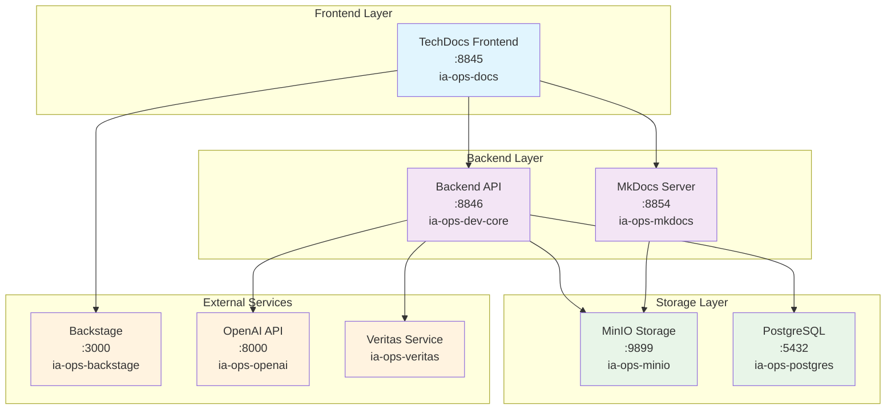

# IA-Ops Portal - Arquitectura del Sistema

## Diagrama de Arquitectura General

## Componentes Principales

### Frontend (Puerto 8845)
- **ia-ops-docs**: Portal de documentación técnica
- **Tecnologías**: FastAPI, Jinja2, Bootstrap 5
- **Funciones**: 
  - Interfaz web para TechDocs
  - Gestión de repositorios
  - Modal de navegación de documentación

### Backend (Puerto 8846)
- **ia-ops-dev-core**: API principal del sistema
- **Tecnologías**: FastAPI, Python
- **Funciones**:
  - API REST `/api/minio/folders`
  - Integración con MinIO
  - Gestión de configuraciones

### MkDocs Server (Puerto 8854)
- **ia-ops-mkdocs**: Servidor de documentación
- **Tecnologías**: MkDocs, Flask, Python
- **Funciones**:
  - Servir documentación de repositorios
  - Sincronización automática desde MinIO
  - Generación dinámica de sitios

## Puertos y Servicios

| Servicio | Puerto | Repositorio | Función |
|----------|--------|-------------|---------|
| Frontend | 8845 | ia-ops-docs | Portal web TechDocs |
| Backend | 8846 | ia-ops-dev-core | API REST |
| MkDocs | 8854 | ia-ops-mkdocs | Documentación |
| MinIO | 9899 | ia-ops-minio | Storage |
| PostgreSQL | 5432 | ia-ops-postgres | Database |
| Backstage | 3000 | ia-ops-backstage | Dev Portal |
| OpenAI | 8000 | ia-ops-openai | AI Services |
