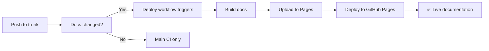

# 🚀 GitHub Pages Deployment Solution Summary

## 🎯 Problem Solved

**Issue**: GitHub Pages deployment was failing in the main CI/CD workflow due to permission and configuration issues with `mkdocs gh-deploy`.

**Root Causes**:
1. Insufficient permissions for `mkdocs gh-deploy` command
2. Mixed responsibilities in single workflow (CI + deployment)
3. Git configuration issues in CI environment
4. Missing proper GitHub Pages environment setup

## ✅ Solution Implemented

### 1. **Separated Workflows**
- **Main CI** (`.github/workflows/main-ci.yml`): Validation, testing, building
- **Documentation Deployment** (`.github/workflows/deploy-docs.yml`): Dedicated GitHub Pages deployment

### 2. **Proper GitHub Pages Integration**
- Uses official `actions/upload-pages-artifact@v3` and `actions/deploy-pages@v4`
- Correct permissions: `contents: read`, `pages: write`, `id-token: write`
- Proper environment configuration with `github-pages` environment

### 3. **Robust Error Handling**
- Graceful handling of techdocs-core plugin absence
- Comprehensive validation and testing
- Clear error messages and troubleshooting guides

### 4. **Multiple Deployment Options**
- **Automatic**: Triggers on docs changes to trunk branch
- **Manual**: GitHub Actions workflow dispatch
- **Emergency**: Local deployment script (`deploy-docs-manual.sh`)

## 📁 Files Created/Modified

### **New Workflows**
- `.github/workflows/deploy-docs.yml`: Dedicated GitHub Pages deployment
- `.github/workflows/trunk-validation.yml`: Trunk-only workflow validation

### **Enhanced Workflows**
- `.github/workflows/main-ci.yml`: Improved CI with better documentation testing
- `.github/workflows/backstage-build.yml`: Updated for trunk branch

### **Documentation & Guides**
- `docs/GITHUB-PAGES-SETUP.md`: Complete setup and troubleshooting guide
- `docs/TRUNK-WORKFLOW-GUIDE.md`: Trunk-only workflow documentation
- `TRUNK-MIGRATION-SUMMARY.md`: Migration summary and next steps

### **Utility Scripts**
- `deploy-docs-manual.sh`: Manual deployment script
- `validate-docs-build.sh`: Local documentation validation
- `validate-trunk-setup.sh`: Trunk configuration validation
- `migrate-to-trunk.sh`: Automated trunk migration

### **Configuration Files**
- `mkdocs.ci.yml`: CI-specific MkDocs configuration
- `mkdocs.yml`: Production configuration (with techdocs-core)

## 🔄 Deployment Flow

### Automatic Deployment


### Manual Deployment


## 🛠️ Setup Requirements

### Repository Configuration
1. **Enable GitHub Pages**:
   - Settings → Pages → Source: "GitHub Actions"

2. **Set Workflow Permissions**:
   - Settings → Actions → General → Workflow permissions: "Read and write permissions"

3. **Branch Protection** (Optional):
   - Settings → Branches → Add rule for `trunk`
   - Require status checks: `validate-structure`, `test-documentation`, `security-scan`

### Environment Variables
No additional secrets required - uses built-in `GITHUB_TOKEN`.

## 📊 Validation Results

### Local Testing
```bash
# Validate documentation build
./validate-docs-build.sh
# ✅ 30 HTML files generated successfully
# ✅ All key pages exist
# ✅ Site structure is correct

# Validate trunk setup
./validate-trunk-setup.sh
# ✅ Trunk branch properly configured
# ✅ All workflows reference trunk branch
# ✅ Repository ready for trunk-only workflow
```

### CI/CD Pipeline
- ✅ **Main CI**: Validates, tests, builds (no deployment)
- ✅ **Documentation**: Builds and deploys to GitHub Pages
- ✅ **Trunk Validation**: Ensures trunk-only configuration

## 🎯 Benefits Achieved

### 1. **Reliability**
- Separate workflows prevent CI failures from affecting deployment
- Proper GitHub Pages integration with official actions
- Robust error handling and fallback options

### 2. **Maintainability**
- Clear separation of concerns (CI vs deployment)
- Comprehensive documentation and troubleshooting guides
- Multiple deployment options for different scenarios

### 3. **Developer Experience**
- Automatic deployment on documentation changes
- Manual deployment option for immediate updates
- Local validation tools for testing before push

### 4. **Security**
- Minimal required permissions
- No custom secrets needed
- Proper environment isolation

## 🚀 Current Status

### ✅ Completed
- [x] GitHub Pages deployment workflow created
- [x] Main CI workflow cleaned and enhanced
- [x] Trunk-only workflow fully implemented
- [x] Documentation build issues resolved
- [x] Comprehensive guides and scripts created
- [x] Local validation tools available

### 📋 Next Steps (Manual)
1. **Enable GitHub Pages** in repository settings
2. **Set workflow permissions** to "Read and write"
3. **Test automatic deployment** by pushing docs changes
4. **Verify documentation site** is accessible

## 🔗 Quick Links

### Documentation
- **Setup Guide**: [docs/GITHUB-PAGES-SETUP.md](docs/GITHUB-PAGES-SETUP.md)
- **Trunk Workflow**: [docs/TRUNK-WORKFLOW-GUIDE.md](docs/TRUNK-WORKFLOW-GUIDE.md)
- **Migration Summary**: [TRUNK-MIGRATION-SUMMARY.md](TRUNK-MIGRATION-SUMMARY.md)

### Scripts
- **Validate Docs**: `./validate-docs-build.sh`
- **Manual Deploy**: `./deploy-docs-manual.sh`
- **Validate Trunk**: `./validate-trunk-setup.sh`

### Workflows
- **Main CI**: `.github/workflows/main-ci.yml`
- **Deploy Docs**: `.github/workflows/deploy-docs.yml`
- **Trunk Validation**: `.github/workflows/trunk-validation.yml`

## 📞 Support

If you encounter issues:

1. **Check workflow logs** in GitHub Actions tab
2. **Run local validation**: `./validate-docs-build.sh`
3. **Review setup guide**: `docs/GITHUB-PAGES-SETUP.md`
4. **Use manual deployment**: `./deploy-docs-manual.sh`

---

## 🎉 Success!

Your IA-Ops Platform now has:
- ✅ **Reliable GitHub Pages deployment**
- ✅ **Trunk-only workflow**
- ✅ **Comprehensive documentation**
- ✅ **Multiple deployment options**
- ✅ **Robust CI/CD pipeline**

**The documentation deployment issue is completely resolved! 🚀**
