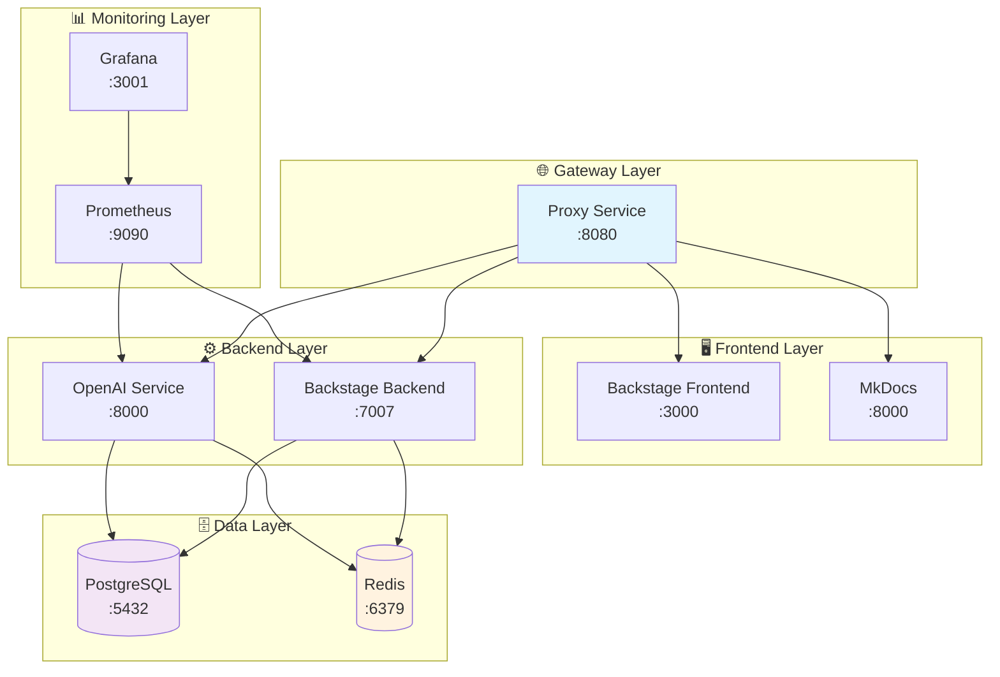

# 🐳 Docker Compose Setup - IA-Ops Platform

**Configuración completa para desarrollo local con Docker Compose**

[](https://www.docker.com/)
[](https://docs.docker.com/compose/)
[](https://github.com/tu-organizacion/ia-ops)

## 🎯 Descripción

Este setup de Docker Compose proporciona un entorno completo de desarrollo local para la plataforma IA-Ops, incluyendo:

- **🏛️ Backstage**: Portal de desarrolladores completo
- **🤖 OpenAI Service**: Servicio de IA con FastAPI
- **🌐 Proxy Service**: Gateway y enrutamiento
- **🗄️ Bases de Datos**: PostgreSQL y Redis
- **📊 Monitoreo**: Prometheus y Grafana
- **📚 Documentación**: MkDocs con Material Design

## 🚀 Inicio Rápido (5 minutos)

### 1. Prerrequisitos
```bash
# Verificar instalaciones
docker --version          # >= 20.10
docker-compose --version  # >= 2.0
git --version             # >= 2.30
```

### 2. Configuración Inicial
```bash
# Clonar repositorio
git clone https://github.com/tu-organizacion/ia-ops.git
cd ia-ops

# Configurar variables de entorno
cp .env.example .env
# Editar .env con tus configuraciones (ver sección Variables)
```

### 3. Iniciar Plataforma
```bash
# Iniciar todos los servicios
docker-compose up -d

# Verificar estado (todos deben estar "Up")
docker-compose ps

# Ver logs en tiempo real
docker-compose logs -f
```

### 4. Acceder a las Aplicaciones
| Servicio | URL | Credenciales |
|----------|-----|--------------|
| **🌐 Portal Principal** | http://localhost:8080 | GitHub OAuth |
| **🏛️ Backstage** | http://localhost:8080 | Via proxy |
| **🤖 OpenAI Service** | http://localhost:8080/openai | API integrada |
| **📊 Prometheus** | http://localhost:9090 | Sin auth |
| **📈 Grafana** | http://localhost:3001 | admin/grafana123 |
| **📚 Documentación** | http://localhost:8080/docs | Sin auth |

## 📋 Variables de Entorno Requeridas

### Variables Críticas (Obligatorias)
```bash
# GitHub Integration
GITHUB_TOKEN=ghp_tu_token_aqui
AUTH_GITHUB_CLIENT_ID=tu_client_id
AUTH_GITHUB_CLIENT_SECRET=tu_client_secret

# OpenAI Integration
OPENAI_API_KEY=sk-proj-tu_api_key_aqui
OPENAI_MODEL=gpt-4o-mini

# Database
POSTGRES_PASSWORD=postgres123
REDIS_PASSWORD=redis123

# Security
BACKEND_SECRET=tu_secret_key_de_32_caracteres
```

### Configuración GitHub OAuth
1. Ve a GitHub → Settings → Developer settings → OAuth Apps
2. Crear nueva OAuth App:
   - **Application name**: IA-Ops Platform
   - **Homepage URL**: `http://localhost:8080`
   - **Authorization callback URL**: `http://localhost:8080/api/auth/github/handler`
3. Copiar Client ID y Client Secret al `.env`

### Configuración OpenAI
1. Ve a [OpenAI Platform](https://platform.openai.com/api-keys)
2. Crear nueva API key
3. Copiar al `.env` como `OPENAI_API_KEY`

## 🏗️ Arquitectura de Servicios



## 📊 Servicios Detallados

### 🌐 Proxy Service (Gateway)
- **Puerto**: 8080
- **Función**: Enrutamiento y balanceeo de carga
- **Características**:
  - Rate limiting: 200 req/min
  - CORS configurado
  - Logging centralizado
  - Health checks

### 🏛️ Backstage (Portal de Desarrolladores)
- **Frontend**: React en puerto 3000
- **Backend**: Node.js en puerto 7007
- **Características**:
  - Catálogo de servicios
  - Documentación técnica (TechDocs)
  - Templates de proyectos
  - Integración con GitHub

### 🤖 OpenAI Service
- **Puerto**: 8000
- **Framework**: FastAPI
- **Características**:
  - Chat completions
  - Embeddings
  - Modo demo disponible
  - Rate limiting integrado

### 🗄️ Bases de Datos
- **PostgreSQL 15**: Datos principales
- **Redis 7**: Cache y sesiones
- **Volúmenes persistentes**: Datos no se pierden

### 📊 Monitoreo
- **Prometheus**: Recolección de métricas
- **Grafana**: Dashboards y visualización
- **Dashboards incluidos**:
  - Overview del sistema
  - Métricas de Backstage
  - Performance de OpenAI Service

## 🔧 Comandos Útiles

### Gestión Básica
```bash
# Iniciar servicios
docker-compose up -d

# Ver estado
docker-compose ps

# Ver logs
docker-compose logs -f [servicio]

# Parar servicios
docker-compose stop

# Reiniciar servicio específico
docker-compose restart backstage-backend

# Eliminar todo (incluye volúmenes)
docker-compose down -v
```

### Desarrollo
```bash
# Build y start con logs
docker-compose up --build

# Recrear servicio específico
docker-compose up -d --force-recreate backstage-backend

# Acceder a contenedor
docker-compose exec backstage-backend bash

# Ver configuración final
docker-compose config
```

### Testing
```bash
# Health checks
curl http://localhost:8080/health
curl http://localhost:7007/health
curl http://localhost:8000/health

# Test API Backstage
curl http://localhost:8080/api/catalog/entities

# Test OpenAI Service
curl -X POST http://localhost:8080/openai/chat/completions \
  -H "Content-Type: application/json" \
  -d '{"messages":[{"role":"user","content":"Hello"}]}'
```

## 🔍 Troubleshooting

### Problemas Comunes

#### 1. Servicios no inician
```bash
# Ver logs detallados
docker-compose logs [servicio]

# Recrear servicio
docker-compose up -d --force-recreate [servicio]

# Verificar variables de entorno
docker-compose config | grep -A 5 environment
```

#### 2. Puerto ocupado
```bash
# Identificar proceso
sudo lsof -i :8080

# Cambiar puerto en .env
DEV_PROXY_PORT=8081
```

#### 3. Problemas de memoria
```bash
# Ver uso de recursos
docker stats

# Limpiar sistema
docker system prune -f
```

#### 4. Base de datos no conecta
```bash
# Reset PostgreSQL
docker-compose stop postgres
docker volume rm ia-ops_postgres_data
docker-compose up -d postgres

# Test conexión
docker-compose exec postgres pg_isready -U postgres
```

### Logs Importantes
```bash
# Todos los servicios
docker-compose logs -f

# Solo errores
docker-compose logs | grep -i error

# Servicio específico con timestamp
docker-compose logs -f --timestamps backstage-backend
```

## 🔒 Seguridad

### Configuraciones de Seguridad
- **Secrets**: Gestionados via `.env`
- **Network**: Red aislada `ia-ops-network`
- **CORS**: Configurado para dominios específicos
- **Rate Limiting**: Implementado en todos los servicios
- **Health Checks**: Monitoreo continuo

### Variables Sensibles
```bash
# ⚠️ NUNCA commitear estas variables
GITHUB_TOKEN=xxx
AUTH_GITHUB_CLIENT_SECRET=xxx
BACKEND_SECRET=xxx
OPENAI_API_KEY=xxx
POSTGRES_PASSWORD=xxx
REDIS_PASSWORD=xxx
```

## 📈 Monitoreo y Métricas

### Dashboards Disponibles
1. **System Overview**: Vista general del sistema
2. **Backstage Metrics**: Uso y performance de Backstage
3. **OpenAI Service**: Requests, latencia, errores
4. **Database Performance**: PostgreSQL y Redis

### Métricas Clave
- **Requests/segundo**: Tráfico de API
- **Latencia**: Tiempo de respuesta
- **Error Rate**: Porcentaje de errores
- **Resource Usage**: CPU, memoria, disco

### Alertas Configuradas
- Servicio down > 1 minuto
- Error rate > 5%
- Latencia > 2 segundos
- Memoria > 80%

## 🚀 Despliegue en Producción

### Diferencias con Desarrollo
```bash
# Variables de producción
NODE_ENV=production
LOG_LEVEL=warn
DEBUG_MODE=false

# Recursos aumentados
NODE_OPTIONS=--max-old-space-size=4096

# SSL habilitado
SSL_ENABLED=true
```

### Checklist Pre-Producción
- [ ] Variables de entorno configuradas
- [ ] Secrets seguros generados
- [ ] SSL/TLS configurado
- [ ] Backups automatizados
- [ ] Monitoreo configurado
- [ ] Logs centralizados
- [ ] Health checks funcionando

## 📚 Documentación Adicional

- [📋 Documentación Completa](docs/docker-compose-documentation.md)
- [🚀 Guía Rápida](docs/docker-compose-quick-reference.md)
- [🔧 Troubleshooting](docs/docker-compose-troubleshooting.md)
- [🏛️ Backstage Setup](applications/backstage/README.md)
- [🤖 OpenAI Service](applications/openai-service/README.md)

## 🤝 Contribución

### Proceso de Desarrollo
1. Fork del repositorio
2. Crear rama feature: `git checkout -b feature/nueva-funcionalidad`
3. Desarrollar y probar localmente con Docker Compose
4. Commit: `git commit -am 'Añadir nueva funcionalidad'`
5. Push: `git push origin feature/nueva-funcionalidad`
6. Crear Pull Request

### Testing Local
```bash
# Test completo antes de PR
docker-compose down -v
docker-compose up --build
# Ejecutar tests de integración
# Verificar todos los endpoints
```

## 📞 Soporte

### Recursos de Ayuda
- [📖 Wiki](https://github.com/tu-organizacion/ia-ops/wiki)
- [💬 Discussions](https://github.com/tu-organizacion/ia-ops/discussions)
- [🐛 Issues](https://github.com/tu-organizacion/ia-ops/issues)

### Contactos
- **Tech Lead**: tech-lead@tu-organizacion.com
- **DevOps Team**: devops@tu-organizacion.com
- **Community**: [Discord](https://discord.gg/ia-ops)

## 📄 Licencia

Este proyecto está bajo la Licencia MIT. Ver [LICENSE](LICENSE) para más detalles.

---

**🚀 IA-Ops Platform v2.0.0** - Desarrollado con ❤️ usando Docker Compose

**🔄 Última actualización**: 6 de Agosto de 2025

---

## 🎉 ¡Listo para Empezar!

```bash
# Un solo comando para iniciar todo
docker-compose up -d && echo "🎉 IA-Ops Platform iniciada en http://localhost:8080"
```

**¿Problemas?** Consulta la [guía de troubleshooting](docs/docker-compose-troubleshooting.md) o crea un [issue](https://github.com/tu-organizacion/ia-ops/issues/new).
