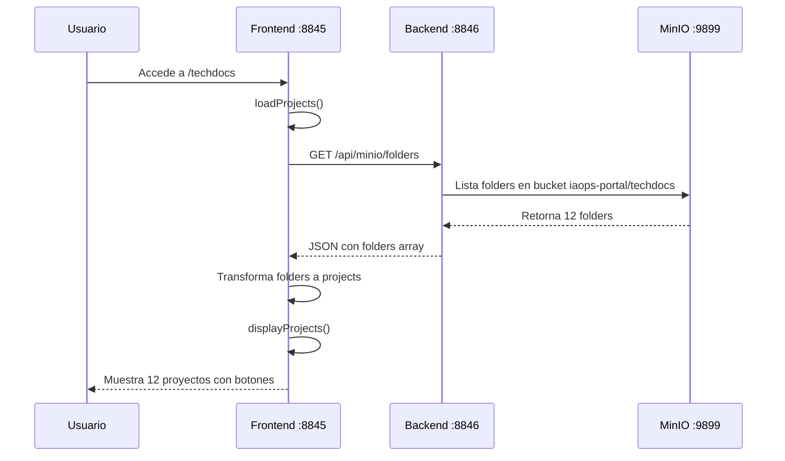
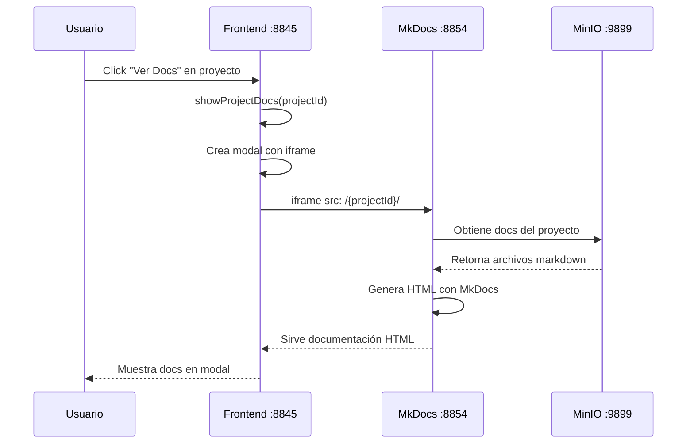
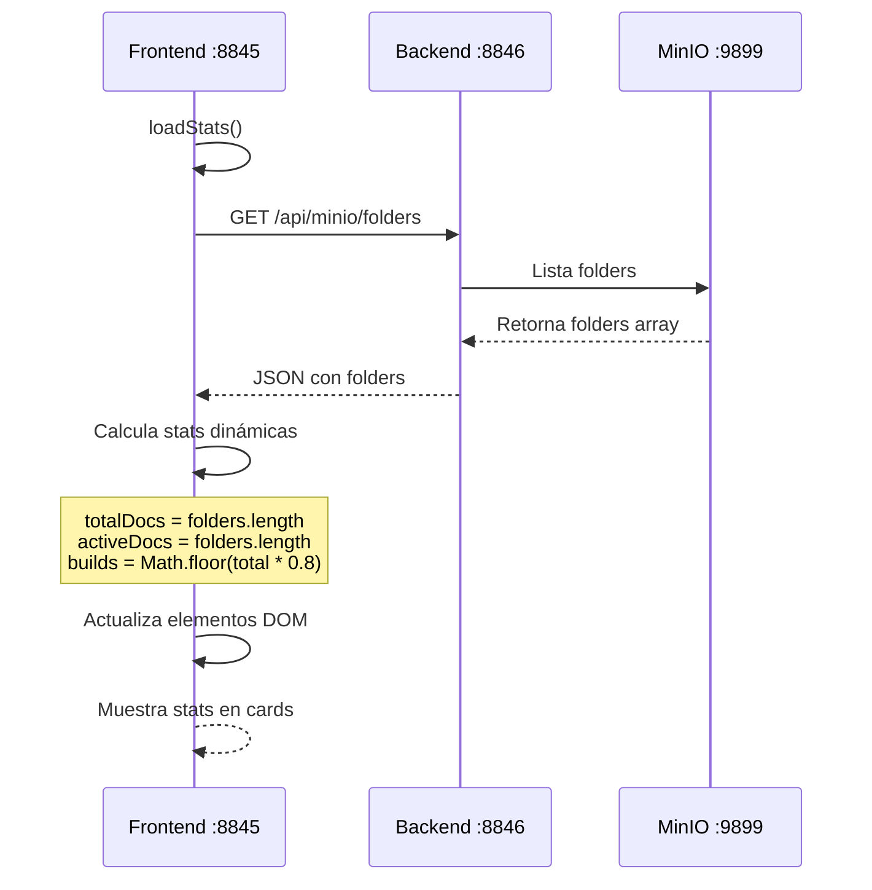
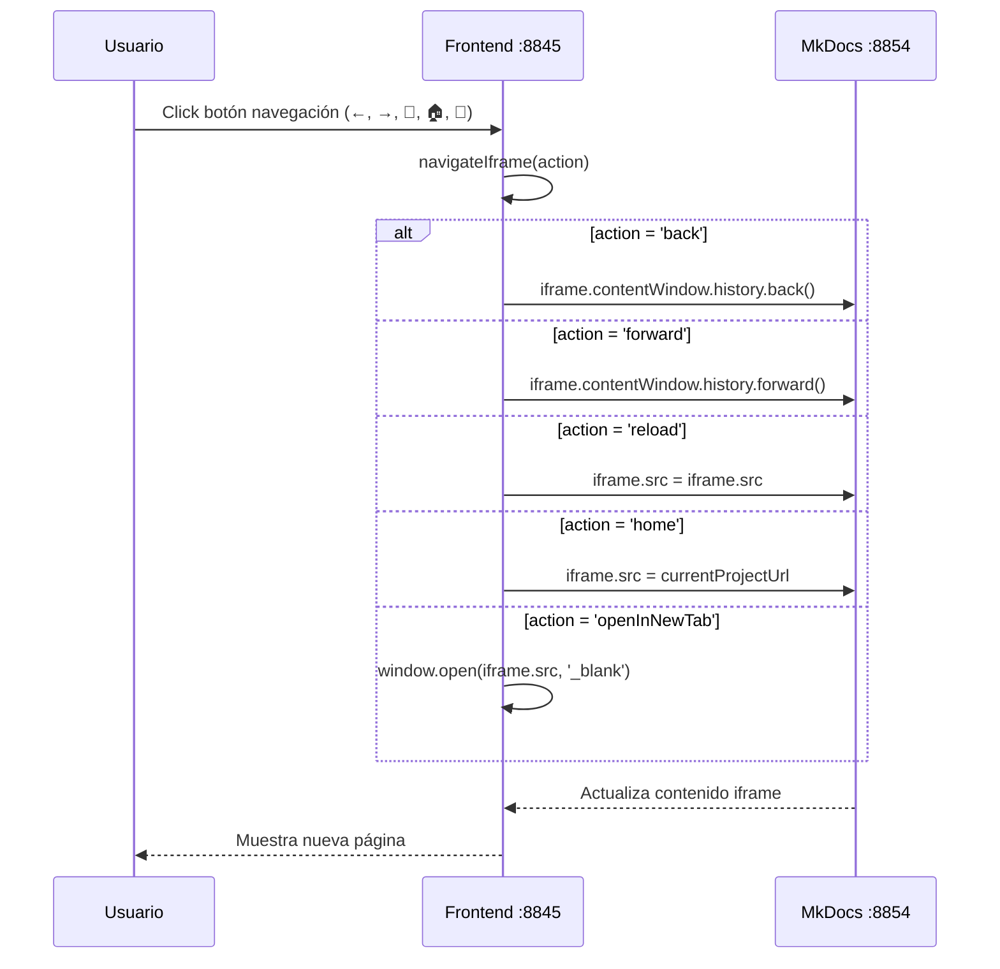
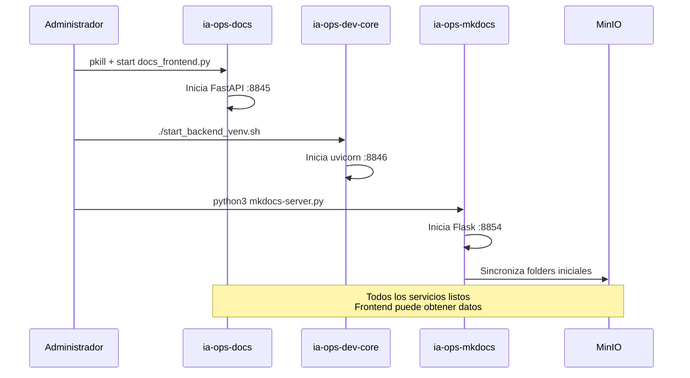

# IA-Ops Portal - Diagramas de Secuencia

## 1. Carga de Repositorios

## 2. Visualización de Documentación

## 3. Carga de Estadísticas

## 4. Navegación en Modal de Documentación

## 5. Flujo de Inicio de Servicios

## Endpoints Críticos

### Backend (ia-ops-dev-core)
- `GET /api/minio/folders` - Obtiene repositorios desde MinIO
- `POST /api/techdocs/build/{project_name}` - Build de documentación
- `GET /api/repositories` - Lista repositorios (legacy)

### Frontend (ia-ops-docs)
- `GET /techdocs` - Página principal TechDocs
- `GET /health` - Health check

### MkDocs (ia-ops-mkdocs)
- `GET /{project_name}/` - Documentación específica del proyecto
- Sincronización automática desde MinIO

## Flujo de Datos Crítico

1. **MinIO** almacena documentación en `iaops-portal/techdocs/{project}/`
2. **Backend** consulta MinIO via `/api/minio/folders`
3. **Frontend** obtiene lista y la transforma a formato UI
4. **MkDocs** sirve documentación directamente desde MinIO
5. **Modal** en Frontend muestra iframe apuntando a MkDocs
