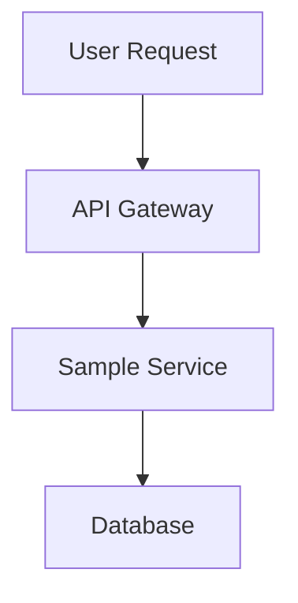

# MkDocs Plugin Configuration for Backstage TechDocs

This document summarizes the MkDocs plugin configuration completed for your Backstage application.

## What Was Configured

### 1. Enhanced TechDocs Configuration

Updated `app-config.yaml` with enhanced TechDocs settings:

```yaml
techdocs:
  builder: 'local'
  generator:
    runIn: 'docker'
    mkdocs:
      defaultPlugins:
        - search
        - techdocs-core
      omitTechdocsCorePlugin: false
  publisher:
    type: 'local'
  cache:
    ttl: 3600000 # 1 hour cache
```

### 2. Sample Service with Complete Documentation

Created a comprehensive sample service at `examples/sample-service/` with:

- **catalog-info.yaml**: Backstage entity definition with TechDocs annotation
- **mkdocs.yml**: Complete MkDocs configuration with plugins
- **docs/**: Full documentation set including:
  - `index.md`: Overview with Mermaid diagrams
  - `getting-started.md`: Installation and setup guide
  - `api.md`: Complete API reference
  - `architecture.md`: System architecture with diagrams
  - `deployment.md`: Deployment guide for multiple platforms

### 3. MkDocs Plugins Configured

The `mkdocs.yml` includes these powerful plugins:

#### Core Plugins
- **techdocs-core**: Backstage integration
- **search**: Full-text search functionality
- **material theme**: Modern, responsive design

#### Enhanced Plugins
- **mkdocs-mermaid2-plugin**: Interactive diagrams
- **awesome-pages**: Advanced navigation
- **macros**: Dynamic content generation
- **include-markdown**: Content inclusion from other files

#### Markdown Extensions
- **admonition**: Info boxes and callouts
- **pymdownx.details**: Collapsible sections
- **pymdownx.superfences**: Enhanced code blocks
- **pymdownx.tabbed**: Tabbed content
- **pymdownx.highlight**: Syntax highlighting
- **tables**: Table support
- **footnotes**: Footnote support

### 4. Theme Configuration

Material theme with:
- Navigation tabs and top navigation
- Search highlighting and suggestions
- Dark/light mode toggle
- Custom color scheme (blue primary/accent)

### 5. Plugin Dependencies

Created `requirements.txt` with all necessary Python packages:
- mkdocs>=1.5.0
- mkdocs-material>=9.0.0
- mkdocs-techdocs-core>=1.3.0
- mkdocs-mermaid2-plugin>=1.1.0
- mkdocs-awesome-pages-plugin>=2.9.0
- mkdocs-macros-plugin>=1.0.0
- mkdocs-include-markdown-plugin>=6.0.0

## Features Demonstrated

### 1. Interactive Diagrams


### 2. Tabbed Content
=== "Frontend"
    React-based interface
=== "Backend"
    Node.js with Express
=== "Database"
    PostgreSQL with Redis

### 3. Admonitions
!!! tip "Pro Tip"
    Use admonitions to highlight important information

!!! warning "Important"
    Critical information stands out

### 4. Code Highlighting
```javascript
const config = {
  database: {
    url: process.env.DATABASE_URL
  }
};
```

### 5. Advanced Navigation
- Automatic page discovery
- Custom navigation structure
- Search integration

## How to Use

### 1. Access Documentation
1. Start Backstage: `yarn start`
2. Navigate to http://localhost:3000
3. Go to the Catalog
4. Find "sample-service" component
5. Click on the "Docs" tab

### 2. Create New Documentation
1. Create a new component directory
2. Add `catalog-info.yaml` with `backstage.io/techdocs-ref: dir:.`
3. Create `mkdocs.yml` (copy from sample-service)
4. Add documentation in `docs/` directory
5. Register in Backstage catalog

### 3. Customize Plugins
Edit `mkdocs.yml` to:
- Add/remove plugins
- Customize theme colors
- Configure navigation
- Add custom CSS/JavaScript

## Plugin Capabilities

### Mermaid Diagrams
- Flowcharts
- Sequence diagrams
- Gantt charts
- Entity relationship diagrams
- User journey maps

### Material Theme Features
- Responsive design
- Search functionality
- Navigation enhancements
- Code highlighting
- Social links
- Version switching

### Content Enhancement
- Dynamic content with macros
- Content inclusion from external files
- Advanced markdown extensions
- Interactive elements

## Best Practices

### 1. Documentation Structure
```
docs/
├── index.md              # Overview
├── getting-started.md    # Quick start
├── api/                  # API documentation
│   ├── index.md
│   └── endpoints.md
├── guides/               # How-to guides
│   ├── deployment.md
│   └── troubleshooting.md
└── reference/            # Reference material
    ├── architecture.md
    └── configuration.md
```

### 2. MkDocs Configuration
- Use semantic versioning for docs
- Configure appropriate caching
- Enable search for better UX
- Use consistent navigation structure

### 3. Content Guidelines
- Start with overview and getting started
- Use diagrams for complex concepts
- Include code examples
- Provide troubleshooting sections
- Keep content up to date

## Troubleshooting

### Common Issues

1. **Plugin Not Found**
   - Ensure plugin is in requirements.txt
   - Check Docker image includes plugin

2. **Mermaid Diagrams Not Rendering**
   - Verify mermaid2 plugin configuration
   - Check diagram syntax

3. **Search Not Working**
   - Ensure search plugin is enabled
   - Check if search index is built

4. **Theme Issues**
   - Verify material theme installation
   - Check theme configuration syntax

### Debug Commands
```bash
# Test MkDocs configuration
mkdocs serve

# Build documentation
mkdocs build

# Check plugin installation
pip list | grep mkdocs
```

## Next Steps

1. **Customize Theme**: Modify colors, fonts, and layout
2. **Add More Plugins**: Explore additional MkDocs plugins
3. **Create Templates**: Standardize documentation structure
4. **Integrate CI/CD**: Automate documentation builds
5. **Add Analytics**: Track documentation usage

## Resources

- [MkDocs Documentation](https://www.mkdocs.org/)
- [Material Theme](https://squidfunk.github.io/mkdocs-material/)
- [Backstage TechDocs](https://backstage.io/docs/features/techdocs/)
- [Mermaid Diagrams](https://mermaid-js.github.io/mermaid/)
- [PyMdown Extensions](https://facelessuser.github.io/pymdown-extensions/)

Your MkDocs plugin configuration is now complete and ready for use! 🎉
