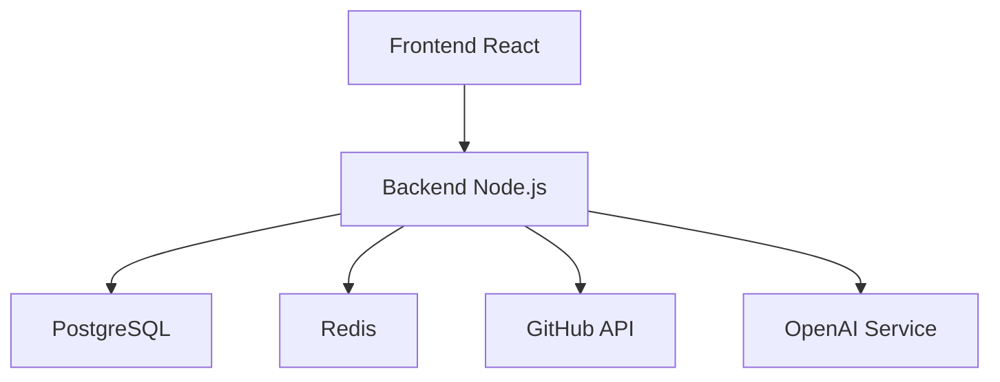

# Backstage Portal

## Descripción

El portal de desarrolladores Backstage es el componente central de la plataforma IA-Ops, proporcionando una interfaz unificada para gestionar servicios, documentación, APIs y flujos de CI/CD.

## Características

- **Catálogo de Servicios**: Gestión centralizada de todos los componentes
- **Documentación Automática**: Integración con TechDocs para documentación en tiempo real
- **GitHub Actions**: Visualización y gestión de pipelines de CI/CD
- **Integración con IA**: Chat integrado con OpenAI
- **Búsqueda Avanzada**: Búsqueda en tiempo real de componentes y documentación

## Arquitectura

## APIs Expuestas

- `/api/catalog` - Gestión del catálogo
- `/api/techdocs` - Documentación técnica
- `/api/auth` - Autenticación
- `/api/proxy` - Proxy para servicios externos

## GitHub Actions

Este componente incluye los siguientes workflows:

- **CI Pipeline**: Pruebas automáticas y linting
- **Build & Deploy**: Construcción y despliegue automático
- **Documentation**: Generación automática de documentación

## Configuración

Ver [configuración](../configuration.md) para detalles de configuración.

## Monitoreo

- **Métricas**: Prometheus metrics en `/metrics`
- **Health Check**: `/health`
- **Logs**: Structured logging con Winston
