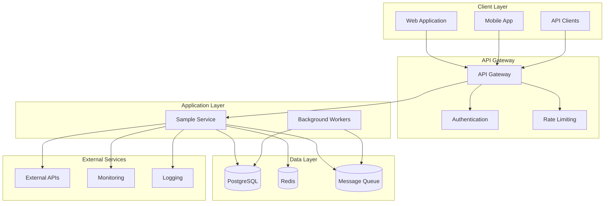
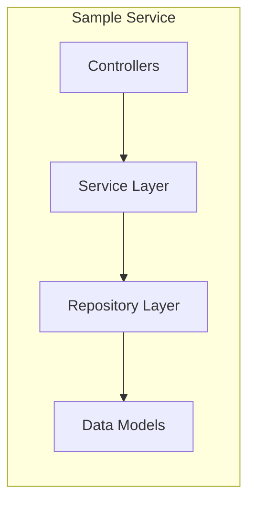
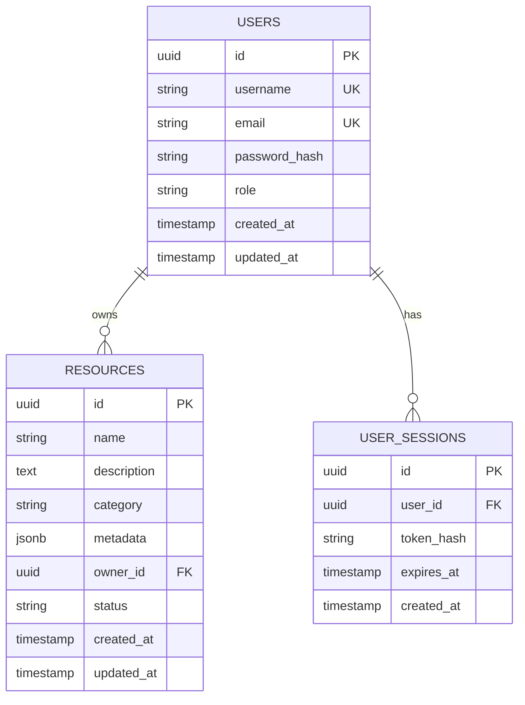
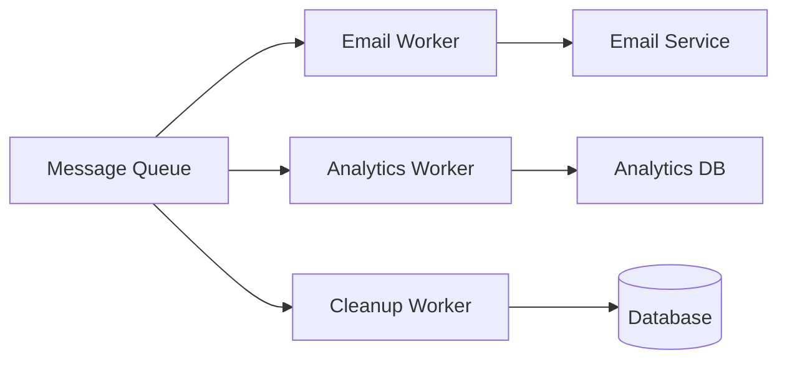
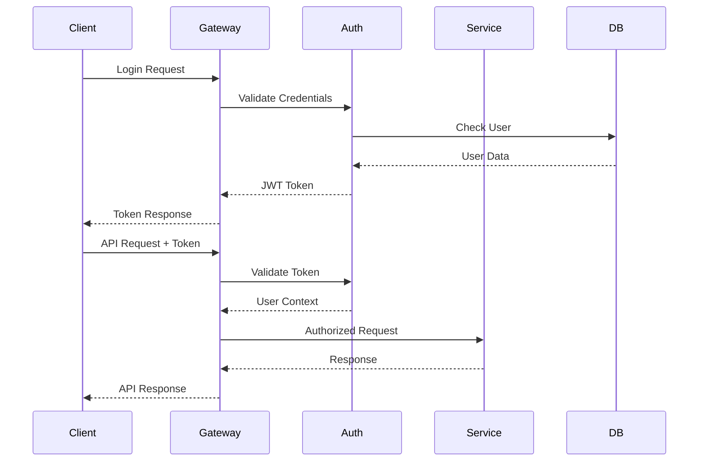
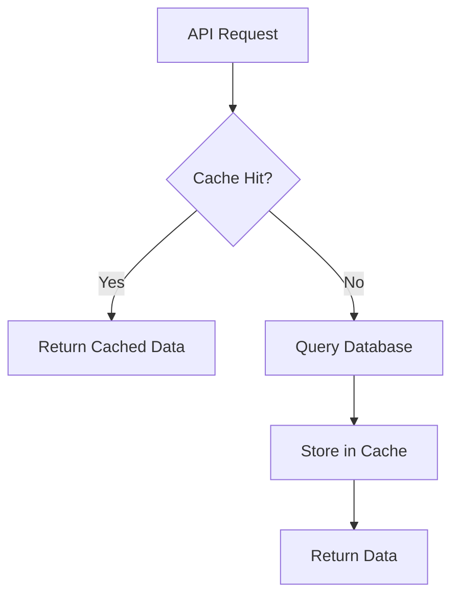
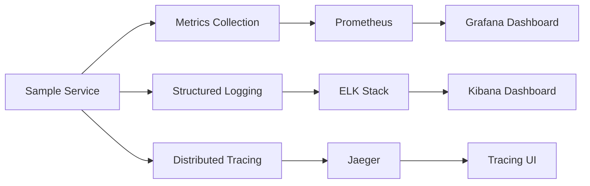

# Architecture

This document describes the architecture and design principles of the Sample Service.

## Overview

The Sample Service follows a microservices architecture pattern with clear separation of concerns and scalable design principles.

## System Architecture



## Components

### API Gateway

The API Gateway serves as the single entry point for all client requests:

- **Request Routing**: Routes requests to appropriate services
- **Authentication**: Validates JWT tokens and user permissions
- **Rate Limiting**: Prevents abuse and ensures fair usage
- **Request/Response Transformation**: Standardizes API formats
- **Monitoring**: Collects metrics and logs for all requests

### Sample Service

The core application service handles business logic:



#### Layers

1. **Controllers**: Handle HTTP requests and responses
2. **Service Layer**: Contains business logic and orchestration
3. **Repository Layer**: Data access abstraction
4. **Models**: Data structures and validation

### Data Storage

#### PostgreSQL Database

Primary data storage with the following schema design:



#### Redis Cache

Used for:
- Session storage
- API response caching
- Rate limiting counters
- Temporary data storage

### Background Workers

Asynchronous task processing:



## Design Principles

### 1. Separation of Concerns

Each component has a single responsibility:
- Controllers handle HTTP concerns
- Services contain business logic
- Repositories manage data access
- Models define data structures

### 2. Dependency Injection

All dependencies are injected, making the system:
- Testable
- Modular
- Configurable

### 3. Error Handling

Consistent error handling across all layers:

```javascript
class ServiceError extends Error {
  constructor(message, code, statusCode = 500) {
    super(message);
    this.code = code;
    this.statusCode = statusCode;
  }
}

// Usage
throw new ServiceError('User not found', 'USER_NOT_FOUND', 404);
```

### 4. Configuration Management

Environment-based configuration:

```javascript
const config = {
  database: {
    url: process.env.DATABASE_URL,
    pool: {
      min: parseInt(process.env.DB_POOL_MIN, 10) || 2,
      max: parseInt(process.env.DB_POOL_MAX, 10) || 10
    }
  },
  redis: {
    url: process.env.REDIS_URL,
    ttl: parseInt(process.env.CACHE_TTL, 10) || 3600
  }
};
```

## Security Architecture

### Authentication Flow



### Security Measures

1. **JWT Authentication**: Stateless token-based authentication
2. **Password Hashing**: bcrypt with salt rounds
3. **Input Validation**: Joi schema validation
4. **SQL Injection Prevention**: Parameterized queries
5. **CORS Configuration**: Restricted cross-origin requests
6. **Rate Limiting**: Prevent brute force attacks
7. **HTTPS Only**: All communication encrypted

## Performance Considerations

### Caching Strategy



### Database Optimization

- **Indexing**: Strategic indexes on frequently queried columns
- **Connection Pooling**: Efficient database connection management
- **Query Optimization**: Optimized SQL queries and joins
- **Pagination**: Limit result sets for large datasets

### Monitoring and Observability



## Deployment Architecture

### Container Strategy

```dockerfile
# Multi-stage build for optimization
FROM node:18-alpine AS builder
WORKDIR /app
COPY package*.json ./
RUN npm ci --only=production

FROM node:18-alpine AS runtime
WORKDIR /app
COPY --from=builder /app/node_modules ./node_modules
COPY . .
EXPOSE 3000
CMD ["npm", "start"]
```

### Kubernetes Deployment

```yaml
apiVersion: apps/v1
kind: Deployment
metadata:
  name: sample-service
spec:
  replicas: 3
  selector:
    matchLabels:
      app: sample-service
  template:
    metadata:
      labels:
        app: sample-service
    spec:
      containers:
      - name: sample-service
        image: sample-service:latest
        ports:
        - containerPort: 3000
        env:
        - name: DATABASE_URL
          valueFrom:
            secretKeyRef:
              name: db-secret
              key: url
```

## Scalability

### Horizontal Scaling

- **Stateless Design**: No server-side session storage
- **Load Balancing**: Multiple service instances
- **Database Sharding**: Partition data across multiple databases
- **Caching**: Reduce database load

### Vertical Scaling

- **Resource Optimization**: Efficient memory and CPU usage
- **Connection Pooling**: Optimize database connections
- **Async Processing**: Non-blocking I/O operations

!!! note "Future Enhancements"
    - Implement event sourcing for audit trails
    - Add GraphQL API alongside REST
    - Implement circuit breaker pattern
    - Add distributed caching with Redis Cluster
