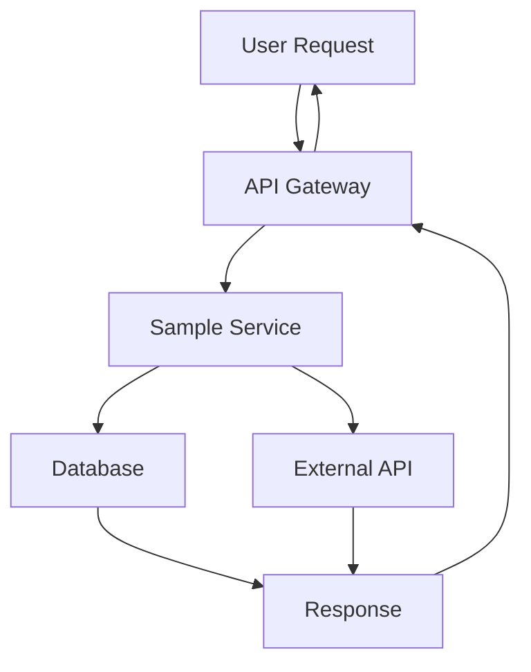

# Sample Service Documentation

Welcome to the Sample Service documentation! This service demonstrates the integration of MkDocs with Backstage TechDocs.

## Overview

This sample service showcases:

- **Modern Documentation**: Built with MkDocs and Material theme
- **Interactive Diagrams**: Using Mermaid for architecture diagrams
- **Code Highlighting**: Syntax highlighting for multiple languages
- **Search Functionality**: Full-text search across all documentation
- **Responsive Design**: Works on desktop and mobile devices

## Quick Start

!!! tip "Getting Started"
    Check out our [Getting Started](getting-started.md) guide to begin using this service.

## Features

### 📚 Rich Documentation
- Markdown-based documentation
- Code syntax highlighting
- Interactive examples
- Tabbed content

### 🎨 Beautiful UI
- Material Design theme
- Dark/light mode toggle
- Navigation tabs
- Search suggestions

### 📊 Diagrams and Charts

## Architecture

The Sample Service follows a microservices architecture pattern:

=== "Frontend"
    - React-based user interface
    - Material-UI components
    - Responsive design

=== "Backend"
    - Node.js with Express
    - RESTful API design
    - JWT authentication

=== "Database"
    - PostgreSQL for data persistence
    - Redis for caching
    - Connection pooling

## Getting Help

If you need help with this service:

1. Check the [API Reference](api.md)
2. Review the [Architecture](architecture.md) documentation
3. See [Deployment](deployment.md) instructions
4. Contact the development team

!!! warning "Important"
    This is a sample service for demonstration purposes. Do not use in production without proper security review.
