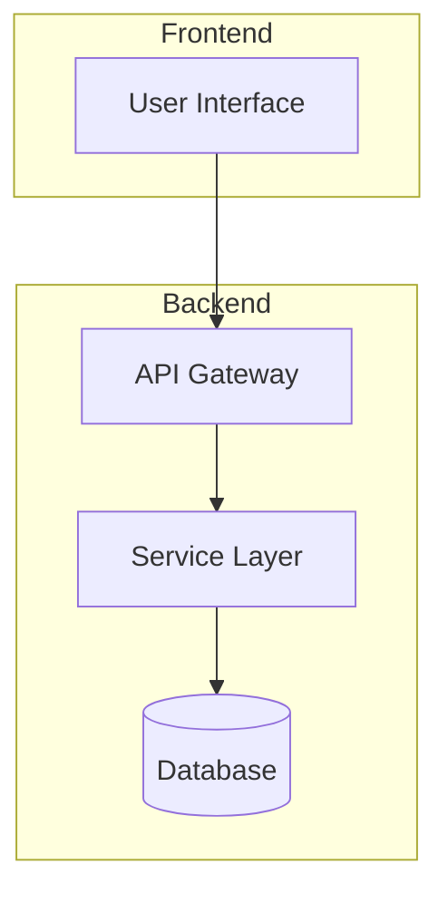

# Architecture

## Visión General

Frontend A for billpay application forma parte del ecosistema IA-Ops y sigue los patrones arquitectónicos establecidos.

## Componentes

### Core Components

- **Controller Layer**: Maneja las peticiones HTTP
- **Service Layer**: Lógica de negocio
- **Data Layer**: Acceso a datos

### Dependencies

- Base de datos
- Servicios externos
- Cache (Redis)

## Patrones de Diseño

- Repository Pattern
- Dependency Injection
- Event-Driven Architecture

## Diagramas

