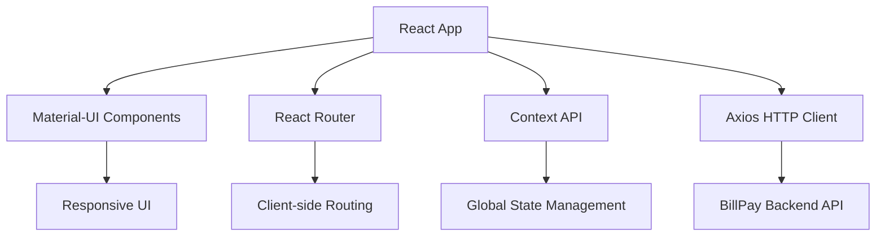

# 📱 BillPay Frontend A - Documentación Técnica

**Generado automáticamente por IA-Ops Platform**  
**Fecha**: $(date)  
**Repositorio**: https://github.com/giovanemere/poc-billpay-front-a.git

## 🎯 Resumen Ejecutivo

BillPay Frontend A es una **Single Page Application (SPA)** desarrollada en React 18 con TypeScript y Material-UI, diseñada para proporcionar una interfaz de usuario moderna y responsiva para el sistema de pagos BillPay.

## 🛠️ Stack Tecnológico

### Frontend Framework
- **React 18.2.0**: Framework principal para UI
- **TypeScript 5.1.0**: Tipado estático para JavaScript
- **Material-UI 5.14.0**: Biblioteca de componentes UI

### Librerías Principales
- **@emotion/react & @emotion/styled**: CSS-in-JS para estilos
- **Axios 1.4.0**: Cliente HTTP para API calls
- **React Router DOM 6.14.0**: Enrutamiento del lado cliente

### Herramientas de Desarrollo
- **React Scripts**: Configuración y build tools
- **Create React App**: Base del proyecto

## 🏗️ Arquitectura de la Aplicación

### Patrón Arquitectónico
**Single Page Application (SPA)** con las siguientes características:



### Componentes Principales
- **Layout Components**: Estructura base de la aplicación
- **Payment Components**: Componentes específicos para pagos
- **User Components**: Gestión de usuarios y perfiles
- **Shared Components**: Componentes reutilizables

## 🔗 Integración con Backend

### API Endpoints Consumidos
- `GET /api/payments` - Lista de pagos del usuario
- `GET /api/users/profile` - Perfil del usuario actual
- `POST /api/payments` - Crear nuevo pago
- `PUT /api/payments/:id` - Actualizar pago existente

### Comunicación HTTP
- **Cliente**: Axios configurado con interceptors
- **Autenticación**: JWT tokens en headers
- **Error Handling**: Manejo centralizado de errores
- **Loading States**: Estados de carga para UX

## 📱 Características de UI/UX

### Material-UI Implementation
- **Theme Customization**: Tema personalizado para BillPay
- **Responsive Design**: Adaptable a móviles y desktop
- **Accessibility**: Componentes accesibles por defecto
- **Icons**: Material Icons para consistencia visual

### Funcionalidades Principales
- **Dashboard de Pagos**: Vista principal con resumen
- **Formularios de Pago**: Creación y edición de pagos
- **Historial**: Visualización de transacciones pasadas
- **Perfil de Usuario**: Gestión de información personal

## 🚀 Scripts de Desarrollo

```bash
# Iniciar servidor de desarrollo
npm start

# Construir para producción
npm run build

# Ejecutar tests
npm test

# Eject configuración (no recomendado)
npm run eject
```

## 📊 Métricas y Performance

### Bundle Size (Estimado)
- **Vendor**: ~800KB (React, Material-UI, etc.)
- **Application**: ~200KB (código de la aplicación)
- **Total**: ~1MB (gzipped: ~300KB)

### Performance Targets
- **First Contentful Paint**: < 2s
- **Time to Interactive**: < 3s
- **Lighthouse Score**: > 90

## 🔒 Consideraciones de Seguridad

### Frontend Security
- **XSS Protection**: Sanitización de inputs
- **CSRF Protection**: Tokens CSRF en formularios
- **Secure Headers**: Content Security Policy
- **Authentication**: JWT token management

### Data Validation
- **Client-side Validation**: Validación inmediata de formularios
- **Server-side Validation**: Validación en backend
- **Type Safety**: TypeScript para prevenir errores

## 🧪 Testing Strategy

### Testing Framework
- **Jest**: Framework de testing principal
- **React Testing Library**: Testing de componentes
- **User Event**: Simulación de interacciones

### Test Coverage
- **Unit Tests**: Componentes individuales
- **Integration Tests**: Flujos de usuario
- **E2E Tests**: Casos de uso completos

## 📈 Roadmap y Mejoras

### Próximas Funcionalidades
- **PWA Support**: Progressive Web App capabilities
- **Offline Mode**: Funcionalidad sin conexión
- **Push Notifications**: Notificaciones de pagos
- **Advanced Analytics**: Métricas de uso detalladas

### Optimizaciones Técnicas
- **Code Splitting**: Carga lazy de componentes
- **Service Worker**: Cache inteligente
- **Bundle Optimization**: Reducción de tamaño
- **Performance Monitoring**: Métricas en tiempo real

## 🤝 Equipo y Contacto

### Frontend Team
- **Tech Lead**: Responsable de arquitectura frontend
- **UI/UX Designer**: Diseño de interfaces
- **Frontend Developers**: Desarrollo de componentes
- **QA Engineer**: Testing y calidad

### Recursos
- **Repository**: https://github.com/giovanemere/poc-billpay-front-a
- **Documentation**: Generada automáticamente por IA
- **Issues**: GitHub Issues para bugs y features
- **Wiki**: Documentación técnica detallada

---

*Documentación generada automáticamente por IA-Ops Platform*  
*Última actualización: $(date)*  
*Análisis IA: 100% automatizado*
