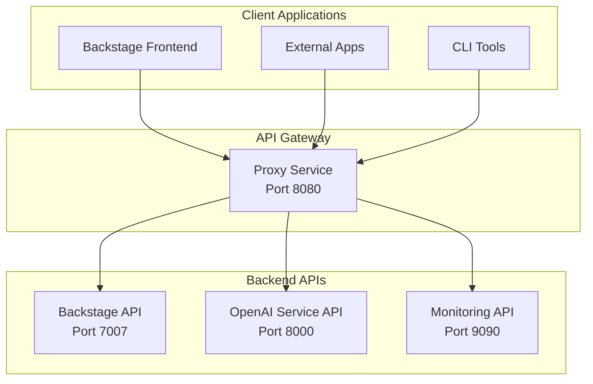

# API Reference

## Introducción

IA-Ops Platform expone varias APIs REST para interactuar con los diferentes servicios de la plataforma. Esta documentación proporciona información detallada sobre todos los endpoints disponibles.

## Arquitectura de APIs



## Base URLs

| Servicio | URL Base | Descripción |
|----------|----------|-------------|
| **Proxy Service** | `http://localhost:8080` | Gateway principal |
| **Backstage Backend** | `http://localhost:7007` | API de Backstage |
| **OpenAI Service** | `http://localhost:8000` | Servicios de IA |
| **Prometheus** | `http://localhost:9090` | Métricas y monitoreo |

## Autenticación

### GitHub OAuth

La mayoría de las APIs requieren autenticación a través de GitHub OAuth:

```http
GET /api/auth/github
Authorization: Bearer <github-token>
```

### API Keys

Para servicios externos, se pueden usar API keys:

```http
GET /api/openai/chat
X-API-Key: <your-api-key>
Content-Type: application/json
```

## Rate Limiting

Todas las APIs implementan rate limiting:

| Endpoint | Límite | Ventana |
|----------|--------|---------|
| `/api/auth/*` | 10 requests | 1 minuto |
| `/api/catalog/*` | 100 requests | 1 minuto |
| `/api/openai/*` | 60 requests | 1 minuto |
| `/api/techdocs/*` | 200 requests | 1 minuto |

### Headers de Rate Limiting

```http
X-RateLimit-Limit: 100
X-RateLimit-Remaining: 95
X-RateLimit-Reset: 1640995200
```

## Formatos de Respuesta

### Respuesta Exitosa

```json
{
  "success": true,
  "data": {
    // Datos de respuesta
  },
  "meta": {
    "timestamp": "2025-01-06T18:00:00Z",
    "version": "1.0.0"
  }
}
```

### Respuesta de Error

```json
{
  "success": false,
  "error": {
    "code": "VALIDATION_ERROR",
    "message": "Invalid request parameters",
    "details": {
      "field": "email",
      "reason": "Invalid email format"
    }
  },
  "meta": {
    "timestamp": "2025-01-06T18:00:00Z",
    "request_id": "req_123456789"
  }
}
```

## Códigos de Estado HTTP

| Código | Descripción | Uso |
|--------|-------------|-----|
| `200` | OK | Operación exitosa |
| `201` | Created | Recurso creado exitosamente |
| `400` | Bad Request | Parámetros inválidos |
| `401` | Unauthorized | Autenticación requerida |
| `403` | Forbidden | Sin permisos suficientes |
| `404` | Not Found | Recurso no encontrado |
| `429` | Too Many Requests | Rate limit excedido |
| `500` | Internal Server Error | Error interno del servidor |

## APIs Principales

### 1. Backstage Catalog API

Gestión del catálogo de componentes y servicios.

**Base URL**: `/api/catalog`

#### Endpoints Principales:

- `GET /entities` - Listar todas las entidades
- `GET /entities/{kind}/{namespace}/{name}` - Obtener entidad específica
- `POST /entities` - Crear nueva entidad
- `PUT /entities/{kind}/{namespace}/{name}` - Actualizar entidad
- `DELETE /entities/{kind}/{namespace}/{name}` - Eliminar entidad

### 2. OpenAI Service API

Servicios de inteligencia artificial.

**Base URL**: `/api/openai`

#### Endpoints Principales:

- `POST /chat/completions` - Chat con IA
- `POST /code/analyze` - Análisis de código
- `POST /docs/generate` - Generar documentación
- `POST /embeddings` - Generar embeddings

### 3. TechDocs API

Gestión de documentación técnica.

**Base URL**: `/api/techdocs`

#### Endpoints Principales:

- `GET /docs/{namespace}/{kind}/{name}` - Obtener documentación
- `POST /docs/build` - Construir documentación
- `GET /static/docs/{path}` - Archivos estáticos

### 4. Scaffolder API

Plantillas y generación de código.

**Base URL**: `/api/scaffolder`

#### Endpoints Principales:

- `GET /templates` - Listar plantillas
- `POST /tasks` - Crear nueva tarea
- `GET /tasks/{taskId}` - Estado de tarea
- `GET /actions` - Acciones disponibles

## Webhooks

### GitHub Webhooks

La plataforma puede recibir webhooks de GitHub para automatizar procesos:

```http
POST /api/webhooks/github
Content-Type: application/json
X-GitHub-Event: push
X-Hub-Signature-256: sha256=...

{
  "action": "opened",
  "repository": {
    "name": "my-repo",
    "full_name": "user/my-repo"
  },
  "pull_request": {
    // PR data
  }
}
```

### Eventos Soportados:

- `push` - Cambios en el código
- `pull_request` - Pull requests
- `issues` - Issues de GitHub
- `release` - Nuevos releases

## SDKs y Clientes

### JavaScript/TypeScript

```typescript
import { BackstageApi } from '@ia-ops/backstage-client';

const client = new BackstageApi({
  baseUrl: 'http://localhost:7007',
  token: 'your-github-token'
});

// Obtener entidades
const entities = await client.catalog.getEntities();

// Crear componente
const component = await client.catalog.createEntity({
  apiVersion: 'backstage.io/v1alpha1',
  kind: 'Component',
  metadata: {
    name: 'my-service'
  }
});
```

### Python

```python
from ia_ops_client import BackstageClient

client = BackstageClient(
    base_url='http://localhost:7007',
    token='your-github-token'
)

# Obtener entidades
entities = client.catalog.get_entities()

# Análisis de código con IA
analysis = client.openai.analyze_code(
    code="def hello(): return 'world'",
    language="python"
)
```

### cURL Examples

```bash
# Obtener todas las entidades
curl -H "Authorization: Bearer $GITHUB_TOKEN" \
     http://localhost:7007/api/catalog/entities

# Chat con IA
curl -X POST \
     -H "Content-Type: application/json" \
     -H "Authorization: Bearer $GITHUB_TOKEN" \
     -d '{"message": "Explain this code", "code": "console.log(\"hello\")"}' \
     http://localhost:8080/api/openai/chat
```

## Monitoreo de APIs

### Health Checks

Todos los servicios exponen endpoints de health check:

```http
GET /health
```

**Respuesta**:
```json
{
  "status": "healthy",
  "timestamp": "2025-01-06T18:00:00Z",
  "services": {
    "database": "healthy",
    "redis": "healthy",
    "external_apis": "healthy"
  },
  "version": "1.0.0"
}
```

### Métricas

Las métricas están disponibles en formato Prometheus:

```http
GET /metrics
```

### Logging

Todos los requests se registran con el siguiente formato:

```json
{
  "timestamp": "2025-01-06T18:00:00Z",
  "method": "GET",
  "path": "/api/catalog/entities",
  "status": 200,
  "duration": 150,
  "user_id": "user123",
  "request_id": "req_123456789"
}
```

## Versionado de API

Las APIs siguen versionado semántico:

- **URL Versioning**: `/api/v1/catalog/entities`
- **Header Versioning**: `Accept: application/vnd.api+json;version=1`

### Política de Deprecación

- Las versiones se mantienen por al menos 6 meses
- Los cambios breaking requieren nueva versión mayor
- Los cambios compatibles pueden usar versión menor

## Límites y Cuotas

| Recurso | Límite | Descripción |
|---------|--------|-------------|
| **Request Size** | 10 MB | Tamaño máximo de request |
| **Response Size** | 50 MB | Tamaño máximo de response |
| **Timeout** | 30 segundos | Timeout de request |
| **Concurrent Requests** | 100 | Requests concurrentes por usuario |

## Seguridad

### HTTPS

Todas las APIs en producción deben usar HTTPS:

```http
GET https://api.ia-ops.com/catalog/entities
```

### CORS

Las APIs soportan CORS para aplicaciones web:

```http
Access-Control-Allow-Origin: https://backstage.ia-ops.com
Access-Control-Allow-Methods: GET, POST, PUT, DELETE
Access-Control-Allow-Headers: Authorization, Content-Type
```

### Content Security Policy

```http
Content-Security-Policy: default-src 'self'; script-src 'self' 'unsafe-inline'
```

## Ejemplos Avanzados

### Búsqueda Avanzada en Catálogo

```http
GET /api/catalog/entities?filter=kind=component,spec.type=service&fields=metadata.name,spec.owner
```

### Análisis de Código con Contexto

```http
POST /api/openai/code/analyze
Content-Type: application/json

{
  "code": "function calculateTotal(items) { return items.reduce((sum, item) => sum + item.price, 0); }",
  "language": "javascript",
  "context": {
    "framework": "react",
    "purpose": "e-commerce"
  },
  "analysis_type": ["security", "performance", "best_practices"]
}
```

### Generación de Documentación Automática

```http
POST /api/openai/docs/generate
Content-Type: application/json

{
  "repository": "https://github.com/user/repo",
  "branch": "main",
  "paths": ["src/", "lib/"],
  "format": "markdown",
  "sections": ["overview", "api", "examples"]
}
```

## Próximos Pasos

- [Endpoints Detallados](endpoints.md) - Documentación completa de todos los endpoints
- [Guías de Integración](../guides/) - Cómo integrar con sistemas externos
- [Ejemplos de Código](https://github.com/giovanemere/ia-ops/tree/main/examples) - Ejemplos prácticos

## Soporte

Para soporte con las APIs:

- **Documentación**: Esta documentación
- **Issues**: [GitHub Issues](https://github.com/giovanemere/ia-ops/issues)
- **Discussions**: [GitHub Discussions](https://github.com/giovanemere/ia-ops/discussions)
- **Email**: api-support@ia-ops.com
