# Arquitectura del Sistema

## Visión General

IA-Ops Platform está diseñada como una arquitectura de microservicios moderna que combina las mejores prácticas de DevOps con capacidades avanzadas de Inteligencia Artificial.

## Arquitectura de Alto Nivel

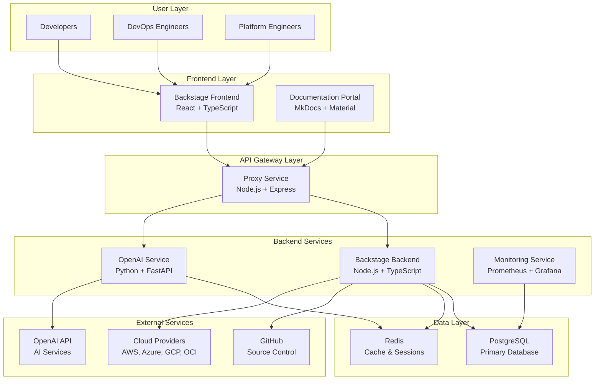

## Componentes Principales

### 1. Frontend Layer

#### Backstage Frontend
- **Tecnología**: React 18+ con TypeScript
- **Propósito**: Portal principal para desarrolladores
- **Características**:
  - Catálogo de servicios y componentes
  - Plantillas de scaffolding
  - Documentación técnica integrada
  - Dashboard de métricas y monitoreo

#### Documentation Portal
- **Tecnología**: MkDocs con Material Theme
- **Propósito**: Documentación técnica centralizada
- **Características**:
  - Documentación versionada
  - Búsqueda avanzada
  - Diagramas interactivos con Mermaid
  - Integración con TechDocs

### 2. API Gateway Layer

#### Proxy Service
- **Tecnología**: Node.js con Express
- **Propósito**: Gateway unificado para todos los servicios
- **Características**:
  - Rate limiting
  - Authentication proxy
  - Load balancing
  - Request/Response logging

### 3. Backend Services

#### Backstage Backend
- **Tecnología**: Node.js con TypeScript
- **Base de datos**: PostgreSQL
- **Características**:
  - Catalog API
  - Scaffolder API
  - TechDocs API
  - Plugin system
  - Multi-cloud integration

#### OpenAI Service
- **Tecnología**: Python con FastAPI
- **Cache**: Redis
- **Características**:
  - Chat completions
  - Code analysis
  - Documentation generation
  - Embeddings for search

#### Monitoring Service
- **Tecnología**: Prometheus + Grafana
- **Características**:
  - Metrics collection
  - Alerting
  - Custom dashboards
  - Service health monitoring

### 4. Data Layer

#### PostgreSQL
- **Versión**: 15+
- **Propósito**: Base de datos principal
- **Esquemas**:
  - Backstage catalog
  - User management
  - Plugin data
  - Audit logs

#### Redis
- **Versión**: 7+
- **Propósito**: Cache y sesiones
- **Uso**:
  - Session storage
  - API response caching
  - Rate limiting counters
  - Temporary data storage

## Patrones de Arquitectura

### 1. Microservices Pattern

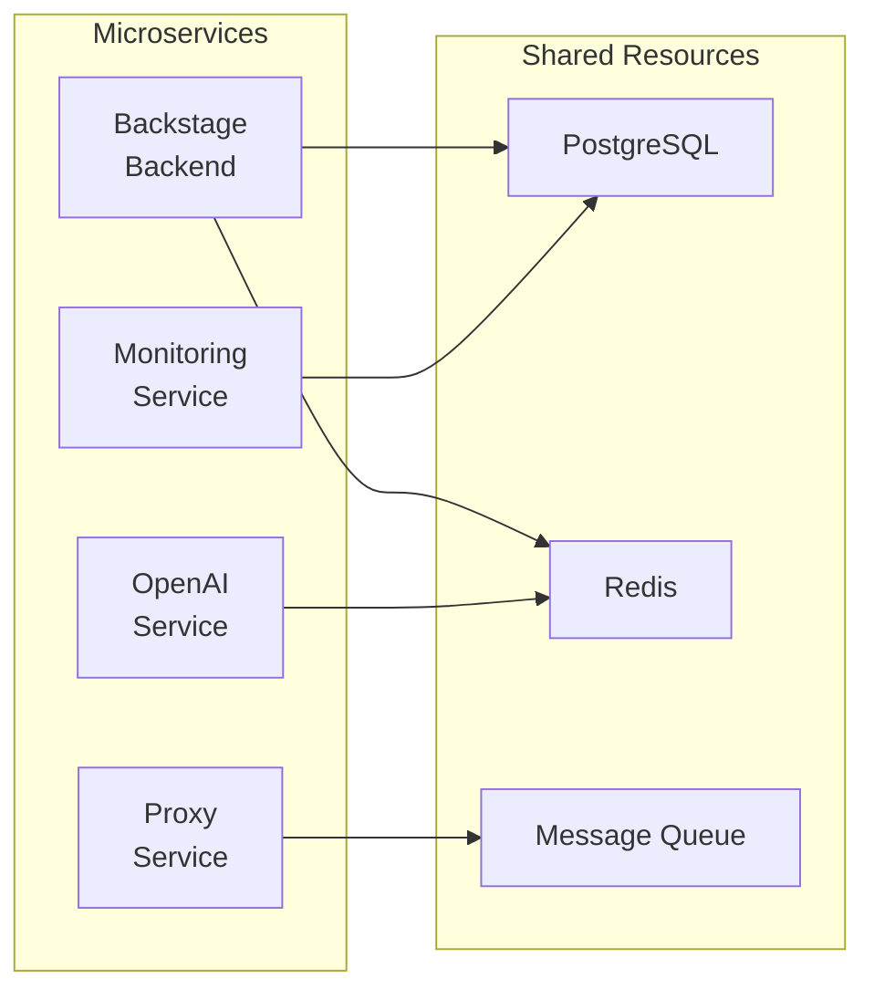

**Beneficios**:
- Escalabilidad independiente
- Tecnologías heterogéneas
- Despliegue independiente
- Tolerancia a fallos

### 2. API Gateway Pattern

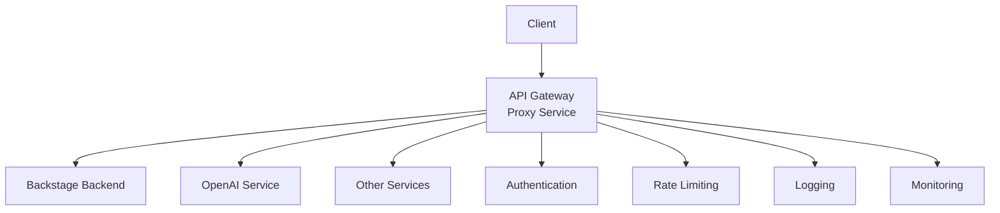

**Beneficios**:
- Punto único de entrada
- Cross-cutting concerns centralizados
- Versionado de API
- Seguridad centralizada

### 3. Plugin Architecture

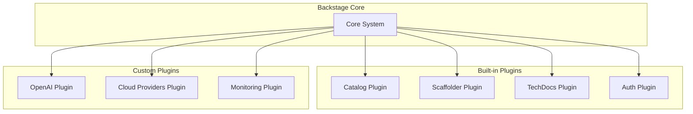

## Flujo de Datos

### 1. User Authentication Flow

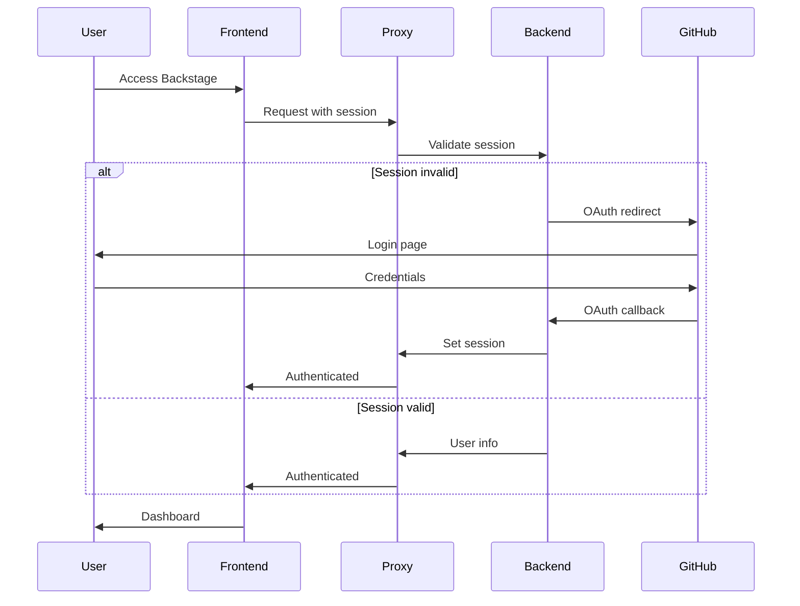

### 2. OpenAI Integration Flow

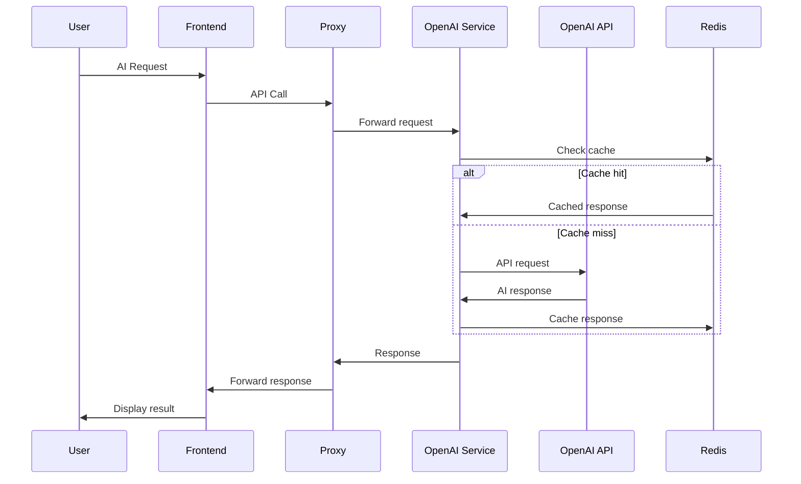

### 3. Documentation Generation Flow

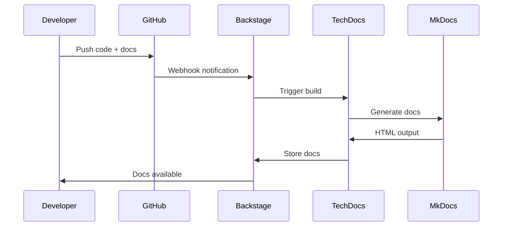

## Seguridad

### 1. Authentication & Authorization

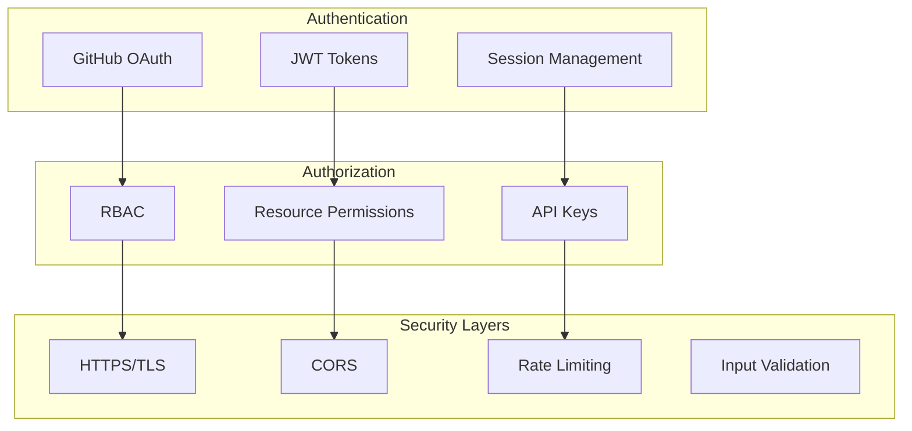

### 2. Security Best Practices

- **Secrets Management**: Variables de entorno y servicios de secretos
- **Network Security**: Comunicación HTTPS, VPN para producción
- **Data Encryption**: Datos en tránsito y en reposo
- **Access Control**: Principio de menor privilegio
- **Audit Logging**: Registro de todas las acciones críticas

## Escalabilidad

### 1. Horizontal Scaling

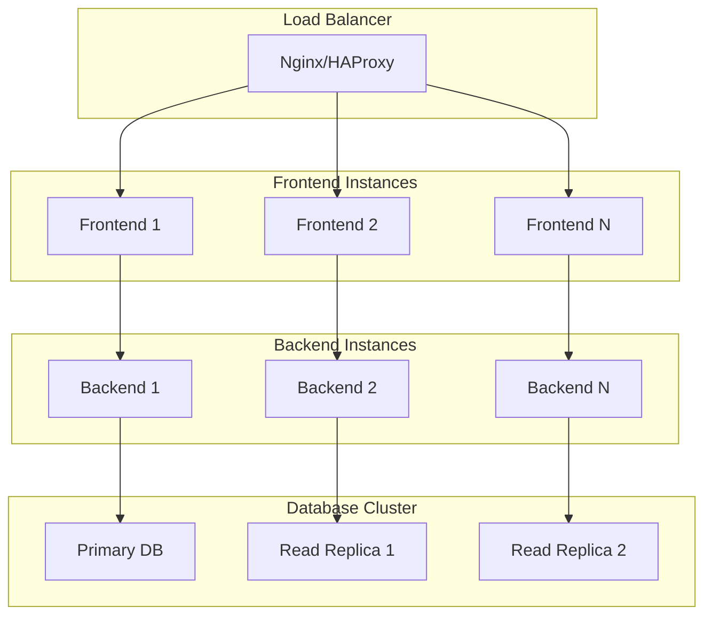

### 2. Caching Strategy

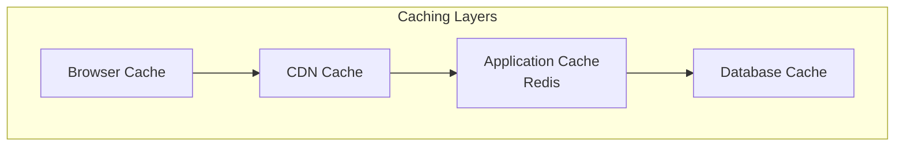

## Monitoreo y Observabilidad

### 1. Monitoring Stack

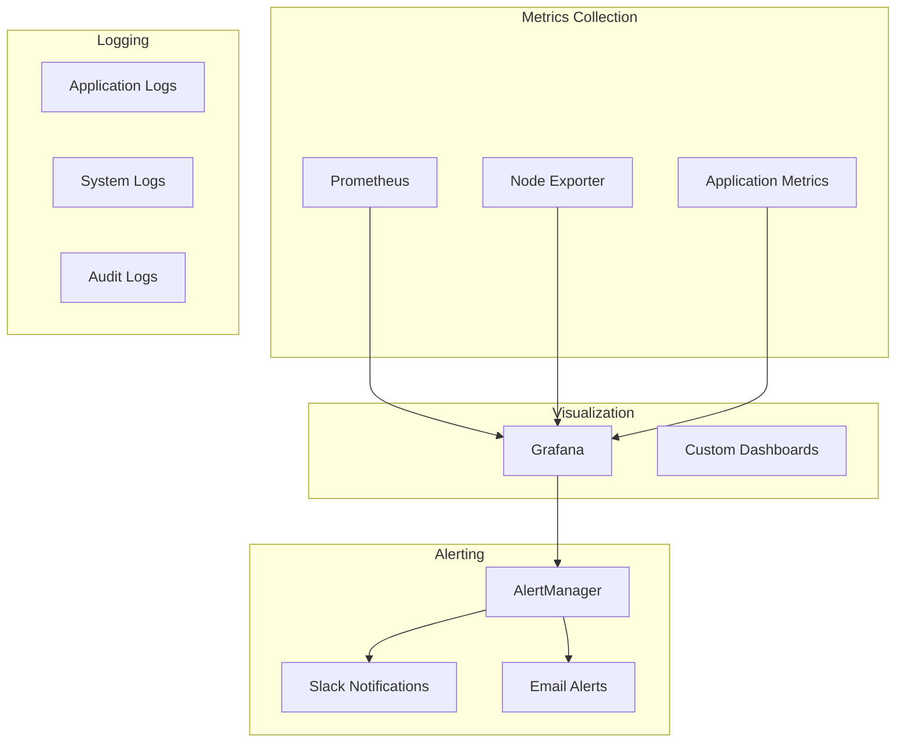

### 2. Key Metrics

- **Application Metrics**:
  - Request rate and latency
  - Error rates
  - User sessions
  - API usage

- **Infrastructure Metrics**:
  - CPU and memory usage
  - Disk I/O
  - Network traffic
  - Container health

- **Business Metrics**:
  - User adoption
  - Feature usage
  - Documentation views
  - AI service usage

## Despliegue

### 1. Container Architecture

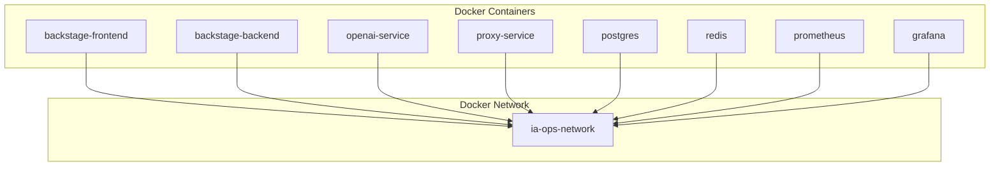

### 2. Kubernetes Deployment

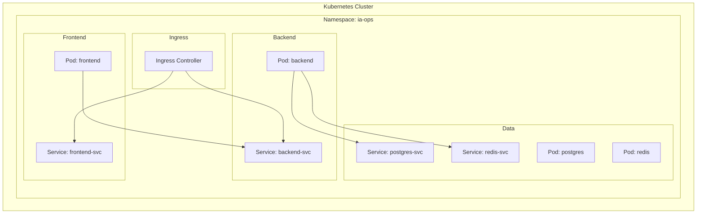

## Consideraciones de Producción

### 1. High Availability

- **Database**: Configuración Master-Slave con failover automático
- **Application**: Múltiples instancias con load balancing
- **Cache**: Redis Cluster para alta disponibilidad
- **Monitoring**: Redundancia en sistemas de monitoreo

### 2. Disaster Recovery

- **Backups**: Backups automáticos de base de datos
- **Replication**: Replicación cross-region
- **Recovery**: Procedimientos de recuperación documentados
- **Testing**: Pruebas regulares de disaster recovery

### 3. Performance Optimization

- **Database**: Índices optimizados, query optimization
- **Caching**: Estrategias de cache multi-nivel
- **CDN**: Content Delivery Network para assets estáticos
- **Compression**: Compresión de respuestas HTTP

## Roadmap Técnico

### Fase 1: Foundation (Actual)
- ✅ Arquitectura básica de microservicios
- ✅ Integración con GitHub y OpenAI
- ✅ Documentación con TechDocs
- ✅ Monitoreo básico

### Fase 2: Enhancement (Q2 2025)
- 🔄 Kubernetes deployment
- 🔄 Advanced monitoring y alerting
- 🔄 Multi-cloud integration completa
- 🔄 CI/CD pipelines automatizados

### Fase 3: Scale (Q3 2025)
- 📋 Auto-scaling capabilities
- 📋 Advanced security features
- 📋 Machine learning pipelines
- 📋 Advanced analytics

### Fase 4: Innovation (Q4 2025)
- 📋 AI-powered development assistance
- 📋 Predictive analytics
- 📋 Advanced automation
- 📋 Edge computing support

## Conclusión

La arquitectura de IA-Ops Platform está diseñada para ser:

- **Escalable**: Puede crecer con las necesidades del negocio
- **Mantenible**: Código limpio y bien documentado
- **Extensible**: Fácil agregar nuevas funcionalidades
- **Resiliente**: Tolerante a fallos y con recuperación automática
- **Segura**: Implementa las mejores prácticas de seguridad

Esta arquitectura proporciona una base sólida para una plataforma de desarrollo moderna que combina DevOps tradicional con capacidades de IA avanzadas.
