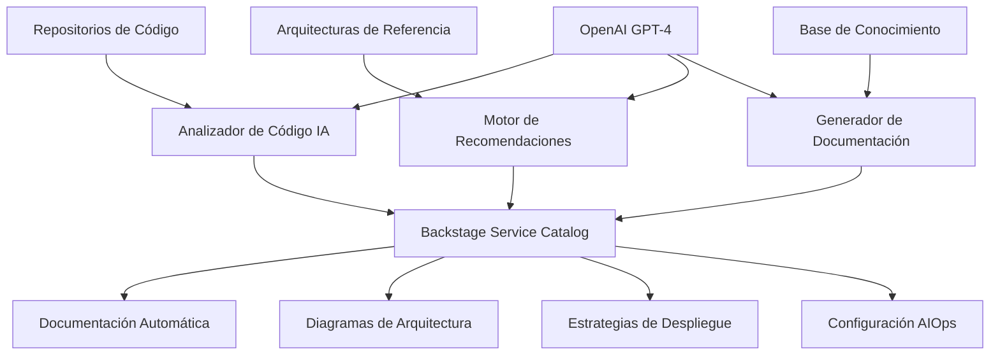
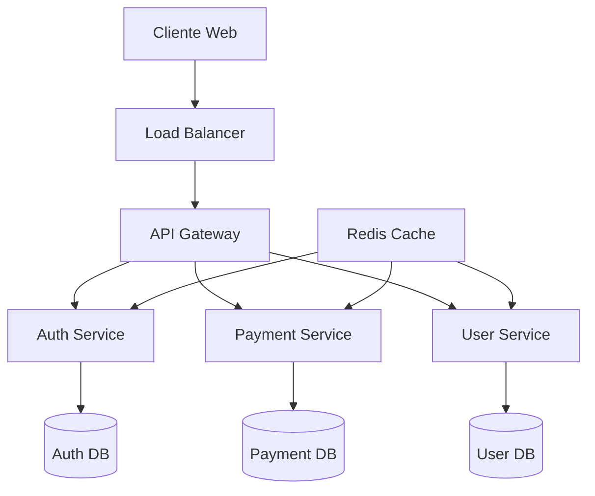

# 🤖 Caso de Negocio: Asistente DevOps con IA

**Fecha de Creación**: 8 de Agosto de 2025  
**Versión**: 1.0.0  
**Estado**: 🔄 En Desarrollo

---

## 📋 Resumen Ejecutivo

### **Objetivo Principal**
Desarrollar un asistente de DevOps experto en automatización y documentación que genere documentación detallada y coherente para aplicaciones empresariales, integrando inteligencia artificial para optimizar procesos de desarrollo y operaciones.

### **Valor de Negocio**
- **Reducción de Tiempo**: 80% menos tiempo en documentación manual
- **Consistencia**: Documentación estandarizada y coherente
- **Calidad**: Análisis automático y recomendaciones expertas
- **Escalabilidad**: Capacidad de procesar múltiples aplicaciones simultáneamente

---

## 🎯 Definición del Problema

### **Desafíos Actuales**
1. **Documentación Inconsistente**: Cada equipo documenta de manera diferente
2. **Tiempo Excesivo**: Documentación manual consume 40-60% del tiempo de desarrollo
3. **Conocimiento Fragmentado**: Arquitecturas y patrones dispersos en múltiples fuentes
4. **Falta de Estándares**: No hay un proceso unificado para análisis arquitectónico

### **Impacto en el Negocio**
- **Costos Elevados**: $50,000+ anuales en tiempo de documentación por equipo
- **Time-to-Market**: Retrasos de 2-4 semanas por proyecto
- **Calidad Variable**: 30% de documentación desactualizada o incorrecta
- **Onboarding Lento**: 3-6 meses para nuevos desarrolladores

---

## 🏗️ Arquitectura de la Solución

### **Componentes Principales**



### **Stack Tecnológico**

#### **Plataforma Base**
- **Backstage**: Portal de desarrollador y catálogo de servicios
- **PostgreSQL**: Base de datos principal
- **Redis**: Cache y sesiones
- **Docker**: Containerización

#### **Inteligencia Artificial**
- **OpenAI GPT-4**: Análisis de código y generación de documentación
- **LangChain**: Orquestación de LLMs
- **Vector Database**: Búsqueda semántica (Pinecone/Chroma)
- **Embeddings**: text-embedding-ada-002

#### **Análisis y Procesamiento**
- **AST Parsers**: Análisis estático de código
- **Git Integration**: Análisis de repositorios
- **YAML/JSON Processors**: Configuraciones y metadatos

---

## 📊 Fuentes de Datos

### **1. Inventario de Aplicaciones**
- **Archivo**: `ia-ops-framework/apps/Listado Aplicaciones DevOps.xlsx`
- **Contenido**: 
  - Catálogo completo de aplicaciones empresariales
  - Metadatos de tecnologías utilizadas
  - Información de equipos y responsables
  - Estados de desarrollo y producción

### **2. Arquitecturas de Referencia**
- **Repositorio**: https://github.com/giovanemere/ia-ops-framework.git
- **Ubicación**: `docs/arquitecturas-referencia/`
- **Patrones Disponibles**:

| Archivo | Descripción | Casos de Uso |
|---------|-------------|--------------|
| `01-dns-architecture.md` | Arquitectura DNS | Resolución de nombres, balanceo |
| `02-deployment-strategies-architecture.md` | Estrategias de despliegue | Blue-Green, Canary, Rolling |
| `03-serverless-architecture.md` | Arquitectura Serverless | Functions, Event-driven |
| `04-iac-architecture.md` | Infrastructure as Code | Terraform, CloudFormation |
| `05-onpremise-architecture.md` | Arquitectura On-Premise | Datacenters, Hybrid Cloud |
| `06-gitops-architecture.md` | GitOps | ArgoCD, Flux, CI/CD |
| `07-database-architecture.md` | Arquitectura de Datos | SQL, NoSQL, Data Lakes |
| `08-weblogic-architecture.md` | WebLogic | Aplicaciones Java EE |
| `09-other-architectures.md` | Otras Arquitecturas | Microservicios, Monolitos |
| `10-diagrams-as-code-best-practices.md` | Diagramas como Código | Mermaid, PlantUML |

### **3. Aplicaciones Existentes**

#### **Sistema BillPay**
- **Backend**: https://github.com/giovanemere/poc-billpay-back
  - Tecnología: Node.js + Express
  - Base de datos: PostgreSQL
  - APIs REST para pagos
  
- **Frontend A**: https://github.com/giovanemere/poc-billpay-front-a.git
  - Tecnología: React 18
  - UI/UX: Material-UI
  - Funcionalidades: Dashboard principal
  
- **Frontend B**: https://github.com/giovanemere/poc-billpay-front-b.git
  - Tecnología: React 18
  - UI/UX: Alternativa de diseño
  - Funcionalidades: Vista simplificada
  
- **Feature Flags**: https://github.com/giovanemere/poc-billpay-front-feature-flags.git
  - Tecnología: React + Feature Toggle
  - Funcionalidades: A/B Testing

#### **Sistema ICBS**
- **Repositorio**: https://github.com/giovanemere/poc-icbs.git
- **Descripción**: Sistema bancario core
- **Tecnologías**: Java + Spring Boot
- **Funcionalidades**: Operaciones bancarias

### **4. Arquitectura AIOps**
- **Ubicación**: `backstage_openwebui/docs/arquitectura`
- **Contenido**: Definiciones para operaciones con IA
- **Componentes**: Monitoreo, alertas, análisis predictivo

---

## 🔄 Flujo de Procesamiento

### **Fase 1: Análisis Automático**

#### **1.1 Ingesta de Código**
```python
# Pseudocódigo del proceso
def analyze_repository(repo_url):
    # Clonar repositorio
    repo = git.clone(repo_url)
    
    # Análizar estructura
    structure = analyze_project_structure(repo)
    
    # Extraer dependencias
    dependencies = extract_dependencies(repo)
    
    # Identificar tecnologías
    tech_stack = identify_technologies(repo)
    
    return {
        'structure': structure,
        'dependencies': dependencies,
        'tech_stack': tech_stack
    }
```

#### **1.2 Análisis con IA**
```python
def ai_analysis(repo_data):
    # Preparar contexto para LLM
    context = prepare_context(repo_data)
    
    # Análisis con GPT-4
    analysis = openai.chat.completions.create(
        model="gpt-4",
        messages=[
            {"role": "system", "content": "Eres un experto en arquitectura de software..."},
            {"role": "user", "content": f"Analiza esta aplicación: {context}"}
        ]
    )
    
    return parse_analysis_response(analysis)
```

### **Fase 2: Selección de Arquitectura**

#### **2.1 Comparación con Patrones**
```python
def select_reference_architecture(analysis):
    # Cargar arquitecturas de referencia
    reference_patterns = load_reference_architectures()
    
    # Calcular similitud
    similarities = []
    for pattern in reference_patterns:
        similarity = calculate_similarity(analysis, pattern)
        similarities.append((pattern, similarity))
    
    # Seleccionar mejor match
    best_match = max(similarities, key=lambda x: x[1])
    return best_match[0]
```

#### **2.2 Personalización**
```python
def customize_architecture(base_architecture, app_requirements):
    # Adaptar arquitectura base
    customized = adapt_architecture(base_architecture, app_requirements)
    
    # Generar recomendaciones específicas
    recommendations = generate_recommendations(customized)
    
    return {
        'architecture': customized,
        'recommendations': recommendations
    }
```

### **Fase 3: Generación de Documentación**

#### **3.1 Componentes Utilizados**
```markdown
## Componentes Utilizados

### Frontend
- **React 18.2.0**: Framework SPA para interfaz de usuario
  - Hooks para gestión de estado
  - Context API para datos globales
  - React Router para navegación

### Backend  
- **Node.js 18**: Runtime de JavaScript del lado servidor
- **Express 4.18**: Framework web minimalista
- **JWT**: Autenticación basada en tokens

### Base de Datos
- **PostgreSQL 15**: Base de datos relacional
  - Esquemas normalizados
  - Índices optimizados
  - Conexiones pooling
```

#### **3.2 Diagramas Automáticos**


#### **3.3 Estrategias de Despliegue**
```yaml
deployment_strategies:
  production:
    strategy: "blue-green"
    reason: "Zero downtime crítico para pagos"
    configuration:
      health_check_path: "/health"
      readiness_timeout: "30s"
      rollback_threshold: "5%"
  
  staging:
    strategy: "rolling"
    reason: "Ambiente de pruebas, downtime aceptable"
    configuration:
      max_unavailable: "25%"
      max_surge: "25%"
```

### **Fase 4: Integración AIOps**

#### **4.1 Métricas Recomendadas**
```yaml
metrics:
  application:
    - name: "response_time_p95"
      threshold: "< 500ms"
      alert_level: "warning"
    
    - name: "error_rate"
      threshold: "< 1%"
      alert_level: "critical"
    
    - name: "throughput_rps"
      threshold: "> 100 rps"
      alert_level: "info"

  infrastructure:
    - name: "cpu_utilization"
      threshold: "< 80%"
      alert_level: "warning"
    
    - name: "memory_usage"
      threshold: "< 85%"
      alert_level: "warning"
```

#### **4.2 Configuración de Logs**
```yaml
logging:
  application_logs:
    level: "info"
    format: "json"
    fields:
      - timestamp
      - level
      - message
      - user_id
      - request_id
      - trace_id
  
  access_logs:
    format: "combined"
    retention: "30 days"
    
  error_logs:
    level: "error"
    notification: "slack"
    retention: "90 days"
```

---

## 📈 Casos de Uso Específicos

### **Caso de Uso 1: Análisis de BillPay Backend**

#### **Input**
- Repositorio: https://github.com/giovanemere/poc-billpay-back
- Tecnologías detectadas: Node.js, Express, PostgreSQL

#### **Procesamiento IA**
```
Análisis automático detecta:
- Patrón MVC en estructura de carpetas
- APIs REST con validación de entrada
- Conexión a base de datos PostgreSQL
- Middleware de autenticación JWT
- Tests unitarios con Jest
```

#### **Output Generado**
```markdown
# Documentación: BillPay Backend Service

## Componentes Utilizados
- **Node.js 18**: Runtime principal del servidor
- **Express 4.18**: Framework web para APIs REST
- **PostgreSQL 15**: Base de datos transaccional
- **JWT**: Sistema de autenticación
- **Jest**: Framework de testing

## Arquitectura de Referencia Aplicable
**Patrón**: API-First Microservice Architecture

### Justificación
Esta aplicación implementa un microservicio especializado en pagos que:
- Expone APIs REST bien definidas
- Maneja transacciones críticas
- Requiere alta disponibilidad
- Necesita escalabilidad horizontal

## Estrategias de Despliegue Recomendadas
### Blue-Green Deployment
- **Razón**: Transacciones de pago requieren zero downtime
- **Configuración**: Health checks en /health endpoint
- **Rollback**: Automático si error rate > 0.5%

## Integración AIOps
### Métricas Críticas
- Payment success rate > 99.9%
- Response time < 200ms
- Database connection pool < 80%

### Logs Requeridos
- Transaction logs (audit trail)
- Error logs (payment failures)
- Performance logs (slow queries)

### Alertas Configuradas
- CRITICAL: Payment service down
- WARNING: High response time (> 500ms)
- INFO: Unusual transaction volume
```

### **Caso de Uso 2: Análisis de ICBS System**

#### **Input**
- Repositorio: https://github.com/giovanemere/poc-icbs.git
- Tecnologías detectadas: Java, Spring Boot, Oracle DB

#### **Output Esperado**
```markdown
# Documentación: ICBS Core Banking System

## Componentes Utilizados
- **Java 17**: Lenguaje principal
- **Spring Boot 3.1**: Framework empresarial
- **Oracle Database**: Base de datos empresarial
- **Spring Security**: Autenticación y autorización
- **Maven**: Gestión de dependencias

## Arquitectura de Referencia Aplicable
**Patrón**: Enterprise Monolithic Architecture

### Justificación
Sistema bancario core que requiere:
- Transacciones ACID estrictas
- Consistencia de datos crítica
- Integración con sistemas legacy
- Cumplimiento regulatorio

## Estrategias de Despliegue Recomendadas
### Rolling Deployment con Maintenance Window
- **Razón**: Sistema crítico requiere ventana de mantenimiento
- **Horario**: Domingos 2:00-4:00 AM
- **Rollback**: Plan de contingencia completo

## Integración AIOps
### Métricas Específicas
- Transaction processing time
- Database lock contention
- Memory heap utilization
- Regulatory compliance checks

### Logs Especializados
- Audit logs (regulatory compliance)
- Transaction logs (financial records)
- Security logs (access control)
- Performance logs (system health)
```

---

## 🎯 Roadmap de Implementación

### **Fase 1: Fundación (Semanas 1-2)**
- [x] ✅ Setup de Backstage con plugins básicos
- [x] ✅ Integración OpenAI Service
- [x] ✅ Configuración de base de datos
- [ ] 🔄 Plugin GitHub para acceso a repositorios
- [ ] ⏳ Plugin MkDocs para documentación

### **Fase 2: Análisis Automático (Semanas 3-4)**
- [ ] ⏳ Desarrollo del analizador de código
- [ ] ⏳ Integración con arquitecturas de referencia
- [ ] ⏳ Pipeline de procesamiento con IA
- [ ] ⏳ Sistema de recomendaciones

### **Fase 3: Generación de Documentación (Semanas 5-6)**
- [ ] ⏳ Templates de documentación inteligentes
- [ ] ⏳ Generador de diagramas automático
- [ ] ⏳ Sistema de versionado de documentación
- [ ] ⏳ Integración con catálogo de servicios

### **Fase 4: Integración AIOps (Semanas 7-8)**
- [ ] ⏳ Configuración automática de métricas
- [ ] ⏳ Setup de logs estructurados
- [ ] ⏳ Sistema de alertas inteligentes
- [ ] ⏳ Dashboards automáticos

### **Fase 5: Optimización y Escalabilidad (Semanas 9-10)**
- [ ] ⏳ Fine-tuning de modelos LLM
- [ ] ⏳ Optimización de performance
- [ ] ⏳ Escalabilidad horizontal
- [ ] ⏳ Documentación de usuario final

---

## 📊 Métricas de Éxito

### **Métricas Técnicas**
- **Precisión de Análisis**: > 95% de componentes identificados correctamente
- **Tiempo de Procesamiento**: < 5 minutos por aplicación mediana
- **Cobertura de Documentación**: > 90% de secciones completadas automáticamente
- **Calidad de Diagramas**: > 85% de diagramas no requieren modificación manual

### **Métricas de Negocio**
- **Reducción de Tiempo**: > 80% menos tiempo en documentación
- **Consistencia**: > 95% de documentación sigue estándares
- **Adopción**: > 75% de equipos usando el asistente activamente
- **Satisfacción**: > 4.0/5 en encuestas de usuario

### **Métricas de ROI**
- **Ahorro de Costos**: $40,000+ anuales por equipo
- **Time-to-Market**: Reducción de 2-3 semanas por proyecto
- **Calidad**: 50% menos defectos relacionados con documentación
- **Onboarding**: Reducción de 50% en tiempo de incorporación

---

## 🔒 Consideraciones de Seguridad

### **Datos Sensibles**
- **Código Fuente**: Análisis local, sin envío a servicios externos
- **Credenciales**: Nunca almacenadas en documentación generada
- **APIs**: Tokens y keys manejados por variables de entorno
- **Compliance**: Cumplimiento con políticas de seguridad empresarial

### **Privacidad**
- **Anonimización**: Datos personales removidos automáticamente
- **Encriptación**: Comunicaciones TLS 1.3
- **Auditoría**: Logs de acceso y modificaciones
- **Retención**: Políticas de retención de datos definidas

---

## 📞 Próximos Pasos

### **Inmediatos (Esta Semana)**
1. **Completar Plugin GitHub**: Acceso a repositorios de aplicaciones
2. **Configurar MkDocs**: Documentación técnica avanzada
3. **Análisis Inicial**: Procesar repositorios BillPay e ICBS
4. **Templates Base**: Crear templates iniciales de documentación

### **Corto Plazo (Próximas 2 Semanas)**
1. **Pipeline IA**: Implementar flujo completo de análisis
2. **Integración Arquitecturas**: Conectar con patrones de referencia
3. **Generación Automática**: Primera versión de documentación automática
4. **Testing**: Validación con aplicaciones reales

### **Mediano Plazo (Próximo Mes)**
1. **Optimización**: Mejorar precisión y velocidad
2. **Escalabilidad**: Soporte para múltiples aplicaciones simultáneas
3. **UI/UX**: Interfaz mejorada en Backstage
4. **Documentación**: Guías de usuario y administrador

---

**Documento creado por**: Asistente IA DevOps  
**Última actualización**: 8 de Agosto de 2025  
**Próxima revisión**: 15 de Agosto de 2025
