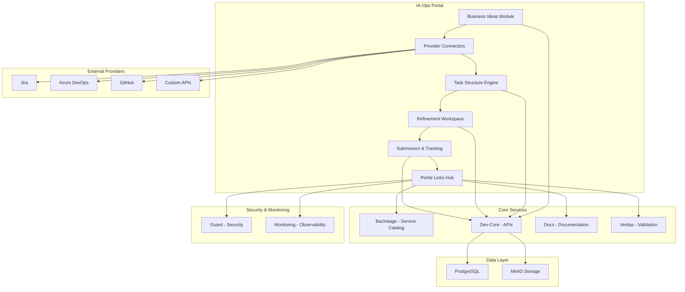
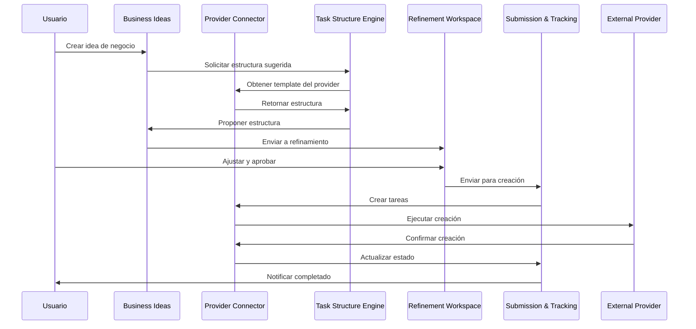

# Arquitectura del Sistema

## 🏗️ Diagrama de Arquitectura General



## 🎯 Componentes Principales

### 1. Business Ideas Module
**Propósito**: Captura y gestión inicial de ideas de negocio

**Funcionalidades**:
- Formulario inteligente de captura
- Categorización automática
- Evaluación de viabilidad
- Priorización basada en criterios

**Tecnologías**: React, TypeScript, API REST

### 2. Provider Connectors
**Propósito**: Integración con sistemas externos de gestión de proyectos

**Providers Soportados**:
- **Jira**: Issues, Epics, Stories, Tasks
- **Azure DevOps**: Work Items, Boards, Backlogs
- **GitHub**: Issues, Projects, Milestones
- **Custom**: APIs personalizadas

**Patrón de Diseño**: Strategy Pattern para intercambio de providers

### 3. Task Structure Engine
**Propósito**: Mapeo dinámico de estructuras organizacionales a estructuras de providers

**Características**:
- Templates configurables por área organizacional
- Mapeo automático de campos
- Validación de estructura
- Adaptación a diferentes modelos

### 4. Refinement Workspace
**Propósito**: Espacio colaborativo para ajustar propuestas antes de la creación

**Funcionalidades**:
- Editor visual de estructura
- Comentarios y sugerencias
- Versionado de cambios
- Aprobación por roles

### 5. Submission & Tracking
**Propósito**: Creación final y seguimiento de tareas en providers

**Características**:
- Cola de procesamiento
- Logs detallados de creación
- Estado de sincronización
- Auditoría completa

## 🔄 Flujo de Datos



## 🏢 Áreas Organizacionales

### Estructura Configurable
```yaml
organizational_areas:
  requirements:
    name: "Requerimientos"
    roles: ["Business Analyst", "Product Owner"]
    templates: ["user_story", "acceptance_criteria"]
    
  architecture:
    name: "Arquitectura"
    roles: ["Solution Architect", "Technical Lead"]
    templates: ["technical_design", "architecture_decision"]
    
  development:
    name: "Desarrollo"
    roles: ["Developer", "Tech Lead"]
    templates: ["feature", "bug_fix", "technical_debt"]
    
  testing:
    name: "Pruebas"
    roles: ["QA Engineer", "Test Lead"]
    templates: ["test_case", "test_plan", "defect"]
    
  security:
    name: "Seguridad"
    roles: ["Security Engineer", "Security Architect"]
    templates: ["security_review", "vulnerability_assessment"]
    
  devops:
    name: "DevOps"
    roles: ["DevOps Engineer", "Platform Engineer"]
    templates: ["deployment", "infrastructure", "automation"]
    
  infrastructure:
    name: "Infraestructura"
    roles: ["Infrastructure Engineer", "Cloud Architect"]
    templates: ["provisioning", "configuration", "monitoring"]
    
  operations:
    name: "Operaciones"
    roles: ["Operations Engineer", "Site Reliability Engineer"]
    templates: ["incident", "maintenance", "runbook"]
    
  monitoring:
    name: "Monitoreo"
    roles: ["Monitoring Engineer", "Observability Engineer"]
    templates: ["alert", "dashboard", "metric"]
```

## 🔧 Tecnologías Utilizadas

### Frontend
- **React 18**: UI principal
- **TypeScript**: Tipado estático
- **Material-UI**: Componentes de interfaz
- **React Query**: Gestión de estado del servidor

### Backend
- **Node.js**: Runtime principal
- **Express**: Framework web
- **TypeScript**: Tipado estático
- **Prisma**: ORM para base de datos

### Base de Datos
- **PostgreSQL**: Base de datos principal
- **MinIO**: Almacenamiento de objetos

### Infraestructura
- **Docker**: Containerización
- **Docker Compose**: Orquestación local
- **Nginx**: Proxy reverso

## 📊 Métricas y Monitoreo

### KPIs del Sistema
- Tiempo promedio de creación de ideas
- Tasa de conversión idea → proyecto
- Tiempo de refinamiento por área
- Éxito de sincronización con providers
- Satisfacción del usuario

### Observabilidad
- Logs estructurados (JSON)
- Métricas de performance
- Trazabilidad distribuida
- Alertas automáticas
