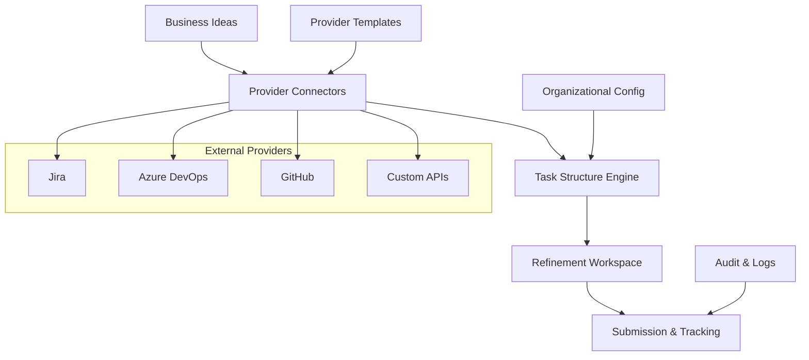

# IA-Ops Portal

Bienvenido al portal principal de IA-Ops, una solución integral para la gestión inteligente de proyectos y operaciones.

## 🎯 Visión General

IA-Ops Portal es el centro de comando que integra todos los módulos y servicios para:

- **Gestión de Ideas de Negocio**: Captura, evaluación y conversión de ideas
- **Conectores Multi-Provider**: Integración con Jira, Azure DevOps, GitHub y más
- **Estructura Dinámica de Tareas**: Adaptación automática a diferentes modelos organizacionales
- **Workspace de Refinamiento**: Espacio colaborativo para ajustar y perfeccionar propuestas
- **Seguimiento y Auditoría**: Control completo del ciclo de vida de proyectos

## 🏗️ Arquitectura del Sistema



## 🚀 Servicios Integrados

### Servicios Activos
- **[Backstage](http://localhost:3000)** - Portal de desarrollo y catálogo de servicios
- **[Docs](http://localhost:8000)** - Documentación técnica y guías
- **[Dev-Core](http://localhost:8080)** - APIs centrales y servicios core
- **[Veritas](http://localhost:8081)** - Validación y verificación de datos

### Servicios en Desarrollo
- **Guard** (Puerto 8082) - Seguridad y control de acceso
- **Monitoring** (Puerto 8083) - Monitoreo y observabilidad

## 📋 Flujo de Trabajo

1. **Captura de Ideas**: Registro inicial de ideas de negocio o mejoras
2. **Análisis y Estructuración**: Evaluación automática y propuesta de estructura
3. **Mapeo a Providers**: Adaptación a la estructura del provider seleccionado
4. **Refinamiento Colaborativo**: Ajustes y mejoras en workspace dedicado
5. **Aprobación y Creación**: Validación final y creación en el provider
6. **Seguimiento**: Monitoreo del progreso y auditoría completa

## 🎯 Áreas Organizacionales Soportadas

- **Requerimientos**: Análisis y documentación de necesidades
- **Arquitectura**: Diseño y estructura técnica
- **Desarrollo**: Implementación y codificación
- **Pruebas**: Testing y validación de calidad
- **Seguridad**: Análisis de vulnerabilidades y controles
- **DevOps**: Automatización y despliegue
- **Infraestructura**: Gestión de recursos y plataformas
- **Operaciones**: Mantenimiento y soporte
- **Monitoreo**: Observabilidad y métricas

## 🔧 Configuración Rápida

```bash
# Clonar e inicializar
git clone git@github.com:giovanemere/ia-ops.git
cd ia-ops

# Iniciar todos los servicios
./start-services-safe.sh

# Acceder al portal
open http://localhost:3000
```

## 📚 Próximos Pasos

1. [Configurar el entorno](config/setup.md)
2. [Entender la arquitectura](architecture/overview.md)
3. [Configurar providers](providers/jira.md)
4. [Definir estructura organizacional](config/org-structure.md)
5. [Crear primera idea de negocio](modules/business-ideas.md)
