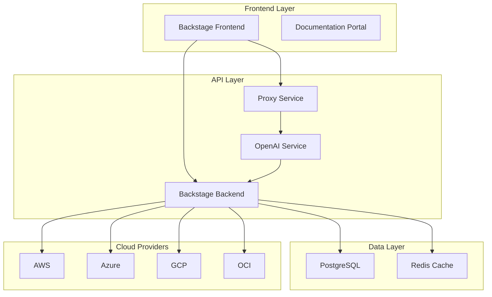

# IA-Ops Platform

Bienvenido a la documentación de **IA-Ops Platform**, una plataforma integrada de IA y DevOps construida con Backstage.

## 🚀 Descripción

IA-Ops Platform es una solución completa que combina las mejores prácticas de DevOps con capacidades avanzadas de Inteligencia Artificial, proporcionando:

- **Portal de Desarrollador** con Backstage
- **Integración con OpenAI** para asistencia inteligente
- **Soporte Multi-Cloud** (AWS, Azure, GCP, OCI)
- **Documentación Técnica** automatizada con TechDocs
- **Monitoreo y Observabilidad** integrados

## ✨ Características Principales

- ✅ **Backstage Portal**: Portal centralizado para desarrolladores
- ✅ **OpenAI Integration**: Asistente de IA para desarrollo y documentación
- ✅ **Multi-Cloud Support**: Soporte para múltiples proveedores de nube
- ✅ **GitOps Workflow**: Flujo de trabajo basado en Git
- ✅ **Automated Documentation**: Documentación técnica automatizada
- ✅ **Monitoring & Observability**: Monitoreo completo con Prometheus y Grafana
- ✅ **Container Orchestration**: Orquestación con Docker y Kubernetes

## 🏗️ Arquitectura



## 🚀 Inicio Rápido

### Prerrequisitos

- Docker y Docker Compose
- Node.js 18+ y npm/yarn
- Python 3.8+
- Git

### Instalación

1. **Clonar el repositorio**:
   ```bash
   git clone https://github.com/giovanemere/ia-ops.git
   cd ia-ops
   ```

2. **Configurar variables de entorno**:
   ```bash
   cp .env.example .env
   # Editar .env con tus configuraciones
   ```

3. **Iniciar servicios**:
   ```bash
   docker-compose up -d
   ```

4. **Acceder a la plataforma**:
   - Backstage: http://localhost:3000
   - Documentación: http://localhost:8000
   - Grafana: http://localhost:3001

### Configuración Rápida

```bash
# Ejecutar script de configuración
./scripts/setup-mkdocs-backstage.sh

# Iniciar desarrollo
./start-with-backstage.sh
```

## 📚 Componentes Principales

### Backstage Portal
Portal centralizado que proporciona:
- Catálogo de servicios y componentes
- Plantillas de scaffolding
- Documentación técnica integrada
- Métricas y monitoreo

### OpenAI Service
Servicio de IA que ofrece:
- Asistencia en desarrollo de código
- Generación automática de documentación
- Análisis de código y sugerencias
- Chatbot inteligente para soporte

### Multi-Cloud Integration
Soporte para múltiples proveedores:
- **AWS**: EC2, EKS, RDS, S3
- **Azure**: AKS, Azure SQL, Blob Storage
- **GCP**: GKE, Cloud SQL, Cloud Storage
- **OCI**: OKE, Autonomous Database

## 🛠️ Tecnologías Utilizadas

| Categoría | Tecnologías |
|-----------|-------------|
| **Frontend** | React, TypeScript, Material-UI |
| **Backend** | Node.js, Express, Python FastAPI |
| **Base de Datos** | PostgreSQL, Redis |
| **Contenedores** | Docker, Docker Compose |
| **Orquestación** | Kubernetes, Helm |
| **Monitoreo** | Prometheus, Grafana, Jaeger |
| **Documentación** | MkDocs, TechDocs |
| **CI/CD** | GitHub Actions, ArgoCD |

## 📖 Documentación

- [**Getting Started**](getting-started.md) - Guía de inicio rápido
- [**Architecture**](architecture.md) - Arquitectura detallada del sistema
- [**API Reference**](api/index.md) - Documentación de APIs
- [**Deployment Guide**](guides/deployment.md) - Guía de despliegue
- [**Troubleshooting**](guides/troubleshooting.md) - Solución de problemas

## 🤝 Contribución

¡Las contribuciones son bienvenidas! Por favor:

1. Fork el repositorio
2. Crea una rama para tu feature (`git checkout -b feature/AmazingFeature`)
3. Commit tus cambios (`git commit -m 'Add some AmazingFeature'`)
4. Push a la rama (`git push origin feature/AmazingFeature`)
5. Abre un Pull Request

## 📄 Licencia

Este proyecto está bajo la Licencia MIT. Ver el archivo [LICENSE](LICENSE) para más detalles.

## 📞 Soporte

- **Issues**: [GitHub Issues](https://github.com/giovanemere/ia-ops/issues)
- **Discussions**: [GitHub Discussions](https://github.com/giovanemere/ia-ops/discussions)
- **Email**: devops@tu-organizacion.com

## 🔗 Enlaces Útiles

- [Backstage Documentation](https://backstage.io/docs/)
- [OpenAI API Documentation](https://platform.openai.com/docs/)
- [Docker Documentation](https://docs.docker.com/)
- [Kubernetes Documentation](https://kubernetes.io/docs/)

---

**¡Gracias por usar IA-Ops Platform!** 🎉
