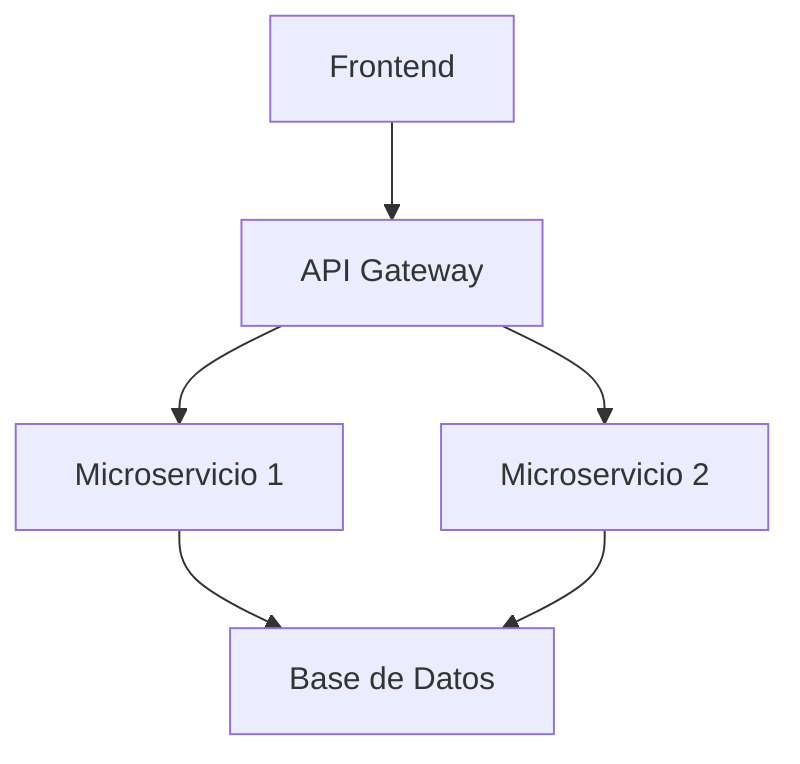

# Integración de MkDocs con Backstage TechDocs

## Introducción

TechDocs es la solución de documentación integrada de Backstage que utiliza MkDocs como generador de documentación. Esta guía te ayudará a configurar y usar MkDocs con Backstage para crear documentación técnica de alta calidad.

## Arquitectura de TechDocs

```
┌─────────────────┐    ┌─────────────────┐    ┌─────────────────┐
│   Repository    │    │   Backstage     │    │   TechDocs      │
│                 │    │                 │    │                 │
│ ├── docs/       │───▶│ ├── Builder     │───▶│ ├── Generated   │
│ ├── mkdocs.yml  │    │ ├── Generator   │    │ │   HTML        │
│ └── catalog-    │    │ └── Publisher   │    │ └── Static      │
│     info.yaml   │    │                 │    │     Assets      │
└─────────────────┘    └─────────────────┘    └─────────────────┘
```

## Configuración Actual en tu Proyecto

### 1. Configuración de Backstage (app-config.yaml)

Tu configuración actual de TechDocs:

```yaml
techdocs:
  builder: 'local'      # Construye documentación localmente
  generator:
    runIn: 'local'      # Ejecuta MkDocs localmente
  publisher:
    type: 'local'       # Almacena documentación localmente
```

### 2. Configuración Avanzada de TechDocs

Para mejorar tu configuración actual, actualiza tu `app-config.yaml`:

```yaml
techdocs:
  builder: 'local'
  generator:
    runIn: 'local'
    dockerImage: 'spotify/techdocs'
    pullImage: true
  publisher:
    type: 'local'
    local:
      publishDirectory: '/tmp/techdocs'
  cache:
    ttl: 3600000  # 1 hora en milisegundos
    readTimeout: 5000
  
  # URLs de configuración
  requestUrl: http://localhost:7007/api/techdocs
  storageUrl: http://localhost:7007/api/techdocs/static/docs
```

## Estructura de Documentación Recomendada

### 1. Estructura de Directorios

```
tu-repositorio/
├── docs/
│   ├── index.md              # Página principal
│   ├── getting-started.md    # Guía de inicio
│   ├── architecture.md       # Arquitectura
│   ├── api/
│   │   ├── index.md         # Documentación de API
│   │   └── endpoints.md     # Endpoints específicos
│   ├── guides/
│   │   ├── deployment.md    # Guía de despliegue
│   │   └── troubleshooting.md
│   └── assets/
│       ├── images/
│       └── diagrams/
├── mkdocs.yml               # Configuración de MkDocs
└── catalog-info.yaml        # Metadatos de Backstage
```

### 2. Configuración de mkdocs.yml

Crea un archivo `mkdocs.yml` optimizado para TechDocs:

```yaml
site_name: 'Tu Proyecto'
site_description: 'Documentación técnica del proyecto'
site_author: 'Tu Equipo'

# Navegación
nav:
  - Home: index.md
  - Getting Started: getting-started.md
  - Architecture: architecture.md
  - API Reference:
    - Overview: api/index.md
    - Endpoints: api/endpoints.md
  - Guides:
    - Deployment: guides/deployment.md
    - Troubleshooting: guides/troubleshooting.md

# Plugin requerido para TechDocs
plugins:
  - techdocs-core

# Tema Material Design
theme:
  name: material
  palette:
    - scheme: default
      primary: blue
      accent: blue
      toggle:
        icon: material/brightness-7
        name: Switch to dark mode
    - scheme: slate
      primary: blue
      accent: blue
      toggle:
        icon: material/brightness-4
        name: Switch to light mode
  features:
    - navigation.tabs
    - navigation.sections
    - navigation.expand
    - navigation.top
    - search.highlight
    - search.share
    - content.code.copy
    - content.code.annotate

# Extensiones de Markdown
markdown_extensions:
  - admonition
  - pymdownx.details
  - pymdownx.superfences:
      custom_fences:
        - name: mermaid
          class: mermaid
          format: !!python/name:pymdownx.superfences.fence_code_format
  - pymdownx.tabbed:
      alternate_style: true
  - pymdownx.highlight:
      anchor_linenums: true
  - pymdownx.inlinehilite
  - pymdownx.snippets
  - attr_list
  - md_in_html
  - toc:
      permalink: true
      title: En esta página

# Configuración adicional
extra:
  version:
    provider: mike
  social:
    - icon: fontawesome/brands/github
      link: https://github.com/tu-usuario/tu-repo
```

### 3. Configuración del catalog-info.yaml

Asegúrate de que tu `catalog-info.yaml` incluya la anotación de TechDocs:

```yaml
apiVersion: backstage.io/v1alpha1
kind: Component
metadata:
  name: tu-componente
  description: Descripción de tu componente
  annotations:
    backstage.io/techdocs-ref: dir:.
    github.com/project-slug: tu-usuario/tu-repo
spec:
  type: service
  lifecycle: production
  owner: tu-equipo
```

## Configuración de Docker para TechDocs

### 1. Dockerfile para TechDocs

Si quieres usar Docker para generar documentación:

```dockerfile
FROM spotify/techdocs:latest

# Instalar dependencias adicionales si es necesario
RUN pip install mkdocs-material mkdocs-mermaid2-plugin

# Copiar archivos de documentación
COPY docs/ /content/docs/
COPY mkdocs.yml /content/

WORKDIR /content

# Generar documentación
RUN mkdocs build --verbose --clean --strict

# Servir documentación
EXPOSE 8000
CMD ["mkdocs", "serve", "--dev-addr=0.0.0.0:8000"]
```

### 2. Docker Compose para TechDocs

Agrega un servicio de documentación a tu `docker-compose.yml`:

```yaml
services:
  techdocs:
    build:
      context: .
      dockerfile: Dockerfile.techdocs
    ports:
      - "8001:8000"
    volumes:
      - ./docs:/content/docs:ro
      - ./mkdocs.yml:/content/mkdocs.yml:ro
    environment:
      - MKDOCS_DEV_ADDR=0.0.0.0:8000
```

## Plugins y Extensiones Recomendadas

### 1. Plugins de MkDocs

```yaml
plugins:
  - techdocs-core
  - search:
      lang: 
        - en
        - es
  - mermaid2:
      arguments:
        theme: base
        themeVariables:
          primaryColor: '#1976d2'
  - git-revision-date-localized:
      type: date
      locale: es
  - minify:
      minify_html: true
```

### 2. Extensiones de Markdown Avanzadas

```yaml
markdown_extensions:
  # Básicas
  - admonition
  - attr_list
  - md_in_html
  - toc:
      permalink: true
      title: En esta página
  
  # PyMdown Extensions
  - pymdownx.arithmatex:
      generic: true
  - pymdownx.betterem:
      smart_enable: all
  - pymdownx.caret
  - pymdownx.details
  - pymdownx.emoji:
      emoji_index: !!python/name:materialx.emoji.twemoji
      emoji_generator: !!python/name:materialx.emoji.to_svg
  - pymdownx.highlight:
      anchor_linenums: true
      line_spans: __span
      pygments_lang_class: true
  - pymdownx.inlinehilite
  - pymdownx.keys
  - pymdownx.mark
  - pymdownx.smartsymbols
  - pymdownx.snippets
  - pymdownx.superfences:
      custom_fences:
        - name: mermaid
          class: mermaid
          format: !!python/name:pymdownx.superfences.fence_code_format
  - pymdownx.tabbed:
      alternate_style: true
  - pymdownx.tasklist:
      custom_checkbox: true
  - pymdownx.tilde
```

## Ejemplos de Documentación

### 1. Página Principal (index.md)

```markdown
# Bienvenido a [Nombre del Proyecto]

## Descripción

Este proyecto es una [descripción breve del proyecto].

## Características Principales

- ✅ Característica 1
- ✅ Característica 2
- ✅ Característica 3

## Inicio Rápido

```bash
# Clonar el repositorio
git clone https://github.com/tu-usuario/tu-repo.git

# Instalar dependencias
npm install

# Ejecutar en desarrollo
npm run dev
```

## Arquitectura



## Enlaces Útiles

- [Documentación de API](api/index.md)
- [Guía de Despliegue](guides/deployment.md)
- [Solución de Problemas](guides/troubleshooting.md)
```

### 2. Documentación de API (api/index.md)

```markdown
# Documentación de API

## Endpoints Principales

### Autenticación

```http
POST /api/auth/login
Content-Type: application/json

{
  "username": "usuario",
  "password": "contraseña"
}
```

**Respuesta:**

```json
{
  "token": "jwt-token-aqui",
  "expires_in": 3600
}
```

### Usuarios

#### Obtener todos los usuarios

```http
GET /api/users
Authorization: Bearer {token}
```

!!! note "Nota"
    Este endpoint requiere autenticación.

!!! warning "Advertencia"
    Los datos sensibles están filtrados en la respuesta.
```

## Comandos Útiles

### 1. Desarrollo Local

```bash
# Instalar MkDocs y dependencias
pip install mkdocs mkdocs-material mkdocs-mermaid2-plugin

# Servir documentación localmente
mkdocs serve

# Construir documentación
mkdocs build

# Desplegar a GitHub Pages
mkdocs gh-deploy
```

### 2. Validación de Documentación

```bash
# Verificar enlaces rotos
mkdocs build --strict

# Validar configuración
mkdocs config

# Ver estructura del sitio
mkdocs build --verbose
```

## Integración con CI/CD

### 1. GitHub Actions

Crea `.github/workflows/docs.yml`:

```yaml
name: Deploy Documentation

on:
  push:
    branches: [ main ]
    paths: [ 'docs/**', 'mkdocs.yml' ]

jobs:
  deploy:
    runs-on: ubuntu-latest
    steps:
    - uses: actions/checkout@v3
    
    - name: Setup Python
      uses: actions/setup-python@v4
      with:
        python-version: '3.x'
    
    - name: Install dependencies
      run: |
        pip install mkdocs mkdocs-material mkdocs-mermaid2-plugin
    
    - name: Build documentation
      run: mkdocs build --strict
    
    - name: Deploy to GitHub Pages
      run: mkdocs gh-deploy --force
```

### 2. Validación en Pull Requests

```yaml
name: Validate Documentation

on:
  pull_request:
    paths: [ 'docs/**', 'mkdocs.yml' ]

jobs:
  validate:
    runs-on: ubuntu-latest
    steps:
    - uses: actions/checkout@v3
    
    - name: Setup Python
      uses: actions/setup-python@v4
      with:
        python-version: '3.x'
    
    - name: Install dependencies
      run: |
        pip install mkdocs mkdocs-material
    
    - name: Validate documentation
      run: mkdocs build --strict
```

## Mejores Prácticas

### 1. Estructura de Contenido

- **Usa títulos descriptivos**: Los títulos deben ser claros y específicos
- **Organiza por audiencia**: Separa documentación para desarrolladores, usuarios finales, etc.
- **Incluye ejemplos**: Siempre proporciona ejemplos prácticos
- **Mantén actualizado**: Revisa y actualiza regularmente

### 2. Escritura Técnica

- **Sé conciso**: Evita párrafos largos
- **Usa listas**: Las listas son más fáciles de escanear
- **Incluye diagramas**: Los diagramas ayudan a entender conceptos complejos
- **Proporciona contexto**: Explica el "por qué", no solo el "cómo"

### 3. Mantenimiento

- **Automatiza validación**: Usa CI/CD para validar documentación
- **Revisa enlaces**: Verifica regularmente que los enlaces funcionen
- **Actualiza con cambios**: Mantén la documentación sincronizada con el código
- **Solicita feedback**: Pide retroalimentación de los usuarios

## Solución de Problemas Comunes

### 1. Error: "No module named 'techdocs_core'"

```bash
# Instalar el plugin requerido
pip install mkdocs-techdocs-core
```

### 2. Error: "Theme 'material' not found"

```bash
# Instalar el tema Material
pip install mkdocs-material
```

### 3. Documentación no se actualiza en Backstage

1. Verifica que `catalog-info.yaml` tenga la anotación correcta
2. Limpia la caché de TechDocs
3. Reconstruye la documentación

### 4. Diagramas Mermaid no se renderizan

```yaml
# Asegúrate de tener la configuración correcta en mkdocs.yml
markdown_extensions:
  - pymdownx.superfences:
      custom_fences:
        - name: mermaid
          class: mermaid
          format: !!python/name:pymdownx.superfences.fence_code_format
```

## Recursos Adicionales

- [Documentación oficial de TechDocs](https://backstage.io/docs/features/techdocs/)
- [Documentación de MkDocs](https://www.mkdocs.org/)
- [Material for MkDocs](https://squidfunk.github.io/mkdocs-material/)
- [PyMdown Extensions](https://facelessuser.github.io/pymdown-extensions/)
- [Mermaid Diagrams](https://mermaid-js.github.io/mermaid/)

## Conclusión

La integración de MkDocs con Backstage TechDocs proporciona una solución poderosa para documentación técnica. Con la configuración adecuada, puedes crear documentación rica, interactiva y fácil de mantener que se integra perfectamente con tu flujo de trabajo de desarrollo.
