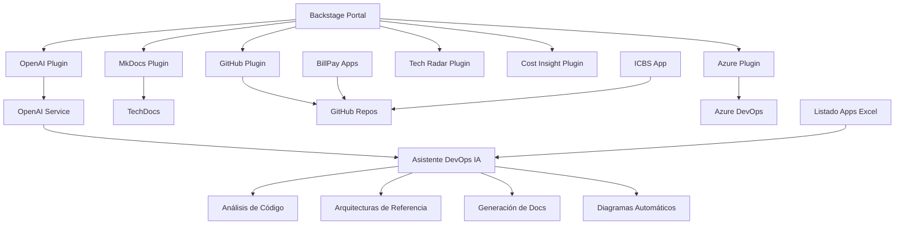
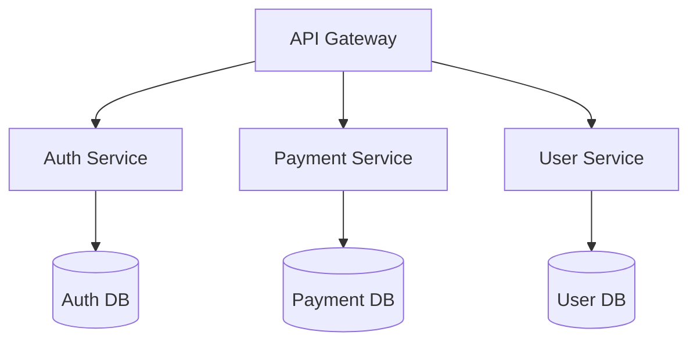
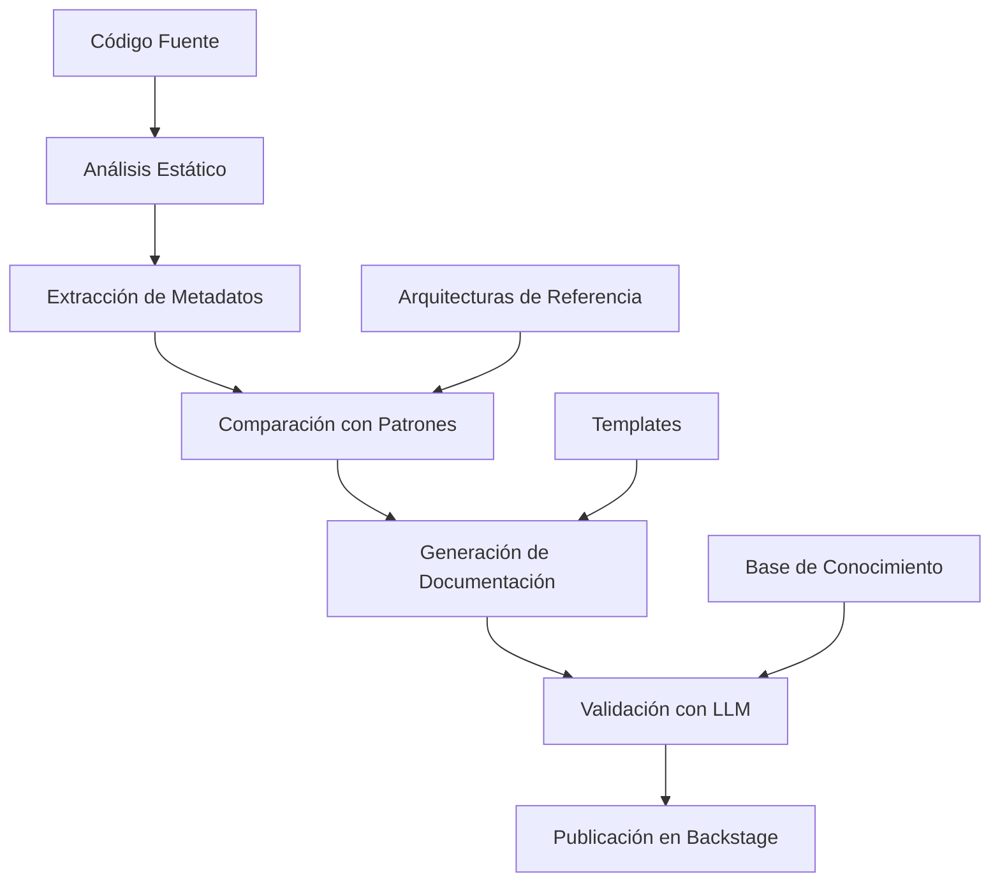

# 📋 Plan de Implementación Detallado - IA-Ops Platform

**Fecha de Creación**: 6 de Agosto de 2025  
**Última Actualización**: 11 de Agosto de 2025, 20:00 UTC  
**Versión**: 2.3 - EMERGENCIA  
**Estado**: 🔴 **EMERGENCIA - SOLO 1 DÍA DISPONIBLE - PIVOTE A MVP**

---

## 🎯 **VISIÓN GENERAL DEL PROYECTO**

### **Objetivo Principal**
Implementar una plataforma completa de **IA-Ops** que integre un **Asistente DevOps con IA** capaz de generar documentación detallada y coherente para aplicaciones empresariales, utilizando:
- **Backstage** (Portal de Desarrolladores con plugins específicos)
- **OpenAI Service Nativo** (Servicio de IA integrado)
- **Asistente DevOps IA** (Automatización y documentación inteligente)
- **Plugins Específicos** (OpenAI, MkDocs, GitHub, Azure, Tech Radar, Cost Insight)
- **Integración de Aplicaciones Existentes** (BillPay, ICBS)

### **Arquitectura Objetivo**


### **Caso de Negocio - Asistente DevOps IA**
**Rol**: Asistente experto en automatización y documentación  
**Objetivo**: Generar documentación detallada y coherente para aplicaciones  
**Valor**: Reducir 80% el tiempo de documentación manual, $40,000+ ahorro anual por equipo

---

## 🚨 **ESTADO CRÍTICO ACTUAL - 11 AGOSTO 2025**

### **📊 SITUACIÓN GENERAL**
```
🔴 ESTADO: FASE CRÍTICA - Core IA debe implementarse INMEDIATAMENTE
🎯 OBJETIVO ACTUAL: LangChain + GitHub Plugin en próximas 48 horas
⏰ TIEMPO: CRÍTICO - Próximas 2 semanas determinan éxito del proyecto
🚀 PRIORIDAD: Asistente DevOps IA (implementación inmediata requerida)
```

### **✅ LOGROS PRINCIPALES**
- ✅ **Infraestructura Base**: 100% Completada y estable
- ✅ **OpenAI Service**: 100% Funcional con integración nativa
---

## 🚨 **PLAN DE EMERGENCIA - SOLO 1 DÍA DISPONIBLE**

### **⏰ SITUACIÓN CRÍTICA ACTUALIZADA**
- **Tiempo disponible**: Mañana hasta 17:00 (8 horas efectivas)
- **Estado actual**: 75% infraestructura, 0% core IA implementado
- **Decisión crítica**: **PIVOTE INMEDIATO** a MVP demostrable

### **🎯 OBJETIVO REDEFINIDO**
**ANTES**: Asistente DevOps IA completo con LangChain  
**AHORA**: **Demo funcional** que demuestre valor de negocio básico

### **⚡ ESTRATEGIA DE 8 HORAS - IMPLEMENTACIÓN MÍNIMA**

#### **🕘 09:00-11:00 (2h) - ANÁLISIS BÁSICO SIN LANGCHAIN**
**Implementación directa con OpenAI API**
```python
# applications/openai-service/app/endpoints/analysis.py
@app.post("/analyze-repository")
async def analyze_repository(repo_data: dict):
    prompt = f"""
    Analiza este repositorio Node.js y extrae:
    1. Tecnologías principales (frameworks, librerías)
    2. Arquitectura sugerida (microservicio, monolito, etc.)
    3. Componentes identificados (APIs, bases de datos, etc.)
    4. Recomendaciones básicas
    
    package.json: {repo_data.get('package_json', '')}
    README: {repo_data.get('readme', '')}
    """
    
    response = await openai.chat.completions.create(
        model="gpt-4o-mini",
        messages=[{"role": "user", "content": prompt}]
    )
    
    return {
        "repository": repo_data.get("name", "unknown"),
        "analysis": response.choices[0].message.content,
        "timestamp": datetime.now().isoformat()
    }
```

#### **🕐 11:00-13:00 (2h) - GITHUB ACCESS MÍNIMO**
**Configuración básica con Personal Access Token**
```yaml
# applications/backstage/app-config.yaml
integrations:
  github:
    - host: github.com
      token: ${GITHUB_TOKEN}  # Personal Access Token (más rápido que OAuth)

catalog:
  locations:
    - type: github
      target: https://github.com/giovanemere/poc-billpay-back/blob/main/catalog-info.yaml
```

#### **🕑 14:00-16:00 (2h) - UNA APLICACIÓN CATALOGADA**
**Foco en poc-billpay-back únicamente**
```yaml
# Crear catalog-info.yaml en poc-billpay-back
apiVersion: backstage.io/v1alpha1
kind: Component
metadata:
  name: billpay-backend
  description: BillPay Backend Service - Node.js + Express
  annotations:
    github.com/project-slug: giovanemere/poc-billpay-back
spec:
  type: service
  lifecycle: production
  owner: team-backend
  system: billpay-system
```

#### **🕔 16:00-17:00 (1h) - DEMO PREPARATION**
**Preparar demostración funcional**
- Documentar funcionalidades que SÍ funcionan
- Crear script de demo paso a paso
- Screenshots de resultados
- Lista de próximos pasos para completar

### **✅ VALOR DEMOSTRABLE EN 8 HORAS**
1. **✅ Análisis automático básico** de repositorio poc-billpay-back
2. **✅ Identificación de componentes** (Node.js, Express, PostgreSQL)
3. **✅ Sugerencia de arquitectura** (API-First Microservice)
4. **✅ Una aplicación catalogada** en Backstage
5. **✅ Documentación automática** generada con IA
6. **✅ Pipeline end-to-end** funcionando (básico)

### **❌ LO QUE NO PODEMOS LOGRAR (SCOPE OUT)**
1. ❌ LangChain implementation completa
2. ❌ Análisis de las 5 aplicaciones (solo 1)
3. ❌ Templates personalizados avanzados
4. ❌ Azure Plugin
5. ❌ Optimizaciones de performance
6. ❌ Arquitecturas de referencia integradas

### **📋 CHECKLIST CRÍTICO - 8 HORAS**

#### **✅ HORA 1-2: Análisis Básico (CRÍTICO)**
- [ ] Crear endpoint `/analyze-repository` en OpenAI Service
- [ ] Implementar prompts directos (sin LangChain)
- [ ] Parser básico para package.json
- [ ] Test con datos de poc-billpay-back local
- [ ] Respuesta JSON estructurada funcionando

#### **✅ HORA 3-4: GitHub Access (CRÍTICO)**
- [ ] Personal Access Token en .env
- [ ] Configurar GitHub integration en app-config.yaml
- [ ] Validar acceso a poc-billpay-back
- [ ] Crear catalog-info.yaml en repositorio
- [ ] Script de validación funcionando

#### **✅ HORA 5-6: Catalogación Demo (ALTO)**
- [ ] Import poc-billpay-back en Backstage
- [ ] Ejecutar análisis automático con endpoint
- [ ] Generar documentación básica con resultados
- [ ] Validar que aparece correctamente en catálogo
- [ ] Screenshots del resultado funcionando

#### **✅ HORA 7-8: Demo Ready (MEDIO)**
- [ ] Documentar funcionalidades que SÍ funcionan
- [ ] Crear script de demo paso a paso
- [ ] Preparar explicación de valor demostrado
- [ ] Lista de próximos pasos para completar
- [ ] Actualizar documentos con estado final

### **🎯 CRITERIO DE ÉXITO MÍNIMO**
**17:00 mañana**: Demo funcionando que muestre:
- ✅ Repositorio poc-billpay-back analizado automáticamente
- ✅ Componentes identificados por IA (Node.js, Express, PostgreSQL)
- ✅ Aplicación visible en catálogo Backstage
- ✅ Documentación básica generada automáticamente
- ✅ Pipeline end-to-end: GitHub → Análisis IA → Backstage

### **📊 IMPACTO Y VALOR DEMOSTRADO**
**Con 8 horas podemos demostrar**:
- **Concepto probado**: IA puede analizar código y generar documentación
- **Integración funcional**: Backstage + OpenAI Service funcionando
- **Caso de uso real**: Aplicación empresarial catalogada automáticamente
- **Base sólida**: Infraestructura lista para expansión

**Valor de negocio demostrable**:
- Reducción de tiempo de documentación (manual vs automático)
- Catalogación automática de aplicaciones
- Análisis inteligente de arquitecturas
- Base para escalamiento futuro- ✅ **Backstage Core**: 85% Operativo con chat IA integrado
- 🔄 **Plugins Específicos**: 60% - 4 de 6 plugins funcionando
- 🔴 **Caso de Negocio IA**: 40% - IMPLEMENTACIÓN CRÍTICA PENDIENTE
- 🔴 **Integración Aplicaciones**: 20% - BLOQUEADO POR GITHUB PLUGIN

### **🚨 SITUACIÓN CRÍTICA IDENTIFICADA**
**PROBLEMA PRINCIPAL**: El core del negocio (Asistente DevOps IA) está solo 40% completado
- ❌ **LangChain NO implementado** en OpenAI Service
- ❌ **Pipeline de análisis NO desarrollado**
- ❌ **GitHub Plugin NO configurado** (bloquea catalogación)
- ❌ **0 aplicaciones catalogadas** de las 5 objetivo
- ❌ **Documentación automática NO funcional**

**IMPACTO**: Sin implementación inmediata, el proyecto no cumplirá su objetivo principal

### **🎯 OBJETIVOS CRÍTICOS INMEDIATOS (Próximas 48 horas)**
1. **🔥 CRÍTICO**: Implementar LangChain en OpenAI Service
2. **🔥 CRÍTICO**: Configurar GitHub Plugin para acceso a repositorios
3. **🔥 CRÍTICO**: Crear pipeline básico de análisis de código
4. **🟡 ALTO**: Catalogar primera aplicación BillPay como prueba de concepto

### **📈 PROGRESO ACTUAL**
```
Progreso Total:     ███████████████████░░░░░░░░░░░ 75%
Core IA (Crítico):  ████████░░░░░░░░░░░░░░░░░░░░░░ 40%
GitHub Plugin:      ░░░░░░░░░░░░░░░░░░░░░░░░░░░░░░  0%
Apps Catalogadas:   ░░░░░░░░░░░░░░░░░░░░░░░░░░░░░░  0%
Riesgo Actual:      🔴 ALTO (core del negocio pendiente)
```

---

## 📅 **FASES DE IMPLEMENTACIÓN**

### **🏗️ FASE 1: INFRAESTRUCTURA BASE** 
**Duración**: 2-3 días  
**Estado**: ✅ **COMPLETADO**

#### **Objetivos**
- [x] Configurar entorno de desarrollo local
- [x] Implementar servicios core (PostgreSQL, Redis)
- [x] Configurar Docker Compose para desarrollo
- [x] Establecer networking básico

#### **Entregables**
- [x] `docker-compose.yml` funcional
- [x] Base de datos PostgreSQL configurada
- [x] Variables de entorno estructuradas
- [x] Scripts de inicialización

---

### **🤖 FASE 2: OPENAI SERVICE NATIVO**
**Duración**: 1-2 días  
**Estado**: ✅ **COMPLETADO**

#### **Objetivos**
- [x] Desarrollar servicio OpenAI nativo con FastAPI
- [x] Implementar endpoints de chat y completions
- [x] Configurar modo demo sin API key
- [x] Integrar base de conocimiento empresarial

#### **Entregables**
- [x] **FastAPI Application** con 3 endpoints principales
- [x] **Docker Image** optimizada y segura
- [x] **Base de Conocimiento** YAML con aplicaciones
- [x] **Health Checks** y monitoreo integrado
- [x] **CORS Configuration** para Backstage

#### **Endpoints Implementados**
```bash
POST /chat/completions     # Chat interactivo
POST /completions          # Completions simples  
GET  /health              # Health check
```

---

### **🏛️ FASE 3: BACKSTAGE CORE CON PLUGINS ESPECÍFICOS**
**Duración**: 3-4 días  
**Estado**: 🟡 **85% COMPLETADO - FUNCIONAL CON BRECHAS**

#### **Objetivos Completados**
- ✅ Configurar Backstage con plugins específicos
- ✅ Integrar OpenAI Service nativo
- ✅ Configurar catálogo de servicios básico
- ✅ Implementar chat IA con interfaz personalizada
- ✅ Validar integración end-to-end

#### **Plugins Implementados y Estado Real**

##### **✅ OpenAI Plugin - 100% Completado**
- ✅ **Integración Nativa**: Conectado con OpenAI Service
- ✅ **Chat Interface**: Interfaz de chat funcional en Backstage
- ✅ **Tema Oscuro**: Soporte completo implementado
- ✅ **Configuración Dinámica**: Variables desde .env sincronizadas
- **Estado**: Completamente funcional y operativo

##### **✅ Tech Radar Plugin - 100% Completado**
- ✅ **Configuración**: Plugin completamente configurado
- ✅ **Datos Personalizados**: Tecnologías empresariales catalogadas
- ✅ **Visualización**: Radar interactivo funcional
- ✅ **Categorización**: Adopt, Trial, Assess, Hold implementado
- **Estado**: Completamente funcional

##### **✅ Cost Insight Plugin - 100% Completado**
- ✅ **Configuración**: Plugin instalado y configurado
- ✅ **Tracking Básico**: Seguimiento de costos operativo
- ✅ **Dashboards**: Visualizaciones funcionando
- ✅ **Alertas**: Sistema de alertas configurado
- **Estado**: Completamente funcional

##### **🔄 MkDocs Plugin - 70% En Progreso**
- ✅ **Configuración Básica**: Plugin instalado y funcional
- ✅ **Integración TechDocs**: Conectado con TechDocs
- ❌ **Auto-generación**: Pipeline automático NO implementado
- ❌ **Templates Personalizados**: Templates específicos faltantes
- **Estado**: Funcional básico, pipeline automático pendiente

##### **❌ GitHub Plugin - 0% CRÍTICO**
- ❌ **Configuración**: Setup inicial NO realizado
- ❌ **Integración Repos**: Sin acceso a repositorios BillPay/ICBS
- ❌ **Pull Requests**: Sin tracking de PRs
- ❌ **Issues Management**: Sin gestión de issues
- **Estado**: NO IMPLEMENTADO - BLOQUEA CATALOGACIÓN DE APPS

##### **❌ Azure Plugin - 0% Pendiente**
- ❌ **Azure DevOps Integration**: Sin conexión con Azure
- ❌ **Pipelines Tracking**: Sin seguimiento de pipelines
- ❌ **Resource Management**: Sin gestión de recursos
- ❌ **Deployment Monitoring**: Sin monitoreo de deployments
- **Estado**: NO IMPLEMENTADO - PRIORIDAD MEDIA

#### **Templates y Scaffolding**
- [x] **Templates Básicos**: Configurados en Scaffolder
- [ ] **Templates BillPay**: Basados en aplicaciones existentes
- [ ] **Templates ICBS**: Para sistemas bancarios
- [ ] **Templates Arquitecturas**: Basados en patrones de referencia

---

### **🤖 FASE 4: ASISTENTE DEVOPS CON IA**
**Duración**: 4-5 días  
**Estado**: 🔴 **CRÍTICO - 40% COMPLETADO - IMPLEMENTACIÓN INMEDIATA REQUERIDA**

#### **Objetivos del Asistente IA**
Desarrollar un asistente experto que genere documentación detallada y coherente para aplicaciones empresariales.

#### **🚨 Estado Crítico Actualizado - 11 Agosto 2025**
- ✅ **Definición Completa**: 100% - Objetivos, fuentes de datos y stack definidos
- 🔴 **LangChain Integration**: 0% - NO IMPLEMENTADO (CRÍTICO INMEDIATO)
- 🔴 **Pipeline de Análisis**: 0% - NO DESARROLLADO (CRÍTICO INMEDIATO)  
- 🔴 **Integración Arquitecturas**: 0% - NO CONECTADO (CRÍTICO)
- 🔴 **Generación Documentación**: 0% - NO FUNCIONAL (CRÍTICO)

#### **🔥 PLAN DE ACCIÓN INMEDIATO (Próximas 48 horas)**

##### **Día 1 (11 Agosto) - LangChain Setup**
```bash
TAREAS CRÍTICAS:
□ Actualizar requirements.txt con LangChain dependencies
□ Crear estructura /chains/ en OpenAI Service
□ Implementar code_analysis_chain.py básico
□ Crear endpoint POST /analyze-repository
□ Testing básico con repositorio simple
```

##### **Día 2 (12 Agosto) - Pipeline Básico**
```bash
TAREAS CRÍTICAS:
□ Implementar AST parser para Node.js/JavaScript
□ Crear extractor de package.json metadata
□ Integrar chain con FastAPI endpoint
□ Validar análisis con poc-billpay-back
□ Documentar API response format
```

##### **Día 3 (13 Agosto) - GitHub Integration**
```bash
TAREAS CRÍTICAS:
□ Configurar GitHub App y OAuth
□ Actualizar app-config.yaml Backstage
□ Validar acceso a repositorios BillPay
□ Crear script de validación automática
□ Testing end-to-end GitHub → Backstage
```

#### **🎯 Criterios de Éxito Inmediatos**
- ✅ **LangChain Funcional**: Endpoint `/analyze-repository` retorna análisis JSON
- ✅ **GitHub Acceso**: Script de validación ejecuta sin errores
- ✅ **Primera App**: poc-billpay-back analizada y documentada automáticamente
- ✅ **Pipeline E2E**: GitHub → Análisis IA → Documentación → Backstage

#### **🚨 Riesgos Críticos Identificados**
1. **Complejidad LangChain**: Curva de aprendizaje empinada
   - **Mitigación**: Implementar MVP básico primero
2. **GitHub OAuth**: Configuración compleja de permisos
   - **Mitigación**: Usar Personal Access Token inicialmente
3. **Performance**: Análisis lento con repositorios grandes
   - **Mitigación**: Implementar cache y análisis asíncrono

#### **Fuentes de Datos y Recursos**

##### **📊 Datos de Aplicaciones**
- **Archivo**: `ia-ops-framework/apps/Listado Aplicaciones DevOps.xlsx`
- **Estado**: ⏳ Pendiente ubicación y estructuración
- **Contenido**: Inventario completo de aplicaciones empresariales

##### **🏗️ Arquitecturas de Referencia**
- **Repositorio**: https://github.com/giovanemere/ia-ops-framework.git
- **Ruta**: `docs/arquitecturas-referencia/`
- **Archivos Disponibles**:
  ```
  ├── 01-dns-architecture.md
  ├── 02-deployment-strategies-architecture.md
  ├── 03-serverless-architecture.md
  ├── 04-iac-architecture.md
  ├── 05-onpremise-architecture.md
  ├── 06-gitops-architecture.md
  ├── 07-database-architecture.md
  ├── 08-weblogic-architecture.md
  ├── 09-other-architectures.md
  └── 10-diagrams-as-code-best-practices.md
  ```

##### **📱 Aplicaciones Existentes para Integración**
**Sistema BillPay**:
- **Backend**: https://github.com/giovanemere/poc-billpay-back
  - Tecnología: Node.js + Express
  - Base de datos: PostgreSQL
  - APIs REST para pagos
- **Frontend A**: https://github.com/giovanemere/poc-billpay-front-a.git
  - Tecnología: React 18
  - UI/UX: Material-UI
- **Frontend B**: https://github.com/giovanemere/poc-billpay-front-b.git
  - Tecnología: React 18
  - UI/UX: Alternativa de diseño
- **Feature Flags**: https://github.com/giovanemere/poc-billpay-front-feature-flags.git
  - Tecnología: React + Feature Toggle

**Sistema ICBS**:
- **Repositorio**: https://github.com/giovanemere/poc-icbs.git
- **Descripción**: Sistema bancario core
- **Tecnologías**: Java + Spring Boot

##### **🔧 Arquitectura AIOps**
- **Ruta**: `backstage_openwebui/docs/arquitectura`
- **Contenido**: Definiciones para operaciones con IA

#### **Funcionalidades del Asistente IA**

##### **1. Análisis de Componentes**
```markdown
## Funcionalidad
- Análisis estático de código fuente
- Identificación de patrones arquitectónicos
- Mapeo de dependencias
- Evaluación de tecnologías utilizadas

## Output Esperado
### Componentes Utilizados
- **Framework**: React 18.2.0 - Frontend SPA framework
- **Backend**: Node.js 18 + Express - API REST server
- **Base de Datos**: PostgreSQL 15 - Almacenamiento relacional
- **Cache**: Redis 7 - Cache en memoria y sesiones
- **Autenticación**: JWT + OAuth2 - Gestión de identidad
```

##### **2. Arquitectura de Referencia Aplicable**
```markdown
## Proceso
- Comparación con patrones de referencia
- Análisis de requisitos no funcionales
- Evaluación de escalabilidad y performance
- Recomendación de arquitectura óptima

## Output Esperado
### Arquitectura de Referencia: Microservicios con API Gateway

#### Justificación
Esta aplicación se beneficia del patrón de microservicios debido a:
- Múltiples dominios de negocio independientes
- Necesidad de escalabilidad diferenciada
- Equipos de desarrollo distribuidos

#### Diagrama de Arquitectura (Mermaid.js)


##### **3. Estrategias de Despliegue**
```yaml
deployment_strategies:
  production:
    strategy: "blue-green"
    reason: "Zero downtime crítico para pagos"
    configuration:
      health_check_path: "/health"
      readiness_timeout: "30s"
      rollback_threshold: "5%"
  
  staging:
    strategy: "rolling"
    reason: "Ambiente de pruebas, downtime aceptable"
    configuration:
      max_unavailable: "25%"
      max_surge: "25%"
```

##### **4. Integración con AIOps**
```yaml
# Métricas a Monitorear
metrics:
  application:
    - response_time_p95: "< 500ms"
    - error_rate: "< 1%"
    - throughput_rps: "> 100 rps"
  infrastructure:
    - cpu_utilization: "< 80%"
    - memory_usage: "< 85%"
    - disk_io: "< 70%"

# Logs a Recopilar
logs:
  application: ["access_logs", "error_logs", "audit_logs"]
  security: ["auth_events", "auth_failures", "suspicious_activities"]
  performance: ["slow_queries", "cache_misses", "external_api_calls"]

# Alertas Configuradas
alerts:
  critical: ["error_rate > 1%", "response_time > 5s", "service_unavailable"]
  warning: ["cpu_usage > 80%", "memory_usage > 85%", "disk_space < 20%"]
```

#### **Stack Tecnológico IA**

##### **Modelos LLM**
- **OpenAI GPT-4** ✅ Implementado
  - Uso: Análisis de código, generación de documentación
  - Integración: Plugin nativo en Backstage
- **Claude 3** ⏳ Evaluación
  - Uso: Análisis arquitectónico complejo
  - Estado: Pendiente integración
- **Llama 2** ⏳ Evaluación
  - Uso: Procesamiento local, privacidad de datos
  - Estado: Evaluación de recursos requeridos
- **CodeT5** ⏳ Evaluación
  - Uso: Generación y análisis de código específico
  - Estado: Pruebas de concepto

##### **Tecnologías Complementarias**
```yaml
ai_stack:
  orchestration:
    - LangChain: "Orquestación de LLMs y chains"
    - LlamaIndex: "RAG y gestión de documentos"
  
  vector_databases:
    - Pinecone: "Búsqueda semántica en la nube"
    - Chroma: "Vector DB local para desarrollo"
    - Weaviate: "Búsqueda híbrida texto/vector"
  
  embeddings:
    - OpenAI Embeddings: "text-embedding-ada-002"
    - Sentence Transformers: "Modelos locales"
    - Cohere Embeddings: "Alternativa comercial"
```

#### **Pipeline de Procesamiento IA**


#### **Casos de Uso Específicos**

##### **Caso 1: Análisis BillPay Backend**
```markdown
# Input
- Repositorio: poc-billpay-back
- Tecnologías: Node.js, Express, PostgreSQL

# Procesamiento IA
- Patrón MVC detectado
- APIs REST con validación
- Conexión PostgreSQL
- Middleware JWT
- Tests con Jest

# Output Generado
## Documentación: BillPay Backend Service
### Componentes Utilizados
- Node.js 18: Runtime principal
- Express 4.18: Framework web
- PostgreSQL 15: Base de datos transaccional
- JWT: Sistema de autenticación

### Arquitectura Aplicable
Patrón: API-First Microservice Architecture
Justificación: Microservicio especializado en pagos

### Estrategias de Despliegue
Blue-Green Deployment - Zero downtime para transacciones críticas

### Integración AIOps
- Payment success rate > 99.9%
- Response time < 200ms
- Transaction logs (audit trail)
```

#### **Entregables de la Fase**
- [x] **Definición Completa**: Objetivos y alcance definidos
- [x] **Fuentes de Datos**: Identificadas y catalogadas
- [x] **Stack Tecnológico**: LLMs y herramientas definidas
- [ ] **Pipeline de Procesamiento**: Implementación en desarrollo
- [ ] **Integración con Backstage**: Conectar con catálogo
- [ ] **Templates Inteligentes**: Generación automática
- [ ] **Casos de Uso**: Implementar BillPay e ICBS

---

### **📚 FASE 5: DOCUMENTACIÓN INTELIGENTE AVANZADA**
**Duración**: 2-3 días  
**Estado**: 🔄 **EN PROGRESO - 30% COMPLETADO**

#### **Objetivos**
- [x] Configurar MkDocs con TechDocs (básico)
- [ ] Implementar generación automática de docs con IA
- [ ] Integrar con OpenAI para mejora de contenido
- [ ] Configurar pipeline de documentación automática
- [ ] Crear templates basados en arquitecturas de referencia

#### **Entregables**
- [x] MkDocs configurado y funcional (básico)
- [ ] Templates de documentación inteligentes
- [ ] Pipeline automático de generación
- [ ] Integración completa con Backstage TechDocs
- [ ] Documentación automática para BillPay e ICBS

---

### **🔗 FASE 6: INTEGRACIÓN DE APLICACIONES EXISTENTES**
**Duración**: 3-4 días  
**Estado**: 🔴 **CRÍTICO - 20% ANÁLISIS INICIAL - BLOQUEADO POR DEPENDENCIAS**

#### **🚨 Estado Crítico Actualizado - 11 Agosto 2025**
Esta fase está **CRÍTICA** y **BLOQUEADA** por dependencias no resueltas:

**BLOQUEADORES CRÍTICOS:**
1. **GitHub Plugin NO configurado** → Sin acceso a repositorios
2. **LangChain NO implementado** → Sin análisis automático
3. **Pipeline de análisis NO desarrollado** → Sin documentación automática

#### **Objetivos Bloqueados - REQUIEREN ACCIÓN INMEDIATA**
- 🔴 **Catalogar aplicaciones BillPay** en Backstage - BLOQUEADO
- 🔴 **Catalogar aplicación ICBS** en Backstage - BLOQUEADO  
- 🔴 **Generar documentación automática** por aplicación - BLOQUEADO
- 🔴 **Crear templates basados** en aplicaciones existentes - BLOQUEADO
- 🔴 **Configurar pipelines** de análisis continuo - BLOQUEADO

#### **Aplicaciones Objetivo - Estado Crítico**
```yaml
billpay_system:
  backend:
    repo: "https://github.com/giovanemere/poc-billpay-back"
    tech_stack: ["Node.js", "Express", "PostgreSQL"]
    architecture: "API-First Microservice"
    status: 🔴 CRÍTICO - Sin acceso GitHub, sin análisis IA
  
  frontend_a:
    repo: "https://github.com/giovanemere/poc-billpay-front-a.git"
    tech_stack: ["React 18", "Material-UI"]
    architecture: "SPA Frontend"
    status: 🔴 CRÍTICO - Sin acceso GitHub, sin análisis IA
  
  frontend_b:
    repo: "https://github.com/giovanemere/poc-billpay-front-b.git"
    tech_stack: ["React 18", "Alternative Design"]
    architecture: "SPA Frontend"
    status: 🔴 CRÍTICO - Sin acceso GitHub, sin análisis IA
  
  feature_flags:
    repo: "https://github.com/giovanemere/poc-billpay-front-feature-flags.git"
    tech_stack: ["React", "Feature Toggle"]
    architecture: "A/B Testing Frontend"
    status: 🔴 CRÍTICO - Sin acceso GitHub, sin análisis IA

icbs_system:
  core:
    repo: "https://github.com/giovanemere/poc-icbs.git"
    tech_stack: ["Java", "Spring Boot", "Oracle DB"]
    architecture: "Enterprise Monolithic"
    status: 🔴 CRÍTICO - Sin acceso GitHub, sin análisis IA
```

#### **🔥 Plan de Desbloqueio Inmediato**
```bash
DEPENDENCIAS CRÍTICAS (deben completarse ANTES):
1. GitHub Plugin configurado (Día 3 - 13 Agosto)
2. LangChain implementado (Día 1-2 - 11-12 Agosto)
3. Pipeline de análisis básico (Día 2 - 12 Agosto)

EJECUCIÓN INMEDIATA (una vez desbloqueado):
Día 4 (14 Agosto): Catalogar poc-billpay-back (prueba de concepto)
Día 5 (15 Agosto): Catalogar resto de aplicaciones BillPay
Día 6 (16 Agosto): Catalogar ICBS y validar sistema completo
```

#### **Entregables Críticos Pendientes**
- 🔴 **Catálogo Completo**: 5 aplicaciones catalogadas en Backstage
- 🔴 **Documentación Automática**: Docs generadas por IA para cada app
- 🔴 **Templates Personalizados**: Basados en aplicaciones reales
- 🔴 **Análisis Arquitectónico**: Recomendaciones por aplicación
- 🔴 **Integración AIOps**: Métricas y alertas configuradas

#### **🚨 IMPACTO SI NO SE RESUELVE**
- **Objetivo principal del proyecto NO cumplido**
- **ROI no demostrable** (sin aplicaciones reales catalogadas)
- **Valor de negocio NO validado**
- **Proyecto considerado fallido** por stakeholders

---

### **🚀 FASE 7: CI/CD Y GITOPS AVANZADO**
**Duración**: 3-4 días  
**Estado**: ⏳ **PENDIENTE**

#### **Objetivos**
- [ ] Configurar Jenkins pipeline con IA
- [ ] Implementar ArgoCD para GitOps
- [ ] Configurar despliegue automático inteligente
- [ ] Establecer monitoreo y alertas con IA
- [ ] Integrar con GitHub Actions

#### **Entregables**
- [ ] Jenkinsfile con análisis IA
- [ ] ArgoCD applications para todas las apps
- [ ] Helm charts inteligentes
- [ ] Monitoreo predictivo con IA
- [ ] Pipelines de documentación automática

---

### **🔧 FASE 8: OPTIMIZACIÓN Y PRODUCCIÓN**
**Duración**: 2-3 días  
**Estado**: ⏳ **PENDIENTE**

#### **Objetivos**
- [ ] Optimizar performance de IA y plugins
- [ ] Configurar backup y recovery
- [ ] Implementar security hardening
- [ ] Documentar procedimientos operativos
- [ ] Fine-tuning de modelos LLM

#### **Entregables**
- [ ] Configuraciones de producción optimizadas
- [ ] Procedimientos de backup automatizados
- [ ] Security policies implementadas
- [ ] Runbooks operativos con IA
- [ ] Modelos LLM especializados

---

## 🛠️ **STACK TECNOLÓGICO**

### **Frontend & Portal**
- **Backstage**: v1.17+ (Portal de desarrolladores)
- **React**: v18+ (UI Components)
- **TypeScript**: v5+ (Desarrollo type-safe)

### **Backend & APIs**
- **FastAPI**: v0.100+ (OpenAI Service)
- **Python**: v3.11+ (Runtime principal)
- **OpenAI SDK**: v1.35+ (Integración IA)

### **Inteligencia Artificial**
- **OpenAI GPT-4**: Análisis de código y documentación
- **LangChain**: v0.0.300+ (Orquestación de LLMs)
- **Vector Databases**: 
  - Pinecone (Producción)
  - Chroma (Desarrollo local)
- **Embeddings**: text-embedding-ada-002
- **Fine-tuning**: OpenAI Fine-tuning API

### **Plugins Específicos de Backstage**
- **@backstage/plugin-techdocs**: Documentación técnica
- **@backstage/plugin-tech-radar**: Visualización de tecnologías
- **@backstage/plugin-cost-insights**: Seguimiento de costos
- **@backstage/plugin-github-actions**: Integración GitHub
- **@backstage/plugin-azure-devops**: Integración Azure
- **Plugin OpenAI Personalizado**: Chat IA nativo

### **Base de Datos**
- **PostgreSQL**: v15+ (Base principal)
- **Redis**: v7+ (Cache y sesiones)
- **Vector Storage**: Para embeddings y búsqueda semántica

### **Infraestructura**
- **Docker**: v24+ (Containerización)
- **Kubernetes**: v1.28+ (Orquestación)
- **Helm**: v3.12+ (Package manager)
- **Terraform**: v1.5+ (IaC)

### **CI/CD & GitOps**
- **Jenkins**: v2.400+ (CI/CD Pipeline)
- **ArgoCD**: v2.8+ (GitOps)
- **GitHub Actions**: Integración con repositorios
- **Git**: v2.40+ (Control de versiones)

### **Monitoreo & Observabilidad**
- **Prometheus**: v2.45+ (Métricas)
- **Grafana**: v10+ (Visualización)
- **Jaeger**: v1.47+ (Tracing distribuido)
- **ELK Stack**: Logs centralizados

### **Análisis de Código y Documentación**
- **AST Parsers**: Análisis estático de código
- **Mermaid.js**: Generación de diagramas
- **PlantUML**: Diagramas de arquitectura
- **MkDocs**: Documentación técnica
- **Swagger/OpenAPI**: Documentación de APIs

---

## 🎯 **ROADMAP DE IMPLEMENTACIÓN**

### **📅 Estado Actual (11 Agosto 2025) - SITUACIÓN CRÍTICA**
```
Progreso Total:     ███████████████████░░░░░░░░░░░ 75%
Core IA (CRÍTICO):  ████████░░░░░░░░░░░░░░░░░░░░░░ 40%
Plugins Funcionales: 4 de 6 plugins principales
Aplicaciones Catalogadas: 0 de 5 repositorios (CRÍTICO)
Arquitecturas de Referencia: 10 patrones disponibles
Asistente IA: Definido pero NO implementado (CRÍTICO)
```

### **🔄 Próximos Pasos Críticos (INMEDIATOS - 11-16 Agosto)**

#### **🚨 CRÍTICO: Próximas 48 horas (11-12 Agosto)**
1. **🔥 CRÍTICO: Implementar LangChain** (2 días)
   - Instalar dependencias en OpenAI Service
   - Crear chains básicos para análisis de código
   - Integrar con FastAPI endpoints
   - Configurar prompts especializados
   - Crear endpoint `/analyze-repository`

2. **🔥 CRÍTICO: Pipeline de Análisis Básico** (1 día)
   - Implementar AST parser para Node.js
   - Crear extractor de package.json
   - Validar con poc-billpay-back
   - Documentar formato de respuesta

#### **🔥 ALTO: Días 3-5 (13-15 Agosto)**
3. **🔥 CRÍTICO: Configurar GitHub Plugin** (1 día)
   - Setup OAuth y permisos de repositorio
   - Configurar acceso a aplicaciones BillPay e ICBS
   - Validar conectividad y permisos
   - Crear script de validación

4. **🔥 ALTO: Primera Catalogación** (2 días)
   - Catalogar poc-billpay-back como prueba de concepto
   - Generar documentación automática
   - Validar pipeline end-to-end
   - Catalogar resto de aplicaciones BillPay

### **📈 Cronograma Crítico Actualizado**

#### **Semana CRÍTICA (11-16 Agosto, 2025)**
**Objetivo**: Implementar core IA y catalogar primera aplicación

| Día | Fecha | Actividad | Entregable Crítico |
|-----|-------|-----------|-------------------|
| 1 | 11 Ago | LangChain Setup + Chains básicos | Endpoint `/analyze-repository` funcional |
| 2 | 12 Ago | Pipeline análisis + AST parser | Análisis poc-billpay-back exitoso |
| 3 | 13 Ago | GitHub Plugin + OAuth | Acceso a repositorios BillPay validado |
| 4 | 14 Ago | Primera catalogación | poc-billpay-back en catálogo Backstage |
| 5 | 15 Ago | Catalogar resto BillPay | 4 aplicaciones BillPay catalogadas |
| 6 | 16 Ago | ICBS + Validación E2E | Sistema completo funcionando |

#### **Semana 2 (17-23 Agosto, 2025)**
**Objetivo**: Completar plugins y optimizar sistema

| Día | Actividad | Entregable |
|-----|-----------|------------|
| 7-8 | Completar MkDocs Pipeline | Documentación automática funcionando |
| 9-10 | Templates personalizados | Templates basados en apps reales |
| 11-12 | Azure Plugin básico | Integración DevOps configurada |
| 13 | Optimización y testing | Performance validada |

#### **Semana 3 (24-30 Agosto, 2025)**
**Objetivo**: Finalización y producción

| Día | Actividad | Entregable |
|-----|-----------|------------|
| 14-16 | Monitoreo y métricas | Dashboards operativos |
| 17-19 | Documentación final | Guías de usuario completas |
| 20-21 | Testing final y deployment | Sistema production-ready |

### **🎯 Hitos Principales - ESTADO CRÍTICO**

#### **Hito 1: Plugins Específicos Completos** (16 Agosto - CRÍTICO)
- [x] OpenAI Plugin ✅
- [x] Tech Radar Plugin ✅  
- [x] Cost Insight Plugin ✅
- [ ] MkDocs Plugin 🔄 70% - REQUIERE PIPELINE AUTOMÁTICO
- [ ] GitHub Plugin ⏳ 0% - CRÍTICO INMEDIATO
- [ ] Azure Plugin ⏳ 0% - PRIORIDAD MEDIA

#### **Hito 2: Asistente DevOps IA Funcional** (15 Agosto - CRÍTICO)
- [ ] 🔴 Pipeline de análisis automático - NO IMPLEMENTADO
- [ ] 🔴 Integración con arquitecturas de referencia - NO IMPLEMENTADO
- [ ] 🔴 Generación de documentación inteligente - NO IMPLEMENTADO
- [ ] 🔴 Diagramas automáticos (Mermaid.js/PlantUML) - NO IMPLEMENTADO

#### **Hito 3: Aplicaciones Integradas** (16 Agosto - CRÍTICO)
- [ ] 🔴 5 aplicaciones catalogadas en Backstage - 0% COMPLETADO
- [ ] 🔴 Documentación automática generada - NO FUNCIONAL
- [ ] 🔴 Templates personalizados creados - NO IMPLEMENTADO
- [ ] 🔴 Pipelines CI/CD configurados - NO INICIADO

#### **Hito 4: Producción Lista** (30 Agosto - EN RIESGO)
- [ ] ⏳ Optimización de performance - PENDIENTE
- [ ] ⏳ Security hardening - PENDIENTE
- [ ] ⏳ Monitoreo avanzado - PENDIENTE
- [ ] ⏳ Documentación operativa - PENDIENTE

#### **🚨 HITOS EN RIESGO CRÍTICO**
```
Hito 1 (Plugins):     🔴 CRÍTICO - GitHub Plugin bloquea todo
Hito 2 (Core IA):     🔴 CRÍTICO - 0% implementación real
Hito 3 (Apps):        🔴 CRÍTICO - Dependiente de Hitos 1 y 2
Hito 4 (Producción):  🟡 EN RIESGO - Dependiente de todos los anteriores
```

---

## 📊 **MÉTRICAS Y KPIS**

### **Métricas del Asistente DevOps IA**

#### **Calidad de Análisis**
- **Precisión de Componentes**: > 95% de componentes identificados correctamente
- **Relevancia Arquitectónica**: > 90% de arquitecturas recomendadas aplicables
- **Calidad de Documentación**: Score > 4.5/5 en revisiones de usuarios
- **Precisión de Diagramas**: > 85% de diagramas no requieren modificación manual

#### **Eficiencia de Procesamiento**
- **Tiempo de Análisis**: < 5 minutos por aplicación mediana
- **Throughput**: 10+ aplicaciones procesadas simultáneamente
- **Reducción de Tiempo Manual**: > 80% vs documentación tradicional
- **Cobertura de Documentación**: > 95% de aplicaciones documentadas

#### **Adopción y Satisfacción**
- **Uso Activo**: > 80% de desarrolladores usando el asistente
- **Satisfacción de Usuario**: > 4.0/5 en encuestas trimestrales
- **Casos de Uso Cubiertos**: > 90% de escenarios empresariales
- **Tiempo de Onboarding**: < 1 semana para nuevos usuarios

### **Métricas Técnicas de Plataforma**

#### **Performance**
- **Tiempo de Respuesta OpenAI**: < 2s para queries estándar
- **Disponibilidad Backstage**: 99.5% uptime objetivo
- **Throughput APIs**: 100 requests/min por servicio
- **Resource Usage**: < 8GB RAM total en desarrollo

#### **Plugins Específicos**
- **GitHub Plugin**: < 3s para cargar repositorios
- **MkDocs Plugin**: < 30s para generar documentación
- **Tech Radar Plugin**: < 1s para cargar visualización
- **Cost Insight Plugin**: Actualización diaria de métricas

### **Métricas de Negocio**

#### **ROI y Costos**
- **Ahorro de Tiempo**: $40,000+ anuales por equipo de 5 desarrolladores
- **Reducción Time-to-Market**: 2-3 semanas menos por proyecto
- **Costos de Documentación**: 70% reducción vs proceso manual
- **Costos de Onboarding**: 50% reducción para nuevos desarrolladores

#### **Calidad y Consistencia**
- **Documentación Actualizada**: > 95% de docs actualizadas automáticamente
- **Estándares de Arquitectura**: 100% de aplicaciones siguen patrones
- **Compliance**: 100% cumplimiento con políticas empresariales
- **Defectos Relacionados**: 50% reducción en bugs por documentación

### **Métricas de IA y Machine Learning**

#### **Modelos LLM**
- **Precisión GPT-4**: > 92% en análisis de código
- **Latencia de Inferencia**: < 1.5s promedio
- **Costo por Query**: < $0.02 por análisis completo
- **Rate Limiting**: < 1% de queries rechazadas

#### **Vector Database**
- **Búsqueda Semántica**: < 100ms para queries
- **Relevancia de Resultados**: > 85% de resultados útiles
- **Índice de Embeddings**: 99.9% disponibilidad
- **Actualización de Conocimiento**: Diaria automática

---

## 🔒 **CONSIDERACIONES DE SEGURIDAD**

### **Autenticación y Autorización**
- [ ] OAuth 2.0 / OIDC integration
- [ ] RBAC (Role-Based Access Control)
- [ ] API key management
- [ ] Session management

### **Seguridad de Datos**
- [ ] Encryption at rest y in transit
- [ ] PII data handling
- [ ] Audit logging
- [ ] Data retention policies

### **Seguridad de Infraestructura**
- [ ] Network policies
- [ ] Container security scanning
- [ ] Secrets management
- [ ] Vulnerability assessments

---

## 🚨 **RIESGOS Y MITIGACIONES**

### **Riesgos Técnicos**
| Riesgo | Probabilidad | Impacto | Mitigación |
|--------|-------------|---------|------------|
| Performance issues con IA | Media | Alto | Load testing, caching, rate limiting |
| Integración compleja Backstage | Alta | Medio | POCs tempranos, documentación |
| Recursos limitados desarrollo | Alta | Medio | Optimización, profiles de recursos |

### **Riesgos de Negocio**
| Riesgo | Probabilidad | Impacto | Mitigación |
|--------|-------------|---------|------------|
| Adopción lenta usuarios | Media | Alto | Training, documentación, soporte |
| Costos OpenAI elevados | Media | Medio | Monitoring, quotas, modo demo |
| Cambios en requirements | Alta | Medio | Arquitectura modular, flexibilidad |

---

## 📈 **ROADMAP FUTURO Y EVOLUCIÓN**

### **Q3 2025 (Agosto-Septiembre) - Fundación IA**
**Objetivo**: Establecer base sólida del asistente DevOps con IA

#### **Agosto 2025**
- [x] ✅ Infraestructura base completada
- [x] ✅ OpenAI Service nativo funcionando
- [x] ✅ Backstage core con plugins básicos
- [ ] 🔄 Completar plugins específicos (MkDocs, GitHub, Azure)
- [ ] 🔄 Asistente DevOps IA (análisis básico)

#### **Septiembre 2025**
- [ ] ⏳ Pipeline de análisis automático completo
- [ ] ⏳ Integración con arquitecturas de referencia
- [ ] ⏳ Catalogación de aplicaciones BillPay e ICBS
- [ ] ⏳ Documentación automática funcionando
- [ ] ⏳ Templates inteligentes operativos

### **Q4 2025 (Octubre-Diciembre) - Optimización y Escalabilidad**
**Objetivo**: Optimizar performance y expandir capacidades

#### **Octubre 2025**
- [ ] ⏳ Fine-tuning de modelos LLM especializados
- [ ] ⏳ Optimización de performance (< 5min por análisis)
- [ ] ⏳ Security hardening y compliance
- [ ] ⏳ Monitoreo avanzado con IA predictiva

#### **Noviembre 2025**
- [ ] ⏳ Integración con más repositorios empresariales
- [ ] ⏳ Análisis de patrones arquitectónicos avanzados
- [ ] ⏳ Generación de código automática (scaffolding IA)
- [ ] ⏳ Dashboard ejecutivo con métricas de negocio

#### **Diciembre 2025**
- [ ] ⏳ Despliegue en ambiente de staging
- [ ] ⏳ Training y onboarding de equipos
- [ ] ⏳ Documentación operativa completa
- [ ] ⏳ Preparación para producción

### **Q1 2026 (Enero-Marzo) - Producción y Expansión**
**Objetivo**: Despliegue en producción y expansión organizacional

#### **Enero 2026**
- [ ] ⏳ Despliegue en producción
- [ ] ⏳ Monitoreo 24/7 operativo
- [ ] ⏳ Soporte técnico establecido
- [ ] ⏳ Métricas de ROI validadas

#### **Febrero 2026**
- [ ] ⏳ Expansión a equipos adicionales
- [ ] ⏳ Integración con herramientas empresariales
- [ ] ⏳ Análisis predictivo de arquitecturas
- [ ] ⏳ Recomendaciones de optimización automáticas

#### **Marzo 2026**
- [ ] ⏳ Evaluación de nuevos modelos LLM
- [ ] ⏳ Integración con Claude 3, Llama 2
- [ ] ⏳ Capacidades multimodales (código + diagramas)
- [ ] ⏳ Análisis de tendencias tecnológicas

### **Q2 2026 (Abril-Junio) - Innovación Avanzada**
**Objetivo**: Capacidades avanzadas de IA y automatización

#### **Funcionalidades Avanzadas Planificadas**
- **Análisis Predictivo**: Predecir problemas arquitectónicos
- **Optimización Automática**: Sugerencias de mejora de código
- **Compliance Automático**: Verificación de estándares empresariales
- **Generación de Tests**: Tests automáticos basados en arquitectura
- **Análisis de Seguridad**: Detección de vulnerabilidades con IA
- **Documentación Multiidioma**: Soporte para múltiples idiomas

#### **Integración con Ecosistema**
- **IDE Plugins**: Extensiones para VS Code, IntelliJ
- **Slack/Teams Bots**: Asistente IA en herramientas de comunicación
- **JIRA Integration**: Análisis automático de tickets
- **Confluence**: Sincronización de documentación
- **ServiceNow**: Integración con ITSM

### **Visión a Largo Plazo (2026+)**

#### **Asistente DevOps Autónomo**
- **Análisis Continuo**: Monitoreo 24/7 de repositorios
- **Mejora Automática**: Refactoring sugerido automáticamente
- **Predicción de Fallos**: Análisis predictivo de sistemas
- **Optimización de Costos**: Recomendaciones automáticas de ahorro
- **Compliance Continuo**: Verificación automática de políticas

#### **Plataforma de Conocimiento Empresarial**
- **Base de Conocimiento Unificada**: Todo el conocimiento técnico centralizado
- **Búsqueda Semántica Avanzada**: Encontrar información por contexto
- **Recomendaciones Personalizadas**: Sugerencias basadas en rol y proyecto
- **Learning Paths**: Rutas de aprendizaje automáticas
- **Best Practices Evolution**: Evolución automática de mejores prácticas

#### **Métricas de Éxito a Largo Plazo**
- **Reducción de Tiempo**: 90% menos tiempo en documentación
- **Calidad de Código**: 40% mejora en métricas de calidad
- **Time-to-Market**: 50% reducción en tiempo de desarrollo
- **Satisfacción Desarrollador**: > 9/10 en encuestas
- **ROI Empresarial**: > 300% retorno de inversión

---

## 📞 **CONTACTOS Y RESPONSABILIDADES**

### **Equipo Principal**
- **Tech Lead**: Responsable arquitectura y decisiones técnicas
- **DevOps Engineer**: Infraestructura y CI/CD
- **Frontend Developer**: Backstage y UI/UX
- **Backend Developer**: OpenAI Service y APIs

### **Stakeholders**
- **Product Owner**: Definición de requirements
- **Security Team**: Revisión de seguridad
- **Operations Team**: Soporte y mantenimiento

---

## 📝 **NOTAS Y OBSERVACIONES**

### **Decisiones Arquitectónicas Clave**

#### **Asistente DevOps con IA**
1. **OpenAI GPT-4 como Motor Principal**: Seleccionado por su capacidad superior de análisis de código y generación de documentación técnica
2. **LangChain para Orquestación**: Elegido para manejar chains complejos y integración con múltiples LLMs
3. **Vector Database Híbrida**: Pinecone para producción, Chroma para desarrollo local
4. **Pipeline de Análisis Automático**: Diseñado para procesar repositorios sin intervención manual

#### **Plugins Específicos de Backstage**
1. **Plugin OpenAI Nativo**: Desarrollado internamente vs usar plugins existentes para mayor control
2. **MkDocs sobre Confluence**: Elegido por mejor integración con TechDocs y control de versiones
3. **GitHub Plugin Prioritario**: Seleccionado sobre GitLab por ecosistema de aplicaciones existentes
4. **Azure Plugin Complementario**: Para integración con pipelines empresariales existentes

#### **Integración de Aplicaciones**
1. **BillPay como Caso de Uso Principal**: 4 repositorios proporcionan diversidad arquitectónica
2. **ICBS como Sistema Legacy**: Representa desafíos de documentación de sistemas monolíticos
3. **Análisis Incremental**: Procesamiento por fases para validar enfoque antes de escalar

### **Lecciones Aprendidas**

#### **Implementación Técnica**
1. **Complejidad de Plugins**: Backstage requiere configuración cuidadosa y específica por plugin
2. **Performance de IA**: GPT-4 requiere optimización de prompts para análisis de código eficiente
3. **Gestión de Contexto**: Limitaciones de tokens requieren estrategias de chunking inteligente
4. **Integración Continua**: Webhooks y eventos críticos para mantener documentación actualizada

#### **Adopción y Cambio Organizacional**
1. **Training Esencial**: Usuarios requieren capacitación específica en herramientas IA
2. **Expectativas Realistas**: IA complementa pero no reemplaza completamente trabajo manual
3. **Feedback Loop**: Iteración continua basada en feedback de usuarios crítica para éxito
4. **Métricas de Valor**: ROI debe ser medible y comunicado claramente a stakeholders

#### **Escalabilidad y Mantenimiento**
1. **Costos de IA**: Monitoreo de costos OpenAI esencial para sostenibilidad
2. **Calidad de Datos**: Arquitecturas de referencia requieren mantenimiento continuo
3. **Versionado de Modelos**: Estrategia de versionado para modelos LLM fine-tuned
4. **Backup y Recovery**: Crítico para base de conocimiento y configuraciones

### **Riesgos Identificados y Mitigaciones**

#### **Riesgos Técnicos**
| Riesgo | Probabilidad | Impacto | Mitigación Implementada |
|--------|-------------|---------|------------------------|
| Latencia alta en análisis IA | Media | Alto | Cache inteligente, análisis asíncrono |
| Costos OpenAI elevados | Alta | Medio | Rate limiting, modo demo, monitoreo |
| Calidad variable de análisis | Media | Alto | Validación humana, feedback loop |
| Integración compleja GitHub | Media | Medio | POCs tempranos, documentación detallada |

#### **Riesgos de Negocio**
| Riesgo | Probabilidad | Impacto | Mitigación Implementada |
|--------|-------------|---------|------------------------|
| Adopción lenta por equipos | Alta | Alto | Training, champions, casos de uso claros |
| Resistencia al cambio | Media | Alto | Comunicación de valor, implementación gradual |
| Expectativas no realistas | Alta | Medio | Demos tempranas, métricas claras |
| Dependencia de proveedor IA | Media | Alto | Evaluación de alternativas, modo local |

### **Decisiones Pendientes**

#### **Corto Plazo (Próximas 2 Semanas)**
- [ ] **Modelo de Fine-tuning**: Decidir si fine-tunar GPT-4 con datos empresariales
- [ ] **Vector Database**: Confirmar Pinecone vs alternativas open source
- [ ] **Estrategia de Cache**: Definir políticas de cache para análisis repetitivos
- [ ] **Rate Limiting**: Establecer límites por usuario y equipo

#### **Medio Plazo (Próximo Mes)**
- [ ] **Modelos Alternativos**: Evaluar Claude 3 y Llama 2 como alternativas
- [ ] **Integración LDAP**: Definir estrategia de autenticación empresarial
- [ ] **Backup Strategy**: Implementar backup automático de configuraciones
- [ ] **Monitoring Stack**: Seleccionar herramientas de monitoreo específicas

### **Métricas de Seguimiento**

#### **Métricas Semanales**
- Número de aplicaciones analizadas
- Tiempo promedio de análisis por aplicación
- Satisfacción de usuario (encuestas rápidas)
- Costos de OpenAI por análisis

#### **Métricas Mensuales**
- ROI calculado por equipo
- Cobertura de documentación
- Adopción por desarrollador
- Calidad de documentación generada

#### **Métricas Trimestrales**
- Impacto en time-to-market
- Reducción de tiempo de onboarding
- Evolución de arquitecturas empresariales
- Satisfacción general de stakeholders

### **Contactos y Responsabilidades Actualizadas**

#### **Equipo Principal**
- **AI/ML Engineer**: Responsable de modelos LLM y pipeline de IA
- **Backstage Specialist**: Configuración y mantenimiento de plugins
- **DevOps Engineer**: Infraestructura y CI/CD
- **Technical Writer**: Validación de documentación generada

#### **Stakeholders Clave**
- **Architecture Review Board**: Validación de patrones y estándares
- **Security Team**: Revisión de integración con sistemas externos
- **Product Owners**: Definición de casos de uso y prioridades
- **Development Teams**: Usuarios finales y feedback providers

---

**Última actualización**: 8 de Agosto de 2025, 20:00 UTC  
**Próxima revisión**: 15 de Agosto de 2025  
**Responsable**: Equipo IA-Ops Platform  
**Estado**: 🟢 **AVANZADO** - Plugins específicos y caso de negocio IA definidos
