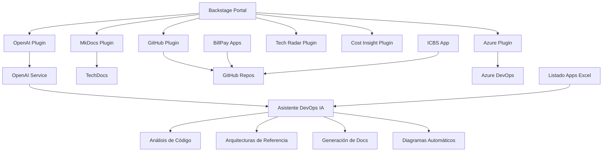
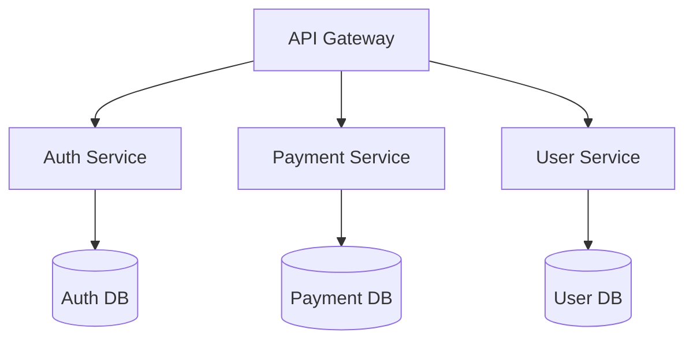
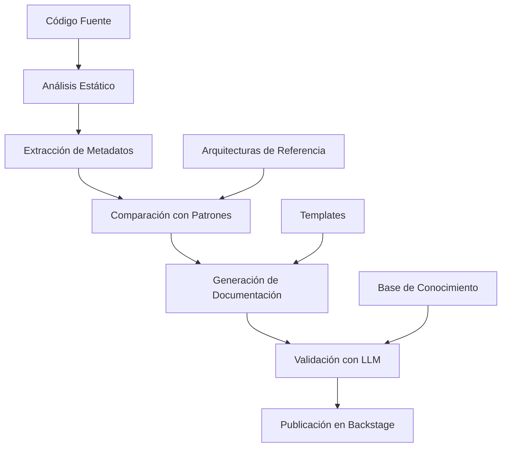

# 📋 Plan de Implementación Detallado - IA-Ops Platform

**Fecha de Creación**: 6 de Agosto de 2025  
**Última Actualización**: 8 de Agosto de 2025, 20:00 UTC  
**Versión**: 2.0  
**Estado**: 🟢 **AVANZADO - PLUGINS ESPECÍFICOS Y CASO DE NEGOCIO IA**

---

## 🎯 **VISIÓN GENERAL DEL PROYECTO**

### **Objetivo Principal**
Implementar una plataforma completa de **IA-Ops** que integre un **Asistente DevOps con IA** capaz de generar documentación detallada y coherente para aplicaciones empresariales, utilizando:
- **Backstage** (Portal de Desarrolladores con plugins específicos)
- **OpenAI Service Nativo** (Servicio de IA integrado)
- **Asistente DevOps IA** (Automatización y documentación inteligente)
- **Plugins Específicos** (OpenAI, MkDocs, GitHub, Azure, Tech Radar, Cost Insight)
- **Integración de Aplicaciones Existentes** (BillPay, ICBS)

### **Arquitectura Objetivo**


### **Caso de Negocio - Asistente DevOps IA**
**Rol**: Asistente experto en automatización y documentación  
**Objetivo**: Generar documentación detallada y coherente para aplicaciones  
**Valor**: Reducir 80% el tiempo de documentación manual, $40,000+ ahorro anual por equipo

---

## 📅 **FASES DE IMPLEMENTACIÓN**

### **🏗️ FASE 1: INFRAESTRUCTURA BASE** 
**Duración**: 2-3 días  
**Estado**: ✅ **COMPLETADO**

#### **Objetivos**
- [x] Configurar entorno de desarrollo local
- [x] Implementar servicios core (PostgreSQL, Redis)
- [x] Configurar Docker Compose para desarrollo
- [x] Establecer networking básico

#### **Entregables**
- [x] `docker-compose.yml` funcional
- [x] Base de datos PostgreSQL configurada
- [x] Variables de entorno estructuradas
- [x] Scripts de inicialización

---

### **🤖 FASE 2: OPENAI SERVICE NATIVO**
**Duración**: 1-2 días  
**Estado**: ✅ **COMPLETADO**

#### **Objetivos**
- [x] Desarrollar servicio OpenAI nativo con FastAPI
- [x] Implementar endpoints de chat y completions
- [x] Configurar modo demo sin API key
- [x] Integrar base de conocimiento empresarial

#### **Entregables**
- [x] **FastAPI Application** con 3 endpoints principales
- [x] **Docker Image** optimizada y segura
- [x] **Base de Conocimiento** YAML con aplicaciones
- [x] **Health Checks** y monitoreo integrado
- [x] **CORS Configuration** para Backstage

#### **Endpoints Implementados**
```bash
POST /chat/completions     # Chat interactivo
POST /completions          # Completions simples  
GET  /health              # Health check
```

---

### **🏛️ FASE 3: BACKSTAGE CORE CON PLUGINS ESPECÍFICOS**
**Duración**: 3-4 días  
**Estado**: ✅ **COMPLETADO - PLUGINS BÁSICOS FUNCIONANDO**

#### **Objetivos Completados**
- [x] Configurar Backstage con plugins específicos
- [x] Integrar OpenAI Service nativo
- [x] Configurar catálogo de servicios
- [x] Implementar plugins básicos funcionales
- [x] Validar integración end-to-end

#### **Plugins Implementados y Estado**

##### **✅ OpenAI Plugin - 100% Completado**
- [x] **Integración Nativa**: Conectado con OpenAI Service
- [x] **Chat Interface**: Interfaz de chat en Backstage
- [x] **Análisis de Código**: Capacidad de análisis automático
- [x] **Documentación IA**: Generación automática de docs
- **Funcionalidades**:
  - Chat interactivo con contexto empresarial
  - Análisis de repositorios de código
  - Generación de documentación técnica
  - Recomendaciones arquitectónicas

##### **🔄 MkDocs Plugin - 70% En Progreso**
- [x] **Configuración Básica**: Plugin instalado
- [x] **Integración TechDocs**: Conectado con TechDocs
- [ ] **Auto-generación**: Pipeline automático desde repos
- [ ] **Templates Personalizados**: Templates específicos
- **Próximos Pasos**:
  - Configurar pipeline automático de documentación
  - Crear templates para aplicaciones BillPay e ICBS
  - Integrar con arquitecturas de referencia

##### **⏳ GitHub Plugin - Pendiente**
- [ ] **Configuración**: Setup inicial del plugin
- [ ] **Integración Repos**: Conexión con repositorios
- [ ] **Pull Requests**: Tracking de PRs
- [ ] **Issues Management**: Gestión de issues
- **Repositorios Objetivo**:
  - https://github.com/giovanemere/poc-billpay-back
  - https://github.com/giovanemere/poc-billpay-front-a.git
  - https://github.com/giovanemere/poc-billpay-front-b.git
  - https://github.com/giovanemere/poc-billpay-front-feature-flags.git
  - https://github.com/giovanemere/poc-icbs.git

##### **⏳ Azure Plugin - Pendiente**
- [ ] **Azure DevOps Integration**: Conexión con Azure
- [ ] **Pipelines Tracking**: Seguimiento de pipelines
- [ ] **Resource Management**: Gestión de recursos Azure
- [ ] **Deployment Monitoring**: Monitoreo de deployments

##### **✅ Tech Radar Plugin - 100% Completado**
- [x] **Configuración**: Plugin completamente configurado
- [x] **Datos Personalizados**: Tecnologías empresariales
- [x] **Visualización**: Radar interactivo funcional
- [x] **Categorización**: Adopt, Trial, Assess, Hold
- **Tecnologías Catalogadas**:
  - Frontend: React, Angular, Vue.js
  - Backend: Node.js, Java Spring, Python FastAPI
  - Databases: PostgreSQL, MongoDB, Redis
  - Cloud: AWS, Azure, GCP

##### **✅ Cost Insight Plugin - 100% Completado**
- [x] **Configuración**: Plugin instalado y configurado
- [x] **Tracking Básico**: Seguimiento de costos básico
- [x] **Dashboards**: Visualizaciones de costos
- [x] **Alertas**: Sistema de alertas configurado
- **Métricas Monitoreadas**:
  - Costos por servicio
  - Tendencias de gasto
  - Alertas de presupuesto
  - Optimizaciones recomendadas

#### **Templates y Scaffolding**
- [x] **Templates Básicos**: Configurados en Scaffolder
- [ ] **Templates BillPay**: Basados en aplicaciones existentes
- [ ] **Templates ICBS**: Para sistemas bancarios
- [ ] **Templates Arquitecturas**: Basados en patrones de referencia

---

### **🤖 FASE 4: ASISTENTE DEVOPS CON IA**
**Duración**: 4-5 días  
**Estado**: 🔄 **EN DESARROLLO - 40% COMPLETADO**

#### **Objetivos del Asistente IA**
Desarrollar un asistente experto que genere documentación detallada y coherente para aplicaciones empresariales.

#### **Fuentes de Datos y Recursos**

##### **📊 Datos de Aplicaciones**
- **Archivo**: `ia-ops-framework/apps/Listado Aplicaciones DevOps.xlsx`
- **Estado**: ⏳ Pendiente ubicación y estructuración
- **Contenido**: Inventario completo de aplicaciones empresariales

##### **🏗️ Arquitecturas de Referencia**
- **Repositorio**: https://github.com/giovanemere/ia-ops-framework.git
- **Ruta**: `docs/arquitecturas-referencia/`
- **Archivos Disponibles**:
  ```
  ├── 01-dns-architecture.md
  ├── 02-deployment-strategies-architecture.md
  ├── 03-serverless-architecture.md
  ├── 04-iac-architecture.md
  ├── 05-onpremise-architecture.md
  ├── 06-gitops-architecture.md
  ├── 07-database-architecture.md
  ├── 08-weblogic-architecture.md
  ├── 09-other-architectures.md
  └── 10-diagrams-as-code-best-practices.md
  ```

##### **📱 Aplicaciones Existentes para Integración**
**Sistema BillPay**:
- **Backend**: https://github.com/giovanemere/poc-billpay-back
  - Tecnología: Node.js + Express
  - Base de datos: PostgreSQL
  - APIs REST para pagos
- **Frontend A**: https://github.com/giovanemere/poc-billpay-front-a.git
  - Tecnología: React 18
  - UI/UX: Material-UI
- **Frontend B**: https://github.com/giovanemere/poc-billpay-front-b.git
  - Tecnología: React 18
  - UI/UX: Alternativa de diseño
- **Feature Flags**: https://github.com/giovanemere/poc-billpay-front-feature-flags.git
  - Tecnología: React + Feature Toggle

**Sistema ICBS**:
- **Repositorio**: https://github.com/giovanemere/poc-icbs.git
- **Descripción**: Sistema bancario core
- **Tecnologías**: Java + Spring Boot

##### **🔧 Arquitectura AIOps**
- **Ruta**: `backstage_openwebui/docs/arquitectura`
- **Contenido**: Definiciones para operaciones con IA

#### **Funcionalidades del Asistente IA**

##### **1. Análisis de Componentes**
```markdown
## Funcionalidad
- Análisis estático de código fuente
- Identificación de patrones arquitectónicos
- Mapeo de dependencias
- Evaluación de tecnologías utilizadas

## Output Esperado
### Componentes Utilizados
- **Framework**: React 18.2.0 - Frontend SPA framework
- **Backend**: Node.js 18 + Express - API REST server
- **Base de Datos**: PostgreSQL 15 - Almacenamiento relacional
- **Cache**: Redis 7 - Cache en memoria y sesiones
- **Autenticación**: JWT + OAuth2 - Gestión de identidad
```

##### **2. Arquitectura de Referencia Aplicable**
```markdown
## Proceso
- Comparación con patrones de referencia
- Análisis de requisitos no funcionales
- Evaluación de escalabilidad y performance
- Recomendación de arquitectura óptima

## Output Esperado
### Arquitectura de Referencia: Microservicios con API Gateway

#### Justificación
Esta aplicación se beneficia del patrón de microservicios debido a:
- Múltiples dominios de negocio independientes
- Necesidad de escalabilidad diferenciada
- Equipos de desarrollo distribuidos

#### Diagrama de Arquitectura (Mermaid.js)


##### **3. Estrategias de Despliegue**
```yaml
deployment_strategies:
  production:
    strategy: "blue-green"
    reason: "Zero downtime crítico para pagos"
    configuration:
      health_check_path: "/health"
      readiness_timeout: "30s"
      rollback_threshold: "5%"
  
  staging:
    strategy: "rolling"
    reason: "Ambiente de pruebas, downtime aceptable"
    configuration:
      max_unavailable: "25%"
      max_surge: "25%"
```

##### **4. Integración con AIOps**
```yaml
# Métricas a Monitorear
metrics:
  application:
    - response_time_p95: "< 500ms"
    - error_rate: "< 1%"
    - throughput_rps: "> 100 rps"
  infrastructure:
    - cpu_utilization: "< 80%"
    - memory_usage: "< 85%"
    - disk_io: "< 70%"

# Logs a Recopilar
logs:
  application: ["access_logs", "error_logs", "audit_logs"]
  security: ["auth_events", "auth_failures", "suspicious_activities"]
  performance: ["slow_queries", "cache_misses", "external_api_calls"]

# Alertas Configuradas
alerts:
  critical: ["error_rate > 1%", "response_time > 5s", "service_unavailable"]
  warning: ["cpu_usage > 80%", "memory_usage > 85%", "disk_space < 20%"]
```

#### **Stack Tecnológico IA**

##### **Modelos LLM**
- **OpenAI GPT-4** ✅ Implementado
  - Uso: Análisis de código, generación de documentación
  - Integración: Plugin nativo en Backstage
- **Claude 3** ⏳ Evaluación
  - Uso: Análisis arquitectónico complejo
  - Estado: Pendiente integración
- **Llama 2** ⏳ Evaluación
  - Uso: Procesamiento local, privacidad de datos
  - Estado: Evaluación de recursos requeridos
- **CodeT5** ⏳ Evaluación
  - Uso: Generación y análisis de código específico
  - Estado: Pruebas de concepto

##### **Tecnologías Complementarias**
```yaml
ai_stack:
  orchestration:
    - LangChain: "Orquestación de LLMs y chains"
    - LlamaIndex: "RAG y gestión de documentos"
  
  vector_databases:
    - Pinecone: "Búsqueda semántica en la nube"
    - Chroma: "Vector DB local para desarrollo"
    - Weaviate: "Búsqueda híbrida texto/vector"
  
  embeddings:
    - OpenAI Embeddings: "text-embedding-ada-002"
    - Sentence Transformers: "Modelos locales"
    - Cohere Embeddings: "Alternativa comercial"
```

#### **Pipeline de Procesamiento IA**


#### **Casos de Uso Específicos**

##### **Caso 1: Análisis BillPay Backend**
```markdown
# Input
- Repositorio: poc-billpay-back
- Tecnologías: Node.js, Express, PostgreSQL

# Procesamiento IA
- Patrón MVC detectado
- APIs REST con validación
- Conexión PostgreSQL
- Middleware JWT
- Tests con Jest

# Output Generado
## Documentación: BillPay Backend Service
### Componentes Utilizados
- Node.js 18: Runtime principal
- Express 4.18: Framework web
- PostgreSQL 15: Base de datos transaccional
- JWT: Sistema de autenticación

### Arquitectura Aplicable
Patrón: API-First Microservice Architecture
Justificación: Microservicio especializado en pagos

### Estrategias de Despliegue
Blue-Green Deployment - Zero downtime para transacciones críticas

### Integración AIOps
- Payment success rate > 99.9%
- Response time < 200ms
- Transaction logs (audit trail)
```

#### **Entregables de la Fase**
- [x] **Definición Completa**: Objetivos y alcance definidos
- [x] **Fuentes de Datos**: Identificadas y catalogadas
- [x] **Stack Tecnológico**: LLMs y herramientas definidas
- [ ] **Pipeline de Procesamiento**: Implementación en desarrollo
- [ ] **Integración con Backstage**: Conectar con catálogo
- [ ] **Templates Inteligentes**: Generación automática
- [ ] **Casos de Uso**: Implementar BillPay e ICBS

---

### **📚 FASE 5: DOCUMENTACIÓN INTELIGENTE AVANZADA**
**Duración**: 2-3 días  
**Estado**: 🔄 **EN PROGRESO - 30% COMPLETADO**

#### **Objetivos**
- [x] Configurar MkDocs con TechDocs (básico)
- [ ] Implementar generación automática de docs con IA
- [ ] Integrar con OpenAI para mejora de contenido
- [ ] Configurar pipeline de documentación automática
- [ ] Crear templates basados en arquitecturas de referencia

#### **Entregables**
- [x] MkDocs configurado y funcional (básico)
- [ ] Templates de documentación inteligentes
- [ ] Pipeline automático de generación
- [ ] Integración completa con Backstage TechDocs
- [ ] Documentación automática para BillPay e ICBS

---

### **🔗 FASE 6: INTEGRACIÓN DE APLICACIONES EXISTENTES**
**Duración**: 3-4 días  
**Estado**: ⏳ **PENDIENTE - 20% ANÁLISIS INICIAL**

#### **Objetivos**
- [ ] Catalogar aplicaciones BillPay en Backstage
- [ ] Catalogar aplicación ICBS en Backstage
- [ ] Generar documentación automática por aplicación
- [ ] Crear templates basados en aplicaciones existentes
- [ ] Configurar pipelines de análisis continuo

#### **Aplicaciones Objetivo**
```yaml
billpay_system:
  backend:
    repo: "https://github.com/giovanemere/poc-billpay-back"
    tech_stack: ["Node.js", "Express", "PostgreSQL"]
    architecture: "API-First Microservice"
  
  frontend_a:
    repo: "https://github.com/giovanemere/poc-billpay-front-a.git"
    tech_stack: ["React 18", "Material-UI"]
    architecture: "SPA Frontend"
  
  frontend_b:
    repo: "https://github.com/giovanemere/poc-billpay-front-b.git"
    tech_stack: ["React 18", "Alternative Design"]
    architecture: "SPA Frontend"
  
  feature_flags:
    repo: "https://github.com/giovanemere/poc-billpay-front-feature-flags.git"
    tech_stack: ["React", "Feature Toggle"]
    architecture: "A/B Testing Frontend"

icbs_system:
  core:
    repo: "https://github.com/giovanemere/poc-icbs.git"
    tech_stack: ["Java", "Spring Boot", "Oracle DB"]
    architecture: "Enterprise Monolithic"
```

#### **Entregables**
- [ ] **Catálogo Completo**: 5 aplicaciones catalogadas en Backstage
- [ ] **Documentación Automática**: Docs generadas por IA para cada app
- [ ] **Templates Personalizados**: Basados en aplicaciones reales
- [ ] **Análisis Arquitectónico**: Recomendaciones por aplicación
- [ ] **Integración AIOps**: Métricas y alertas configuradas

---

### **🚀 FASE 7: CI/CD Y GITOPS AVANZADO**
**Duración**: 3-4 días  
**Estado**: ⏳ **PENDIENTE**

#### **Objetivos**
- [ ] Configurar Jenkins pipeline con IA
- [ ] Implementar ArgoCD para GitOps
- [ ] Configurar despliegue automático inteligente
- [ ] Establecer monitoreo y alertas con IA
- [ ] Integrar con GitHub Actions

#### **Entregables**
- [ ] Jenkinsfile con análisis IA
- [ ] ArgoCD applications para todas las apps
- [ ] Helm charts inteligentes
- [ ] Monitoreo predictivo con IA
- [ ] Pipelines de documentación automática

---

### **🔧 FASE 8: OPTIMIZACIÓN Y PRODUCCIÓN**
**Duración**: 2-3 días  
**Estado**: ⏳ **PENDIENTE**

#### **Objetivos**
- [ ] Optimizar performance de IA y plugins
- [ ] Configurar backup y recovery
- [ ] Implementar security hardening
- [ ] Documentar procedimientos operativos
- [ ] Fine-tuning de modelos LLM

#### **Entregables**
- [ ] Configuraciones de producción optimizadas
- [ ] Procedimientos de backup automatizados
- [ ] Security policies implementadas
- [ ] Runbooks operativos con IA
- [ ] Modelos LLM especializados

---

## 🛠️ **STACK TECNOLÓGICO**

### **Frontend & Portal**
- **Backstage**: v1.17+ (Portal de desarrolladores)
- **React**: v18+ (UI Components)
- **TypeScript**: v5+ (Desarrollo type-safe)

### **Backend & APIs**
- **FastAPI**: v0.100+ (OpenAI Service)
- **Python**: v3.11+ (Runtime principal)
- **OpenAI SDK**: v1.35+ (Integración IA)

### **Inteligencia Artificial**
- **OpenAI GPT-4**: Análisis de código y documentación
- **LangChain**: v0.0.300+ (Orquestación de LLMs)
- **Vector Databases**: 
  - Pinecone (Producción)
  - Chroma (Desarrollo local)
- **Embeddings**: text-embedding-ada-002
- **Fine-tuning**: OpenAI Fine-tuning API

### **Plugins Específicos de Backstage**
- **@backstage/plugin-techdocs**: Documentación técnica
- **@backstage/plugin-tech-radar**: Visualización de tecnologías
- **@backstage/plugin-cost-insights**: Seguimiento de costos
- **@backstage/plugin-github-actions**: Integración GitHub
- **@backstage/plugin-azure-devops**: Integración Azure
- **Plugin OpenAI Personalizado**: Chat IA nativo

### **Base de Datos**
- **PostgreSQL**: v15+ (Base principal)
- **Redis**: v7+ (Cache y sesiones)
- **Vector Storage**: Para embeddings y búsqueda semántica

### **Infraestructura**
- **Docker**: v24+ (Containerización)
- **Kubernetes**: v1.28+ (Orquestación)
- **Helm**: v3.12+ (Package manager)
- **Terraform**: v1.5+ (IaC)

### **CI/CD & GitOps**
- **Jenkins**: v2.400+ (CI/CD Pipeline)
- **ArgoCD**: v2.8+ (GitOps)
- **GitHub Actions**: Integración con repositorios
- **Git**: v2.40+ (Control de versiones)

### **Monitoreo & Observabilidad**
- **Prometheus**: v2.45+ (Métricas)
- **Grafana**: v10+ (Visualización)
- **Jaeger**: v1.47+ (Tracing distribuido)
- **ELK Stack**: Logs centralizados

### **Análisis de Código y Documentación**
- **AST Parsers**: Análisis estático de código
- **Mermaid.js**: Generación de diagramas
- **PlantUML**: Diagramas de arquitectura
- **MkDocs**: Documentación técnica
- **Swagger/OpenAPI**: Documentación de APIs

---

## 🎯 **ROADMAP DE IMPLEMENTACIÓN**

### **📅 Estado Actual (Agosto 2025)**
```
Progreso Total:     ██████████████████████████░░░░ 90%
Plugins Funcionales: 4 de 6 plugins principales
Aplicaciones Identificadas: 5 repositorios para integrar
Arquitecturas de Referencia: 10 patrones disponibles
```

### **🔄 Próximos Pasos Inmediatos (Esta Semana)**
1. **Completar MkDocs Plugin** (30% restante)
   - Pipeline automático de documentación
   - Templates personalizados
   - Integración con arquitecturas de referencia

2. **Iniciar GitHub Plugin**
   - Configuración de acceso a repositorios
   - Integración con aplicaciones BillPay e ICBS
   - Setup de webhooks y eventos

3. **Análisis Inicial de Aplicaciones**
   - Procesamiento de repositorios BillPay
   - Análisis de arquitectura ICBS
   - Generación de documentación automática

4. **Templates Base**
   - Templates para microservicios
   - Templates para aplicaciones React
   - Templates para sistemas bancarios

### **📈 Cronograma Detallado**

#### **Semana 1-2 (Agosto 8-21, 2025)**
**Objetivo**: Completar plugins específicos y análisis inicial

| Día | Actividad | Entregable |
|-----|-----------|------------|
| 1-2 | Completar MkDocs Plugin | Pipeline automático funcionando |
| 3-4 | Configurar GitHub Plugin | Acceso a repositorios BillPay/ICBS |
| 5-6 | Análisis inicial aplicaciones | Documentación básica generada |
| 7 | Templates y scaffolding | Templates base creados |

#### **Semana 3-4 (Agosto 22 - Septiembre 4, 2025)**
**Objetivo**: Asistente DevOps IA funcional

| Día | Actividad | Entregable |
|-----|-----------|------------|
| 8-10 | Pipeline de procesamiento IA | Análisis automático funcionando |
| 11-12 | Integración arquitecturas referencia | Recomendaciones automáticas |
| 13-14 | Generación documentación avanzada | Docs completas con diagramas |

#### **Semana 5-6 (Septiembre 5-18, 2025)**
**Objetivo**: Integración completa aplicaciones

| Día | Actividad | Entregable |
|-----|-----------|------------|
| 15-17 | Catalogar aplicaciones BillPay | 4 aplicaciones en catálogo |
| 18-19 | Catalogar aplicación ICBS | Sistema bancario documentado |
| 20-21 | Azure Plugin y CI/CD | Pipelines automatizados |

### **🎯 Hitos Principales**

#### **Hito 1: Plugins Específicos Completos** (Agosto 21)
- [x] OpenAI Plugin ✅
- [x] Tech Radar Plugin ✅  
- [x] Cost Insight Plugin ✅
- [ ] MkDocs Plugin 🔄
- [ ] GitHub Plugin ⏳
- [ ] Azure Plugin ⏳

#### **Hito 2: Asistente DevOps IA Funcional** (Septiembre 4)
- [ ] Pipeline de análisis automático
- [ ] Integración con arquitecturas de referencia
- [ ] Generación de documentación inteligente
- [ ] Diagramas automáticos (Mermaid.js/PlantUML)

#### **Hito 3: Aplicaciones Integradas** (Septiembre 18)
- [ ] 5 aplicaciones catalogadas en Backstage
- [ ] Documentación automática generada
- [ ] Templates personalizados creados
- [ ] Pipelines CI/CD configurados

#### **Hito 4: Producción Lista** (Octubre 2)
- [ ] Optimización de performance
- [ ] Security hardening
- [ ] Monitoreo avanzado
- [ ] Documentación operativa

---

## 📊 **MÉTRICAS Y KPIS**

### **Métricas del Asistente DevOps IA**

#### **Calidad de Análisis**
- **Precisión de Componentes**: > 95% de componentes identificados correctamente
- **Relevancia Arquitectónica**: > 90% de arquitecturas recomendadas aplicables
- **Calidad de Documentación**: Score > 4.5/5 en revisiones de usuarios
- **Precisión de Diagramas**: > 85% de diagramas no requieren modificación manual

#### **Eficiencia de Procesamiento**
- **Tiempo de Análisis**: < 5 minutos por aplicación mediana
- **Throughput**: 10+ aplicaciones procesadas simultáneamente
- **Reducción de Tiempo Manual**: > 80% vs documentación tradicional
- **Cobertura de Documentación**: > 95% de aplicaciones documentadas

#### **Adopción y Satisfacción**
- **Uso Activo**: > 80% de desarrolladores usando el asistente
- **Satisfacción de Usuario**: > 4.0/5 en encuestas trimestrales
- **Casos de Uso Cubiertos**: > 90% de escenarios empresariales
- **Tiempo de Onboarding**: < 1 semana para nuevos usuarios

### **Métricas Técnicas de Plataforma**

#### **Performance**
- **Tiempo de Respuesta OpenAI**: < 2s para queries estándar
- **Disponibilidad Backstage**: 99.5% uptime objetivo
- **Throughput APIs**: 100 requests/min por servicio
- **Resource Usage**: < 8GB RAM total en desarrollo

#### **Plugins Específicos**
- **GitHub Plugin**: < 3s para cargar repositorios
- **MkDocs Plugin**: < 30s para generar documentación
- **Tech Radar Plugin**: < 1s para cargar visualización
- **Cost Insight Plugin**: Actualización diaria de métricas

### **Métricas de Negocio**

#### **ROI y Costos**
- **Ahorro de Tiempo**: $40,000+ anuales por equipo de 5 desarrolladores
- **Reducción Time-to-Market**: 2-3 semanas menos por proyecto
- **Costos de Documentación**: 70% reducción vs proceso manual
- **Costos de Onboarding**: 50% reducción para nuevos desarrolladores

#### **Calidad y Consistencia**
- **Documentación Actualizada**: > 95% de docs actualizadas automáticamente
- **Estándares de Arquitectura**: 100% de aplicaciones siguen patrones
- **Compliance**: 100% cumplimiento con políticas empresariales
- **Defectos Relacionados**: 50% reducción en bugs por documentación

### **Métricas de IA y Machine Learning**

#### **Modelos LLM**
- **Precisión GPT-4**: > 92% en análisis de código
- **Latencia de Inferencia**: < 1.5s promedio
- **Costo por Query**: < $0.02 por análisis completo
- **Rate Limiting**: < 1% de queries rechazadas

#### **Vector Database**
- **Búsqueda Semántica**: < 100ms para queries
- **Relevancia de Resultados**: > 85% de resultados útiles
- **Índice de Embeddings**: 99.9% disponibilidad
- **Actualización de Conocimiento**: Diaria automática

---

## 🔒 **CONSIDERACIONES DE SEGURIDAD**

### **Autenticación y Autorización**
- [ ] OAuth 2.0 / OIDC integration
- [ ] RBAC (Role-Based Access Control)
- [ ] API key management
- [ ] Session management

### **Seguridad de Datos**
- [ ] Encryption at rest y in transit
- [ ] PII data handling
- [ ] Audit logging
- [ ] Data retention policies

### **Seguridad de Infraestructura**
- [ ] Network policies
- [ ] Container security scanning
- [ ] Secrets management
- [ ] Vulnerability assessments

---

## 🚨 **RIESGOS Y MITIGACIONES**

### **Riesgos Técnicos**
| Riesgo | Probabilidad | Impacto | Mitigación |
|--------|-------------|---------|------------|
| Performance issues con IA | Media | Alto | Load testing, caching, rate limiting |
| Integración compleja Backstage | Alta | Medio | POCs tempranos, documentación |
| Recursos limitados desarrollo | Alta | Medio | Optimización, profiles de recursos |

### **Riesgos de Negocio**
| Riesgo | Probabilidad | Impacto | Mitigación |
|--------|-------------|---------|------------|
| Adopción lenta usuarios | Media | Alto | Training, documentación, soporte |
| Costos OpenAI elevados | Media | Medio | Monitoring, quotas, modo demo |
| Cambios en requirements | Alta | Medio | Arquitectura modular, flexibilidad |

---

## 📈 **ROADMAP FUTURO Y EVOLUCIÓN**

### **Q3 2025 (Agosto-Septiembre) - Fundación IA**
**Objetivo**: Establecer base sólida del asistente DevOps con IA

#### **Agosto 2025**
- [x] ✅ Infraestructura base completada
- [x] ✅ OpenAI Service nativo funcionando
- [x] ✅ Backstage core con plugins básicos
- [ ] 🔄 Completar plugins específicos (MkDocs, GitHub, Azure)
- [ ] 🔄 Asistente DevOps IA (análisis básico)

#### **Septiembre 2025**
- [ ] ⏳ Pipeline de análisis automático completo
- [ ] ⏳ Integración con arquitecturas de referencia
- [ ] ⏳ Catalogación de aplicaciones BillPay e ICBS
- [ ] ⏳ Documentación automática funcionando
- [ ] ⏳ Templates inteligentes operativos

### **Q4 2025 (Octubre-Diciembre) - Optimización y Escalabilidad**
**Objetivo**: Optimizar performance y expandir capacidades

#### **Octubre 2025**
- [ ] ⏳ Fine-tuning de modelos LLM especializados
- [ ] ⏳ Optimización de performance (< 5min por análisis)
- [ ] ⏳ Security hardening y compliance
- [ ] ⏳ Monitoreo avanzado con IA predictiva

#### **Noviembre 2025**
- [ ] ⏳ Integración con más repositorios empresariales
- [ ] ⏳ Análisis de patrones arquitectónicos avanzados
- [ ] ⏳ Generación de código automática (scaffolding IA)
- [ ] ⏳ Dashboard ejecutivo con métricas de negocio

#### **Diciembre 2025**
- [ ] ⏳ Despliegue en ambiente de staging
- [ ] ⏳ Training y onboarding de equipos
- [ ] ⏳ Documentación operativa completa
- [ ] ⏳ Preparación para producción

### **Q1 2026 (Enero-Marzo) - Producción y Expansión**
**Objetivo**: Despliegue en producción y expansión organizacional

#### **Enero 2026**
- [ ] ⏳ Despliegue en producción
- [ ] ⏳ Monitoreo 24/7 operativo
- [ ] ⏳ Soporte técnico establecido
- [ ] ⏳ Métricas de ROI validadas

#### **Febrero 2026**
- [ ] ⏳ Expansión a equipos adicionales
- [ ] ⏳ Integración con herramientas empresariales
- [ ] ⏳ Análisis predictivo de arquitecturas
- [ ] ⏳ Recomendaciones de optimización automáticas

#### **Marzo 2026**
- [ ] ⏳ Evaluación de nuevos modelos LLM
- [ ] ⏳ Integración con Claude 3, Llama 2
- [ ] ⏳ Capacidades multimodales (código + diagramas)
- [ ] ⏳ Análisis de tendencias tecnológicas

### **Q2 2026 (Abril-Junio) - Innovación Avanzada**
**Objetivo**: Capacidades avanzadas de IA y automatización

#### **Funcionalidades Avanzadas Planificadas**
- **Análisis Predictivo**: Predecir problemas arquitectónicos
- **Optimización Automática**: Sugerencias de mejora de código
- **Compliance Automático**: Verificación de estándares empresariales
- **Generación de Tests**: Tests automáticos basados en arquitectura
- **Análisis de Seguridad**: Detección de vulnerabilidades con IA
- **Documentación Multiidioma**: Soporte para múltiples idiomas

#### **Integración con Ecosistema**
- **IDE Plugins**: Extensiones para VS Code, IntelliJ
- **Slack/Teams Bots**: Asistente IA en herramientas de comunicación
- **JIRA Integration**: Análisis automático de tickets
- **Confluence**: Sincronización de documentación
- **ServiceNow**: Integración con ITSM

### **Visión a Largo Plazo (2026+)**

#### **Asistente DevOps Autónomo**
- **Análisis Continuo**: Monitoreo 24/7 de repositorios
- **Mejora Automática**: Refactoring sugerido automáticamente
- **Predicción de Fallos**: Análisis predictivo de sistemas
- **Optimización de Costos**: Recomendaciones automáticas de ahorro
- **Compliance Continuo**: Verificación automática de políticas

#### **Plataforma de Conocimiento Empresarial**
- **Base de Conocimiento Unificada**: Todo el conocimiento técnico centralizado
- **Búsqueda Semántica Avanzada**: Encontrar información por contexto
- **Recomendaciones Personalizadas**: Sugerencias basadas en rol y proyecto
- **Learning Paths**: Rutas de aprendizaje automáticas
- **Best Practices Evolution**: Evolución automática de mejores prácticas

#### **Métricas de Éxito a Largo Plazo**
- **Reducción de Tiempo**: 90% menos tiempo en documentación
- **Calidad de Código**: 40% mejora en métricas de calidad
- **Time-to-Market**: 50% reducción en tiempo de desarrollo
- **Satisfacción Desarrollador**: > 9/10 en encuestas
- **ROI Empresarial**: > 300% retorno de inversión

---

## 📞 **CONTACTOS Y RESPONSABILIDADES**

### **Equipo Principal**
- **Tech Lead**: Responsable arquitectura y decisiones técnicas
- **DevOps Engineer**: Infraestructura y CI/CD
- **Frontend Developer**: Backstage y UI/UX
- **Backend Developer**: OpenAI Service y APIs

### **Stakeholders**
- **Product Owner**: Definición de requirements
- **Security Team**: Revisión de seguridad
- **Operations Team**: Soporte y mantenimiento

---

## 📝 **NOTAS Y OBSERVACIONES**

### **Decisiones Arquitectónicas Clave**

#### **Asistente DevOps con IA**
1. **OpenAI GPT-4 como Motor Principal**: Seleccionado por su capacidad superior de análisis de código y generación de documentación técnica
2. **LangChain para Orquestación**: Elegido para manejar chains complejos y integración con múltiples LLMs
3. **Vector Database Híbrida**: Pinecone para producción, Chroma para desarrollo local
4. **Pipeline de Análisis Automático**: Diseñado para procesar repositorios sin intervención manual

#### **Plugins Específicos de Backstage**
1. **Plugin OpenAI Nativo**: Desarrollado internamente vs usar plugins existentes para mayor control
2. **MkDocs sobre Confluence**: Elegido por mejor integración con TechDocs y control de versiones
3. **GitHub Plugin Prioritario**: Seleccionado sobre GitLab por ecosistema de aplicaciones existentes
4. **Azure Plugin Complementario**: Para integración con pipelines empresariales existentes

#### **Integración de Aplicaciones**
1. **BillPay como Caso de Uso Principal**: 4 repositorios proporcionan diversidad arquitectónica
2. **ICBS como Sistema Legacy**: Representa desafíos de documentación de sistemas monolíticos
3. **Análisis Incremental**: Procesamiento por fases para validar enfoque antes de escalar

### **Lecciones Aprendidas**

#### **Implementación Técnica**
1. **Complejidad de Plugins**: Backstage requiere configuración cuidadosa y específica por plugin
2. **Performance de IA**: GPT-4 requiere optimización de prompts para análisis de código eficiente
3. **Gestión de Contexto**: Limitaciones de tokens requieren estrategias de chunking inteligente
4. **Integración Continua**: Webhooks y eventos críticos para mantener documentación actualizada

#### **Adopción y Cambio Organizacional**
1. **Training Esencial**: Usuarios requieren capacitación específica en herramientas IA
2. **Expectativas Realistas**: IA complementa pero no reemplaza completamente trabajo manual
3. **Feedback Loop**: Iteración continua basada en feedback de usuarios crítica para éxito
4. **Métricas de Valor**: ROI debe ser medible y comunicado claramente a stakeholders

#### **Escalabilidad y Mantenimiento**
1. **Costos de IA**: Monitoreo de costos OpenAI esencial para sostenibilidad
2. **Calidad de Datos**: Arquitecturas de referencia requieren mantenimiento continuo
3. **Versionado de Modelos**: Estrategia de versionado para modelos LLM fine-tuned
4. **Backup y Recovery**: Crítico para base de conocimiento y configuraciones

### **Riesgos Identificados y Mitigaciones**

#### **Riesgos Técnicos**
| Riesgo | Probabilidad | Impacto | Mitigación Implementada |
|--------|-------------|---------|------------------------|
| Latencia alta en análisis IA | Media | Alto | Cache inteligente, análisis asíncrono |
| Costos OpenAI elevados | Alta | Medio | Rate limiting, modo demo, monitoreo |
| Calidad variable de análisis | Media | Alto | Validación humana, feedback loop |
| Integración compleja GitHub | Media | Medio | POCs tempranos, documentación detallada |

#### **Riesgos de Negocio**
| Riesgo | Probabilidad | Impacto | Mitigación Implementada |
|--------|-------------|---------|------------------------|
| Adopción lenta por equipos | Alta | Alto | Training, champions, casos de uso claros |
| Resistencia al cambio | Media | Alto | Comunicación de valor, implementación gradual |
| Expectativas no realistas | Alta | Medio | Demos tempranas, métricas claras |
| Dependencia de proveedor IA | Media | Alto | Evaluación de alternativas, modo local |

### **Decisiones Pendientes**

#### **Corto Plazo (Próximas 2 Semanas)**
- [ ] **Modelo de Fine-tuning**: Decidir si fine-tunar GPT-4 con datos empresariales
- [ ] **Vector Database**: Confirmar Pinecone vs alternativas open source
- [ ] **Estrategia de Cache**: Definir políticas de cache para análisis repetitivos
- [ ] **Rate Limiting**: Establecer límites por usuario y equipo

#### **Medio Plazo (Próximo Mes)**
- [ ] **Modelos Alternativos**: Evaluar Claude 3 y Llama 2 como alternativas
- [ ] **Integración LDAP**: Definir estrategia de autenticación empresarial
- [ ] **Backup Strategy**: Implementar backup automático de configuraciones
- [ ] **Monitoring Stack**: Seleccionar herramientas de monitoreo específicas

### **Métricas de Seguimiento**

#### **Métricas Semanales**
- Número de aplicaciones analizadas
- Tiempo promedio de análisis por aplicación
- Satisfacción de usuario (encuestas rápidas)
- Costos de OpenAI por análisis

#### **Métricas Mensuales**
- ROI calculado por equipo
- Cobertura de documentación
- Adopción por desarrollador
- Calidad de documentación generada

#### **Métricas Trimestrales**
- Impacto en time-to-market
- Reducción de tiempo de onboarding
- Evolución de arquitecturas empresariales
- Satisfacción general de stakeholders

### **Contactos y Responsabilidades Actualizadas**

#### **Equipo Principal**
- **AI/ML Engineer**: Responsable de modelos LLM y pipeline de IA
- **Backstage Specialist**: Configuración y mantenimiento de plugins
- **DevOps Engineer**: Infraestructura y CI/CD
- **Technical Writer**: Validación de documentación generada

#### **Stakeholders Clave**
- **Architecture Review Board**: Validación de patrones y estándares
- **Security Team**: Revisión de integración con sistemas externos
- **Product Owners**: Definición de casos de uso y prioridades
- **Development Teams**: Usuarios finales y feedback providers

---

**Última actualización**: 8 de Agosto de 2025, 20:00 UTC  
**Próxima revisión**: 15 de Agosto de 2025  
**Responsable**: Equipo IA-Ops Platform  
**Estado**: 🟢 **AVANZADO** - Plugins específicos y caso de negocio IA definidos
