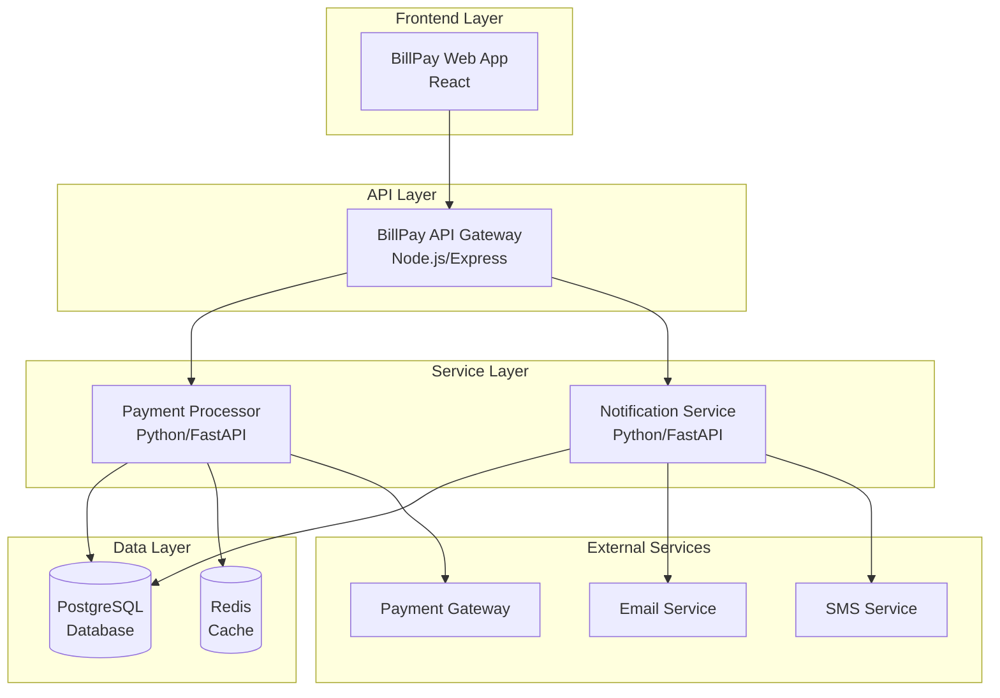
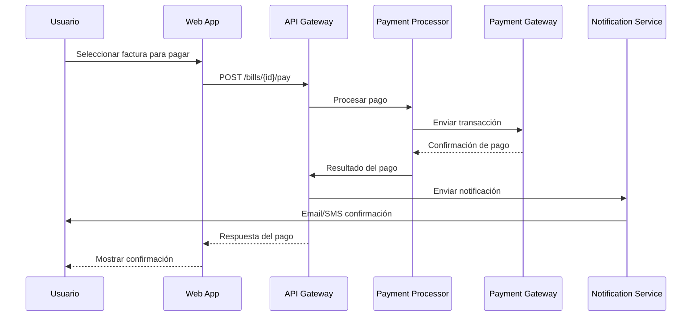
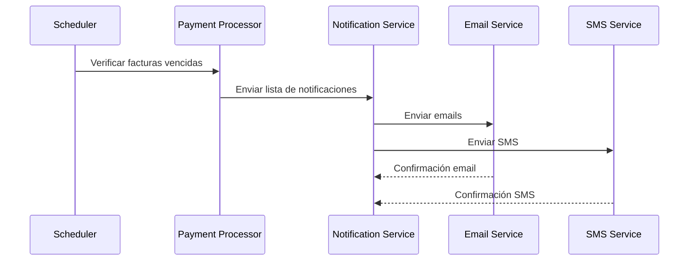

# 💳 Sistema BillPay

## Descripción General

BillPay es un sistema integral de gestión y pago de facturas que permite a los usuarios:
- Gestionar sus facturas pendientes
- Procesar pagos de forma segura
- Recibir notificaciones sobre vencimientos
- Consultar historial de pagos

## Arquitectura del Sistema



## Componentes del Sistema

### 🌐 Frontend Components
- **BillPay Web Application**: Interfaz de usuario principal desarrollada en React

### 🔌 API Components
- **BillPay API Gateway**: Gateway principal que expone las APIs REST

### ⚙️ Backend Services
- **Payment Processor Service**: Servicio de procesamiento de pagos
- **Notification Service**: Servicio de notificaciones y alertas

### 💾 Data Components
- **BillPay Database**: Base de datos PostgreSQL principal
- **Redis Cache**: Sistema de caché para optimización de rendimiento

### 🔗 External Resources
- **Payment Gateway**: Gateway externo para procesamiento de pagos
- **Email Service**: Servicio externo de envío de emails
- **SMS Service**: Servicio externo de envío de SMS

## APIs Principales

### BillPay API v1
- **Base URL**: `/api/v1`
- **Autenticación**: JWT Bearer Token
- **Formato**: JSON

#### Endpoints Principales:
```
GET    /bills              # Obtener facturas del usuario
POST   /bills              # Crear nueva factura
GET    /bills/{id}         # Obtener factura específica
POST   /bills/{id}/pay     # Procesar pago de factura
GET    /payments           # Historial de pagos
GET    /notifications      # Obtener notificaciones
```

## Flujos de Trabajo

### 1. Flujo de Pago de Factura


### 2. Flujo de Notificaciones


## Configuración y Despliegue

### Variables de Entorno
```bash
# Database
BILLPAY_DB_HOST=localhost
BILLPAY_DB_PORT=5432
BILLPAY_DB_NAME=billpay
BILLPAY_DB_USER=billpay_user
BILLPAY_DB_PASSWORD=secure_password

# Redis
REDIS_HOST=localhost
REDIS_PORT=6379
REDIS_PASSWORD=redis_password

# Payment Gateway
PAYMENT_GATEWAY_URL=https://api.paymentgateway.com
PAYMENT_GATEWAY_API_KEY=your_api_key
PAYMENT_GATEWAY_SECRET=your_secret

# Notification Services
EMAIL_SERVICE_URL=https://api.emailservice.com
EMAIL_API_KEY=your_email_api_key
SMS_SERVICE_URL=https://api.smsservice.com
SMS_API_KEY=your_sms_api_key

# JWT
JWT_SECRET=your_jwt_secret
JWT_EXPIRATION=24h
```

### Docker Compose
```yaml
version: '3.8'
services:
  billpay-api:
    image: billpay/api:latest
    ports:
      - "3000:3000"
    environment:
      - NODE_ENV=production
    depends_on:
      - billpay-db
      - redis
  
  payment-processor:
    image: billpay/payment-processor:latest
    ports:
      - "8001:8000"
    depends_on:
      - billpay-db
      - redis
  
  notification-service:
    image: billpay/notification-service:latest
    ports:
      - "8002:8000"
    depends_on:
      - billpay-db
  
  billpay-db:
    image: postgres:15
    environment:
      POSTGRES_DB: billpay
      POSTGRES_USER: billpay_user
      POSTGRES_PASSWORD: secure_password
    volumes:
      - billpay_data:/var/lib/postgresql/data
  
  redis:
    image: redis:7-alpine
    command: redis-server --requirepass redis_password

volumes:
  billpay_data:
```

## Monitoreo y Observabilidad

### Métricas Clave
- **Transacciones por minuto**: Volumen de pagos procesados
- **Tasa de éxito de pagos**: Porcentaje de pagos exitosos
- **Latencia de API**: Tiempo de respuesta de endpoints
- **Disponibilidad del sistema**: Uptime de servicios críticos

### Alertas Configuradas
- **Falla en procesamiento de pagos**: > 5% de fallos en 5 minutos
- **Alta latencia**: Tiempo de respuesta > 2 segundos
- **Servicio no disponible**: Endpoint no responde por > 1 minuto
- **Base de datos**: Conexiones > 80% del límite

### Dashboards Grafana
- **BillPay Overview**: Vista general del sistema
- **Payment Processing**: Métricas de procesamiento de pagos
- **API Performance**: Rendimiento de APIs
- **Infrastructure**: Métricas de infraestructura

## Seguridad

### Medidas de Seguridad Implementadas
- **Autenticación JWT**: Tokens seguros para autenticación
- **Encriptación de datos**: Datos sensibles encriptados en BD
- **HTTPS obligatorio**: Todas las comunicaciones cifradas
- **Rate limiting**: Límites de requests por usuario/IP
- **Validación de entrada**: Sanitización de todos los inputs
- **Auditoría**: Logs de todas las transacciones

### Compliance
- **PCI DSS**: Cumplimiento para manejo de datos de tarjetas
- **GDPR**: Protección de datos personales
- **SOX**: Controles financieros y auditoría

## Desarrollo y Testing

### Entorno de Desarrollo
```bash
# Clonar repositorios
git clone https://github.com/tu-organizacion/billpay-api.git
git clone https://github.com/tu-organizacion/billpay-frontend.git
git clone https://github.com/tu-organizacion/payment-processor.git
git clone https://github.com/tu-organizacion/notification-service.git

# Iniciar servicios locales
docker-compose -f docker-compose.dev.yml up -d

# Instalar dependencias y ejecutar tests
npm install && npm test  # Para servicios Node.js
pip install -r requirements.txt && pytest  # Para servicios Python
```

### Testing Strategy
- **Unit Tests**: Cobertura > 80% en todos los servicios
- **Integration Tests**: Tests de APIs y servicios
- **E2E Tests**: Flujos completos de usuario
- **Load Tests**: Pruebas de carga y rendimiento
- **Security Tests**: Pruebas de penetración y vulnerabilidades

## Roadmap

### Q1 2025
- [ ] Implementación de pagos recurrentes
- [ ] Integración con más gateways de pago
- [ ] Dashboard de analytics avanzado

### Q2 2025
- [ ] API móvil nativa
- [ ] Notificaciones push
- [ ] Integración con bancos

### Q3 2025
- [ ] Machine Learning para detección de fraude
- [ ] Pagos con criptomonedas
- [ ] Internacionalización

## Contacto y Soporte

### Equipo Responsable
- **Product Owner**: payments-po@tu-organizacion.com
- **Tech Lead**: payments-lead@tu-organizacion.com
- **DevOps**: devops@tu-organizacion.com

### Canales de Soporte
- **Slack**: #billpay-support
- **Jira**: [BillPay Project](https://jira.tu-organizacion.com/projects/BILLPAY)
- **Confluence**: [BillPay Wiki](https://confluence.tu-organizacion.com/display/BILLPAY)

### SLA
- **Disponibilidad**: 99.9% uptime
- **Tiempo de respuesta**: < 2 segundos para APIs críticas
- **Soporte**: 24/7 para issues críticos
- **Resolución**: P1 < 1 hora, P2 < 4 horas, P3 < 24 horas
